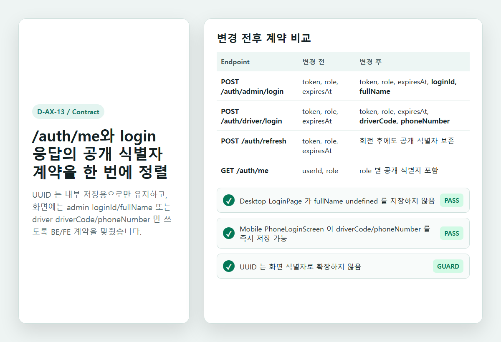
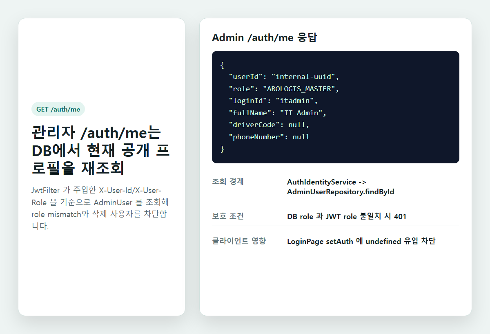
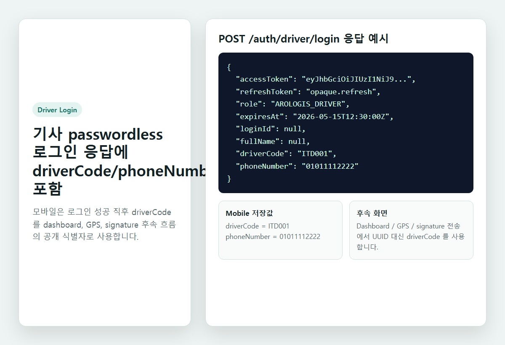
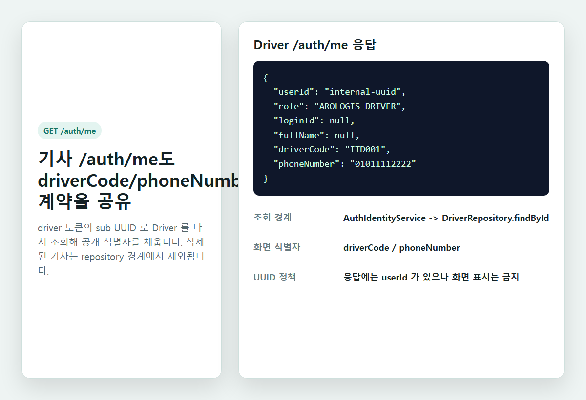
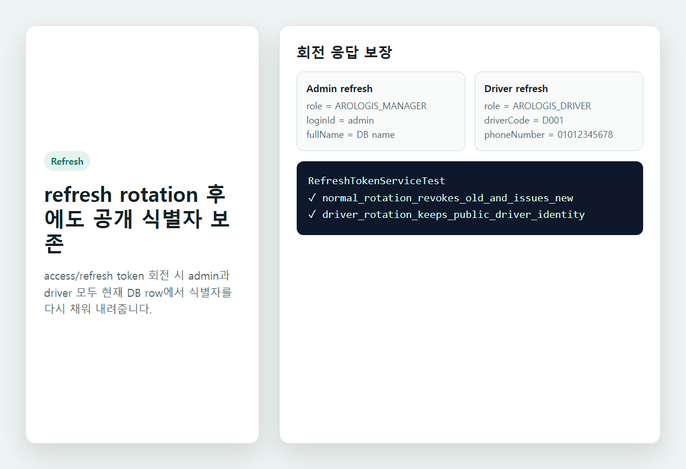
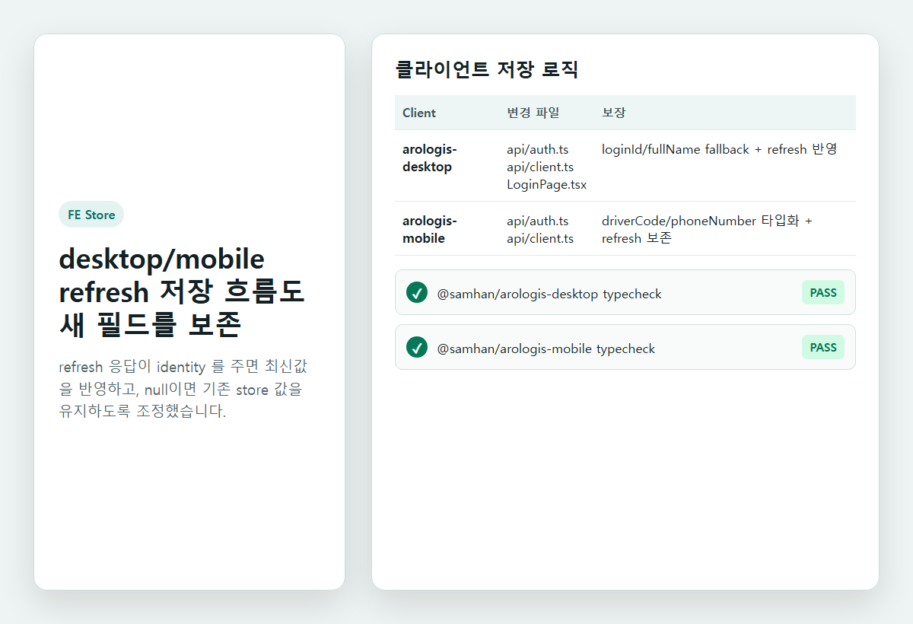
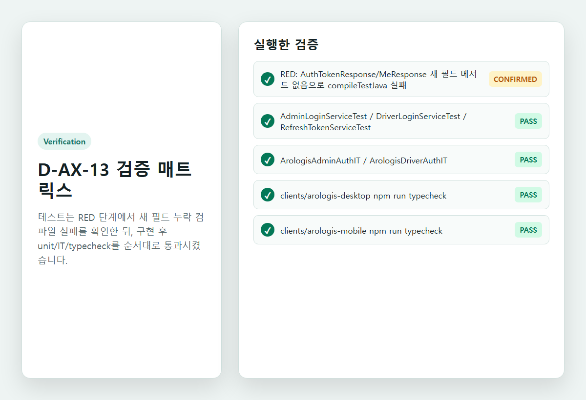

# D-AX-13 auth contract QA

## Scope

D-AX-13은 `/auth/me`와 login/refresh 응답의 공개 식별자 계약을 BE/FE에서 정렬한다.
UUID는 내부 저장과 인증 검증에만 사용하고, 화면 노출 식별자는 admin `loginId/fullName`, driver `driverCode/phoneNumber`로 제한한다.

## Scenarios

| ID | Case | Expected |
|---|---|---|
| Q1 | admin login | token 응답에 `loginId/fullName`이 포함된다. |
| Q2 | admin `/auth/me` | `userId/role/loginId/fullName`이 반환되고 driver 식별자는 null이다. |
| Q3 | driver login | token 응답에 `driverCode/phoneNumber`가 포함된다. |
| Q4 | driver `/auth/me` | `userId/role/driverCode/phoneNumber`가 반환되고 admin 식별자는 null이다. |
| Q5 | refresh rotation | token 회전 후에도 role별 공개 식별자가 유지된다. |
| Q6 | desktop auth store | `loginId/fullName` undefined 저장을 방지한다. |
| Q7 | mobile auth store | `driverCode/phoneNumber`를 login/refresh 흐름에서 보존한다. |
| Q8 | UUID guard | 화면 식별자는 UUID가 아니라 loginId/fullName/driverCode/phoneNumber를 사용한다. |

## Screenshots

