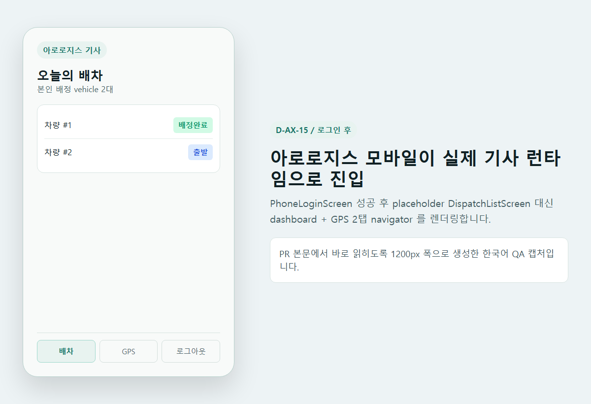
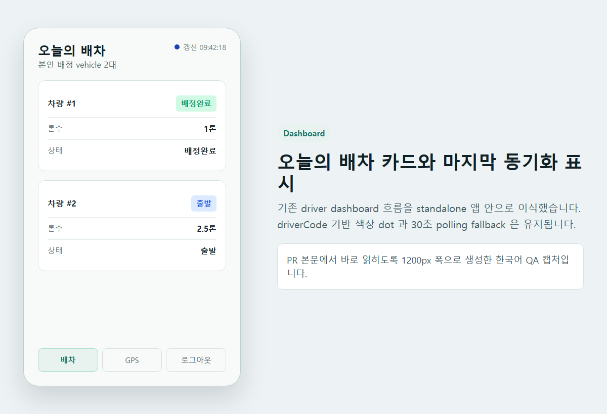
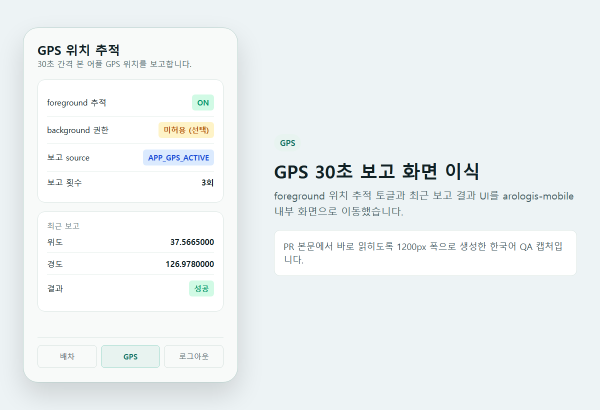
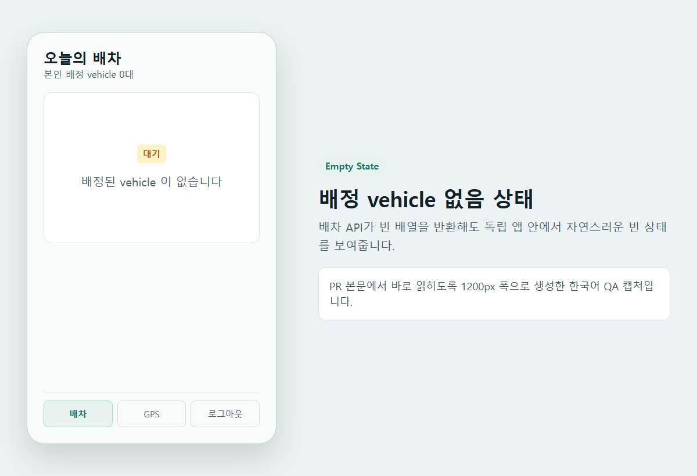
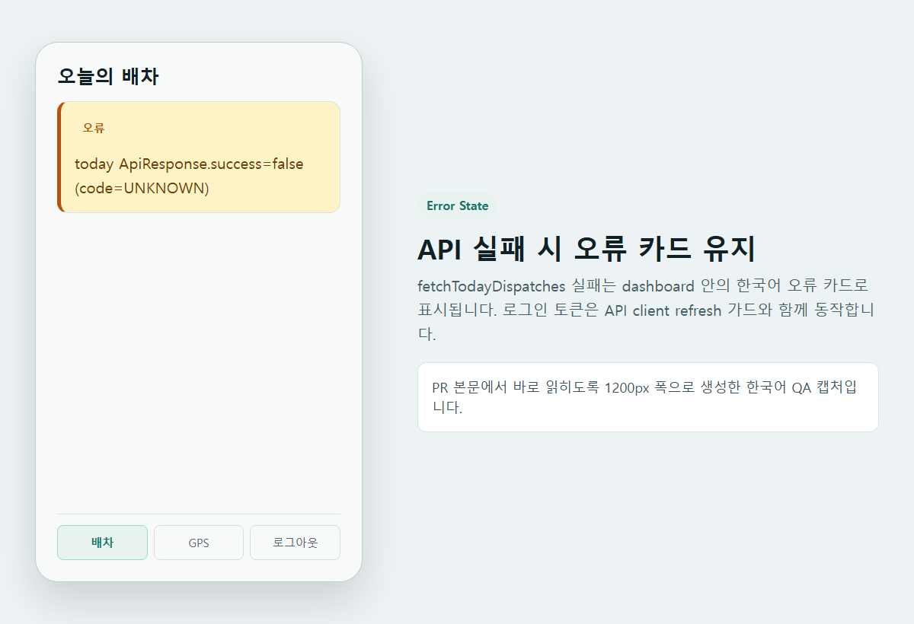
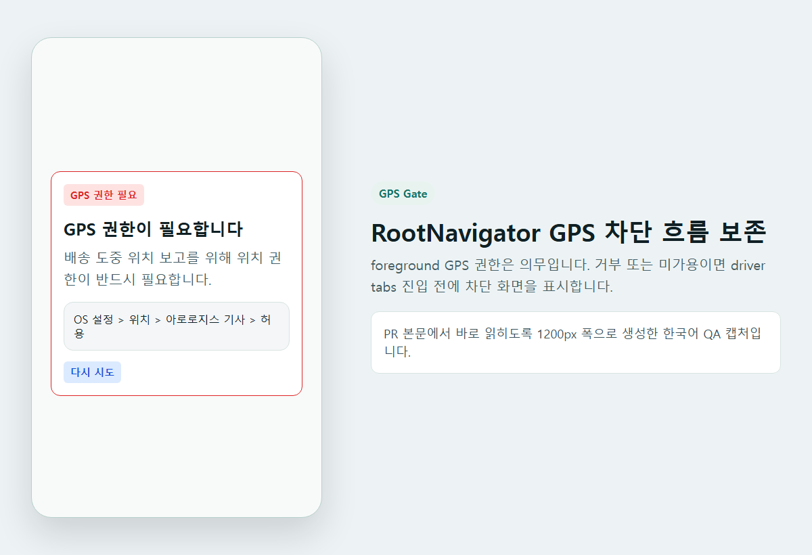
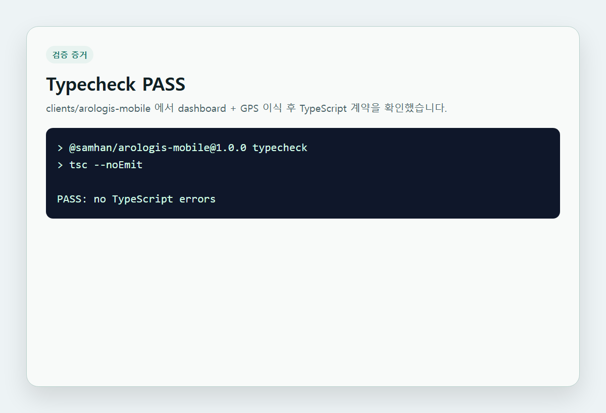
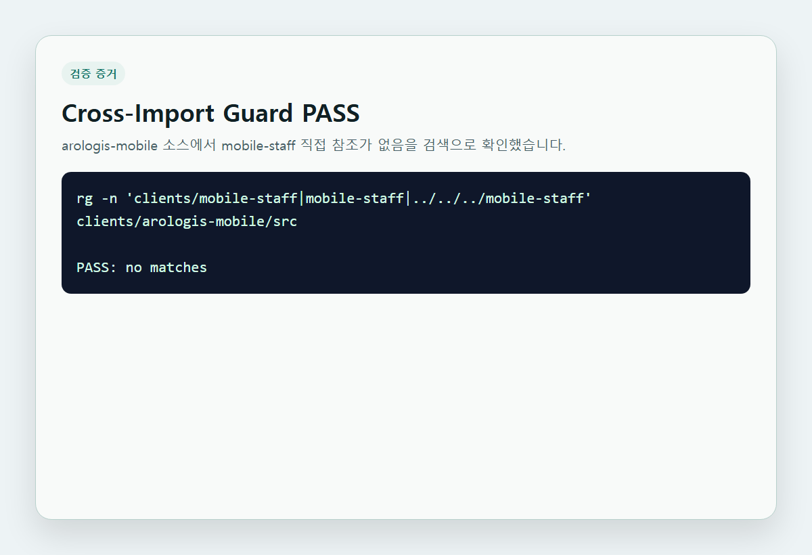

# D-AX-15 arologis-mobile dashboard/GPS QA

## Scope

D-AX-15 는 추천안 B 기준으로 `clients/arologis-mobile` 에 dashboard + GPS 런타임만 먼저 이식한다.
서명, 배송사진, 검수사진, 실제 slip 상세 bridge 는 다음 PR 선택지로 남긴다.

## Scenarios

| ID | Case | Expected |
|---|---|---|
| Q1 | 로그인 성공 후 진입 | `RootNavigator` 가 `DispatchListScreen` 대신 `DriverTabNavigator` 를 렌더링한다. |
| Q2 | 배차 탭 | `fetchTodayDispatches` 결과를 vehicle 카드로 표시하고 driverCode hash dot / 마지막 동기화 시각을 보여준다. |
| Q3 | 배차 빈 상태 | vehicle 이 없으면 "배정된 vehicle 이 없습니다" 빈 상태를 보여준다. |
| Q4 | 배차 오류 | ApiResponse 실패 또는 네트워크 오류를 dashboard 오류 카드로 보여준다. |
| Q5 | GPS 탭 | foreground 위치를 30초 간격 `APP_GPS_ACTIVE` source 로 보고한다. |
| Q6 | GPS 권한 거부 | RootNavigator 의 `GpsPermissionScreen` 차단 흐름을 유지한다. |
| Q7 | Cross-import guard | `clients/arologis-mobile/src` 에서 `mobile-staff` 직접 참조가 없다. |

## Screenshots

