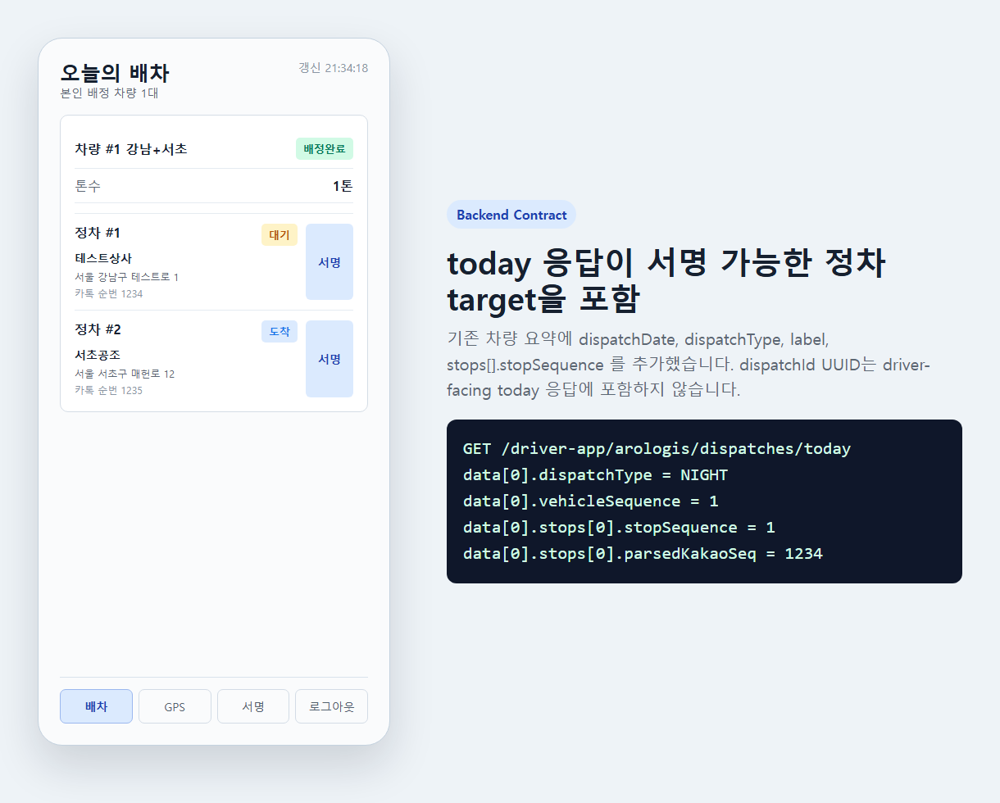
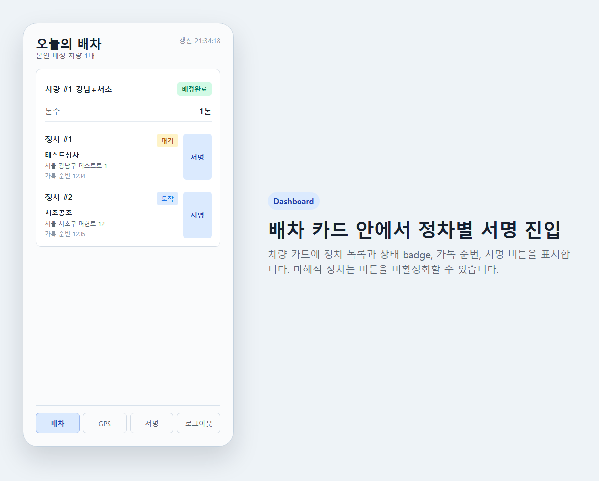
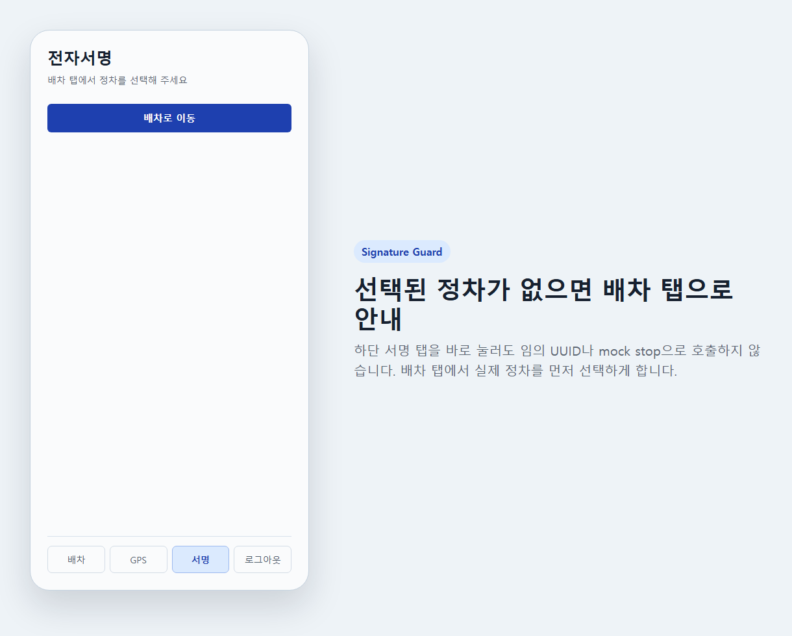
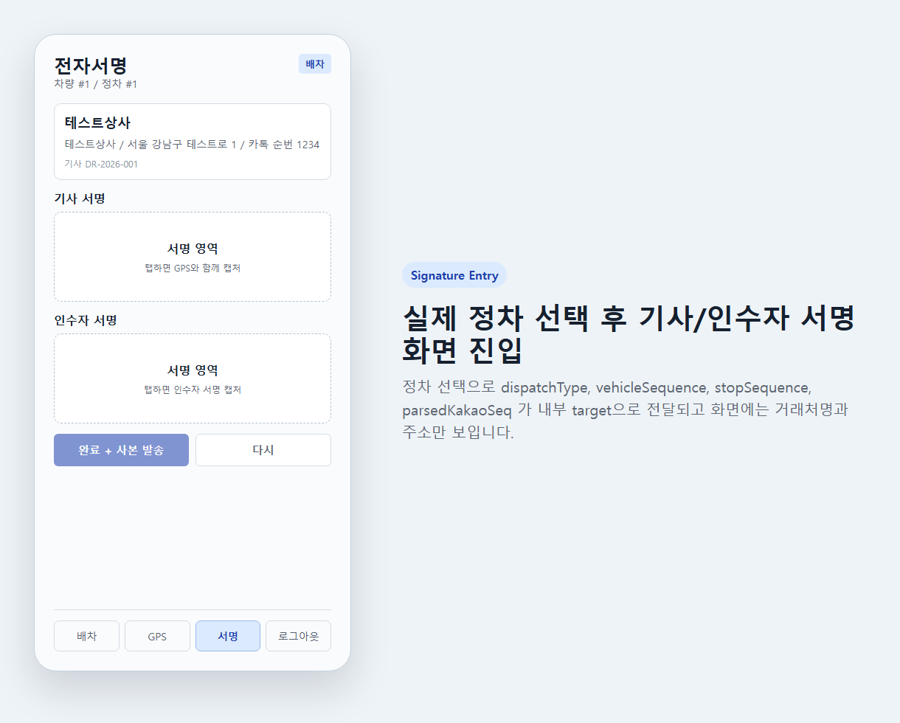
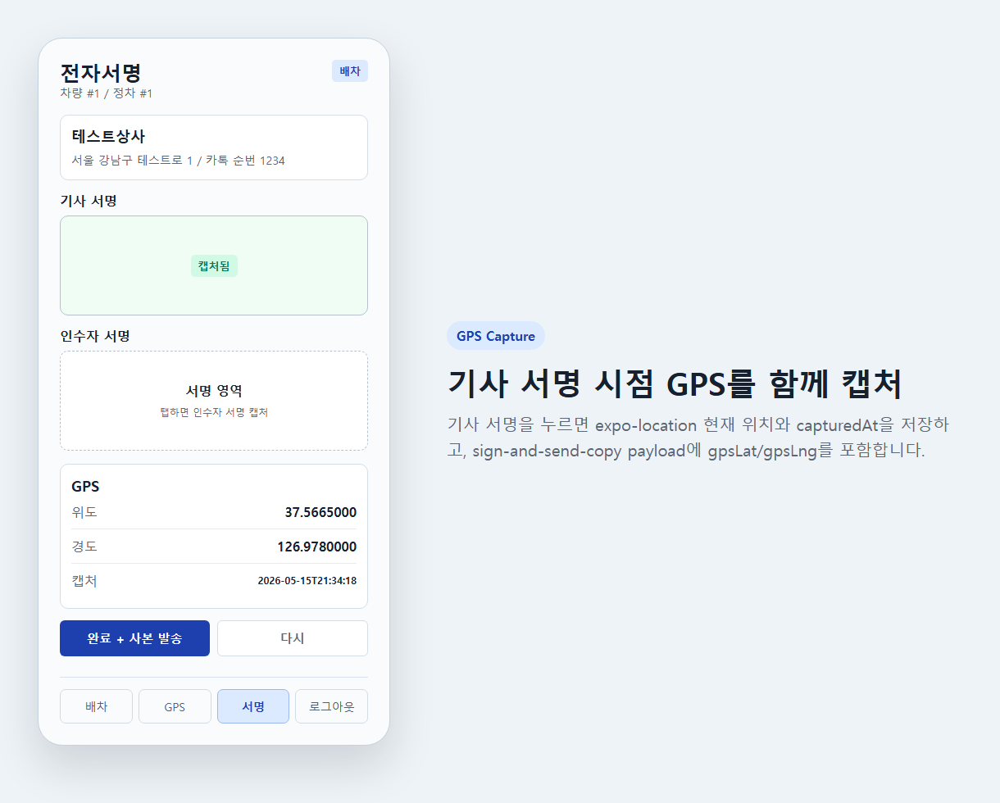
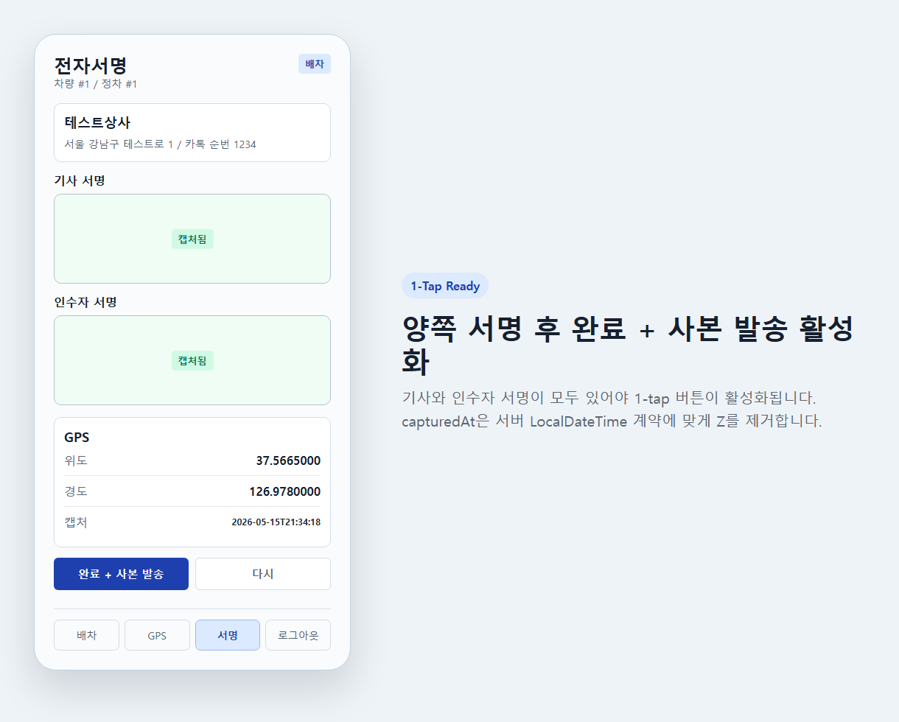
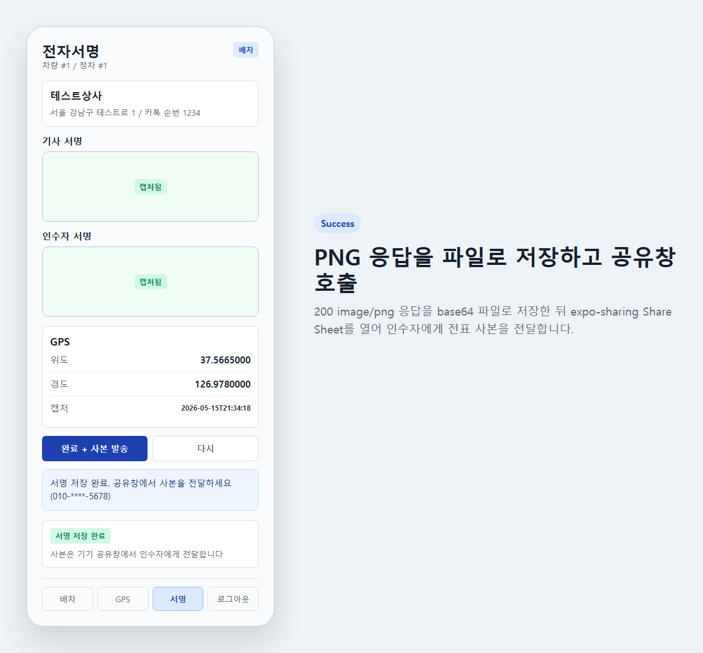
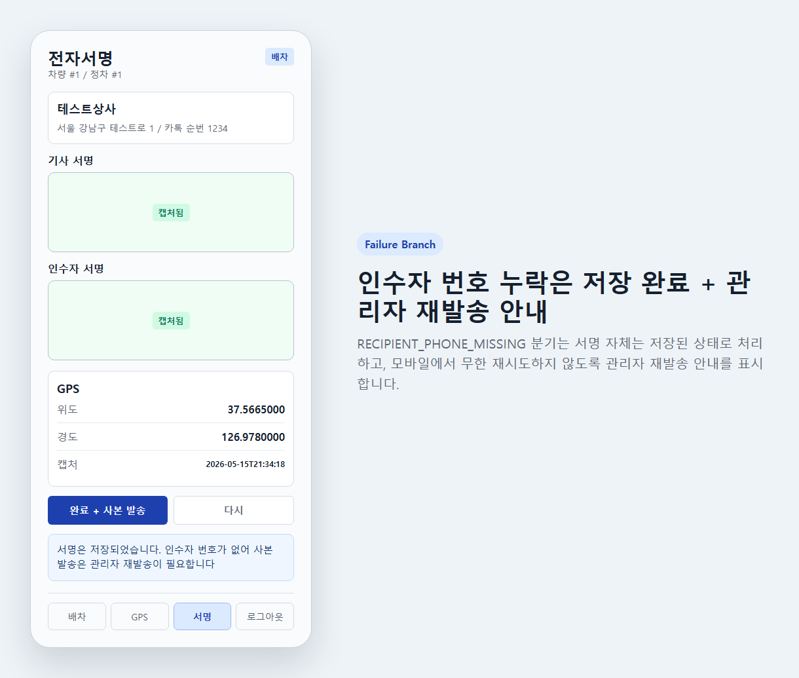
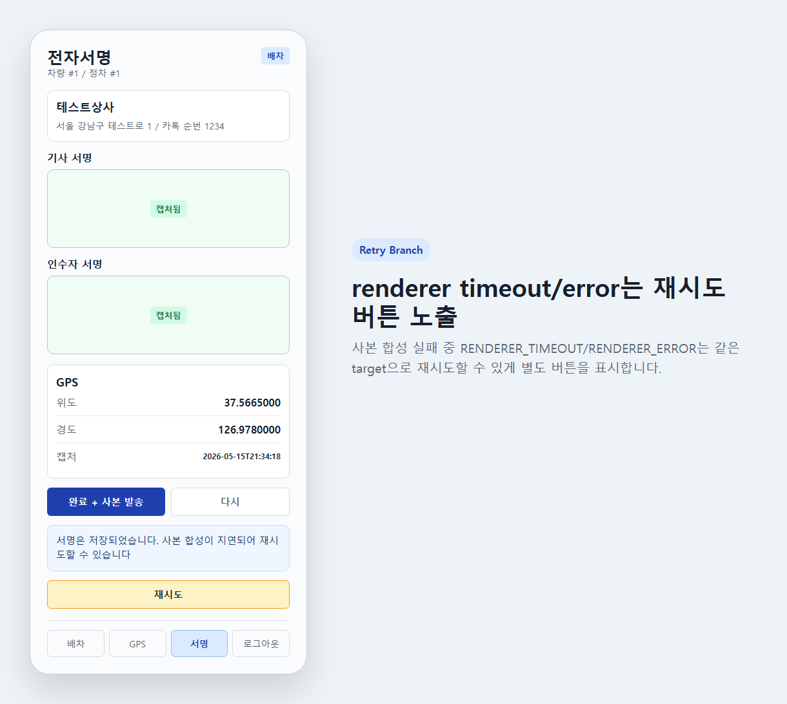
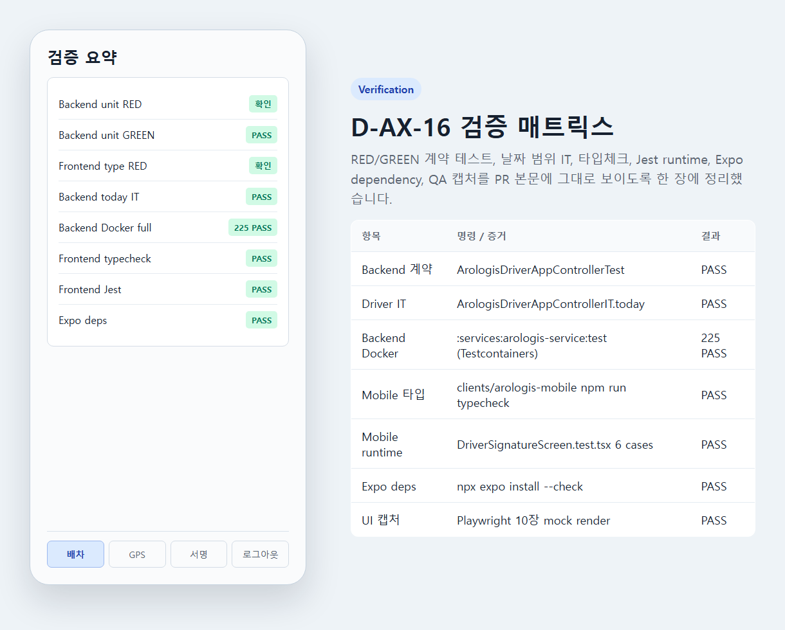

# D-AX-16 arologis-mobile signature / sign-and-send-copy QA

## Scope

D-AX-16 은 사용자 선택 1번에 따라 `clients/arologis-mobile` 에 전자서명 + sign-and-send-copy 1-tap 흐름을 이식한다.
배송사진 / 검수사진은 다음 선택지로 분리한다.

## Scenarios

| ID | Case | Expected |
|---|---|---|
| Q1 | `GET /dispatches/today` 계약 | 차량 요약에 `dispatchDate`, `dispatchType`, `label`, `stops[].stopSequence`, 정차 표시 정보가 포함되고 `dispatchId` 는 없다. |
| Q2 | 배차 카드 정차 표시 | dashboard 차량 카드 안에 정차 목록, 상태 badge, 카톡 순번, `서명` 버튼이 보인다. |
| Q3 | 서명 탭 guard | 선택된 정차 없이 서명 탭을 누르면 임의 target 호출 없이 배차 탭 이동을 안내한다. |
| Q4 | 실제 정차 선택 | `서명` 버튼으로 선택한 `dispatchType + vehicleSequence + stopSequence + parsedKakaoSeq` 가 signature screen 내부 target 이 된다. UUID 는 화면/API에 보이지 않는다. |
| Q5 | 기사 서명 GPS | 기사 서명 캡처 시 `getCurrentPositionAsync()` 로 위도/경도/capturedAt 을 저장한다. |
| Q6 | 양쪽 서명 gate | 기사 + 인수자 서명이 모두 있어야 `완료 + 사본 발송` 버튼이 활성화된다. |
| Q7 | PNG success | 200 `image/png` 응답을 base64 파일로 저장하고 `expo-sharing` Share Sheet 를 호출한다. |
| Q8 | recipient phone missing | `RECIPIENT_PHONE_MISSING` 은 서명 저장 완료 + 관리자 재발송 안내로 표시한다. |
| Q9 | renderer retry | `RENDERER_TIMEOUT` / `RENDERER_ERROR` 는 재시도 버튼을 표시한다. |
| Q10 | verification evidence | Docker/Testcontainers backend full test, frontend typecheck/Jest, Expo dependency check, domain integrity doc, screenshot generation 결과를 PR 본문에 인라인 첨부한다. |

## Screenshots

