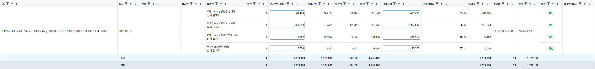
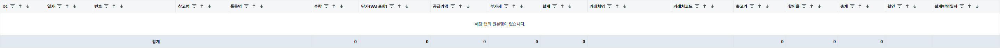
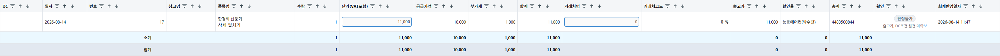
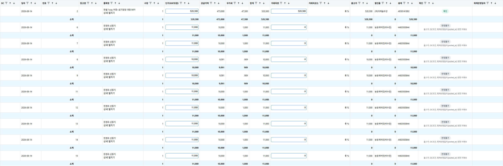

# 일마감 열 정합·행 높이 QA 보고서

## ① 어긋난 지점

- 대상: PR #1270, 브랜치 `fix/daily-closing-parity`, 기준 `origin/main` `d0250cd0e`
- 요청된 정찰 보고서 `docs/dev-reports/2026-08-17-daily-closing-parity-recon/report.md`는 이 워크트리에 존재하지 않았다.
- 현재 소스의 근거상 5열은 헤더 정의·데이터 매핑·렌더 정렬 중 어느 하나가 5칸 밀린 구조가 아니었다.
  - 헤더 정의: `clients/desktop/src/renderer/routes/DailyClosingPage.tsx:348`
  - 값 매핑: 같은 파일 `:384-405`
  - 실제 표 행 순서: 같은 파일 `:1057-1084` 및 금액 편집 셀 `:615-627`
- 따라서 이번 수정은 5열 계약을 별도 함수로 추출해 헤더와 필터·검색·정렬·다중선택 복사의 단일 원천으로 고정했다. RED에서 드러난 직접 결함은 이 계약 함수가 테스트/공유 경로로 노출되지 않아 5열 정합을 자동 검증할 수 없었던 점이다.

| 헤더 | 반드시 표시되는 값 | 소스 근거 |
|---|---|---|
| 거래처명 | `row.partnerName` | `DailyClosingPage.tsx:396` |
| 거래처코드 | `row.partnerCode` | `DailyClosingPage.tsx:397` |
| 출고가 | `row.productPrice` | `DailyClosingPage.tsx:398` |
| 할인율 | `row.discountRate` | `DailyClosingPage.tsx:399` |
| 총계 | `row.grandTotal` | `DailyClosingPage.tsx:400` |

## ② RED 원문

수정 전 추가한 5열 계약 테스트의 첫 실행 결과:

```text
DailyClosingPage.test.tsx (32 tests | 5 failed)
TypeError: dailyClosingColumnValue is not a function
```

즉 다섯 열 각각의 `헤더 X 열의 값이 X이다` 단정이 모두 RED였고, 이를 통과시키는 매핑 계약을 구현했다.

## ③ 고친 내용 및 수단 선택 근거

1. `dailyClosingColumnValue`를 export하고 표의 필터·전역 검색·정렬·선택값 조회가 모두 이를 사용하게 했다. 다섯 열의 돌려막기 재발을 단위 테스트로 직접 차단한다.
2. `수정 불가` 조건부 `<span>`은 제거하되 잠금 정보는 제거하지 않았다. 잠긴 입력 자체에 `disabled`와 사유 `title`을 유지했다(`DailyClosingPage.tsx:594-603`). 이 방식은 행마다 자식 요소 수를 늘리지 않고 키보드/마우스 접근 시 브라우저 툴팁으로 같은 정보를 전달한다.
3. 모든 데이터 `<tr>`에 `height: 57px`를 적용했다(`DailyClosingPage.tsx:350-351`, `:1057`). 품목명/상세 링크와 확인 사유가 두 줄인 현재 콘텐츠를 수용하는 최소 기준이며, 잠금 여부와 무관하게 행 높이를 동일하게 만든다.

## ④ GREEN

- `npx vitest run src/renderer/routes/DailyClosingPage.test.tsx`: **33/33 통과**
  - 5개 열 매핑 계약 통과
  - 금액 편집·양방향 할인율 동기화 통과
  - 잠긴 입력의 `disabled` 및 사유 `title` 통과
  - 잠긴 행/편집 가능 행의 셀 자식 구조와 `57px` 높이 기준 통과
- `npm run typecheck`: **통과**
- `npm run lint`: **통과, 오류 0건** (기존 경고 196건)
- `npm run build`: **통과**

## ⑤ 17열 전체 라이브 캡처 및 열별 정합

해상도 3200px 폭으로 캡처했다. 라이브 로그인 HTTP 200 및 공유 스택 24개 healthy를 확인했으며, 조회·필터만 수행하고 공유 DB/전표는 변경하지 않았다.

| 날짜 | 탭 | 행 수 | 측정 높이 |
|---|---|---:|---|
| 2026-08-03 | 선발행 | 4 | `57,57,57,57` |
| 2026-08-14 | 결과 | 1 | `57` |
| 2026-08-14 | 선발행 | 12 | `57` × 12 |

2026-08-14는 결과 1행 + 선발행 12행으로 총 13행이며, 요청한 날짜별 라이브 행 수를 모두 확인했다. 화면의 17열 순서는 다음과 같다.

`DC · 일자 · 번호 · 창고명 · 품목명 · 수량 · 단가(VAT포함) · 공급가액 · 부가세 · 합계 · 거래처명 · 거래처코드 · 출고가 · 할인율 · 총계 · 확인 · 회계반영일자`

| 헤더 | 캡처에서 확인한 값의 의미 | 정합 결과 |
|---|---|---|
| 거래처명 | 거래처 이름 | 정합 |
| 거래처코드 | 거래처 코드 | 정합 |
| 출고가 | 출고 금액 | 정합 |
| 할인율 | 할인율(%) | 정합 |
| 총계 | 최종 총계 금액 | 정합 |









## ⑥ 행 높이 동일 캡처

라이브 화면은 회계반영 결과와 선발행 탭이 잠긴 행/편집 가능 행으로 분리되어 있어 각각 캡처했다. 결과 탭은 잠긴 입력, 선발행 탭은 편집 가능한 입력이며 두 캡처 모두 데이터 행 높이 57px이다. 같은 표 안에 두 상태를 섞은 렌더 구조는 테스트에서 직접 검증했다.


테스트의 동일 구조 단정:

```text
잠긴 셀과 편집 가능 셀의 children.length 동일
두 행 모두 style에 height: 57px
잠긴 input은 disabled이며 title에 회계전표 사유 포함
두 금액 셀 모두 수정 불가 태그 span 없음
```

## ⑦ 조건부 셀 요소 전수 확인

이 화면의 일반 데이터행에서 확인한 조건부 요소는 다음과 같다.

- 금액 편집 셀: `수정됨` `<span>` 1곳(`:617`), 오류 `<span>` 1곳(`:618`)
- 확인 셀: 확인 사유 `<span>` 1곳(`:428`)
- 품목명 셀: 품목명/상세 버튼을 담는 고정 `<div>` 1곳(`:1062-1072`)
- 펼친 상세행: 상세 정보 `<div>` 1곳과 상세 필드 `<span>`들(`:1099-1107`)
- 이번 결함의 `disabled ? <span>수정 불가</span>`는 제거하고 input `title`로 대체했다.

다른 화면의 같은 문구/수정요청 패턴은 목록만 남긴다. 이 PR에서는 고치지 않았다.

- `clients/desktop/src/renderer/routes/admin/AccountingEditRequestsPage.tsx:310`
- `clients/desktop/src/renderer/routes/admin/SlipEditRequestsPage.tsx:361`

## ⑧ 편집·잠금 경로 무손상

- 단가/출고가/할인율 편집과 양방향 할인율 동기화 테스트를 통과했다.
- 회계반영 뒤 금액 입력의 `disabled` 잠금은 유지했다.
- 잠긴 행은 사유를 input `title`로 계속 전달한다.
- 전표별 합계행·필터·정렬·다중선택 복사 경로는 공통 매핑 함수로 전환했으며 전체 typecheck/lint/build와 화면 테스트를 통과했다.
- 전표 생성, 레거시 부재 기능, 견적품목 기준 전환, 상세 6칸은 범위 밖으로 건드리지 않았다.

## ⑨ 프로세스 회수

- 기동한 Vite 개발 서버 1건: 회수 완료
- Playwright 브라우저: 테스트 종료와 함께 회수 완료
- 격리 컨테이너: 기동하지 않음, 잔여 0
- 포트 5175 listener: 회수 후 0
- 공유 스택은 중지·변경하지 않음
- `_local` 캡처와 Vite 로그를 제거했으며, 자격·시트 ID·키 값은 보고서에 기록하지 않았다.

커밋·push·git add는 수행하지 않았다.
