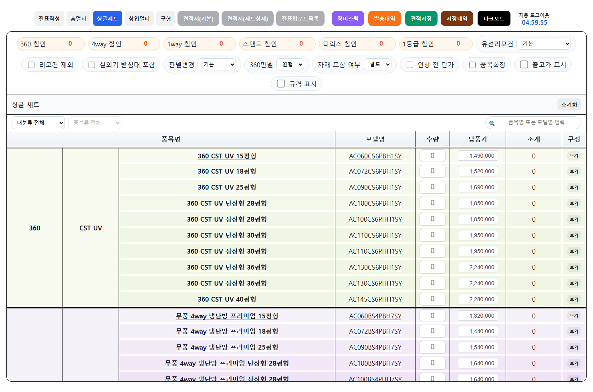

# 품목 노출 구분 + 시트 순서 보존 (요구사항1 PR-A) — 실 QA

- 일시: 2026-06-10 / branch `feat/product-exposure-display-order`
- 개발책임자 결정: 견적서/주문서엔 **designated 품목만 노출**(전 품목 노출 금지) + **구글 시트 노출 순서 그대로 유지**.
- 방법: 실 product_db + standalone-boot product-service(본 PR 코드 + V13 마이그레이션) 실 sync + 실 Google Sheet 대조. 가짜 데이터 0.

## ① V13 — display_order 컬럼 + sync 적재

- V13 마이그레이션 적용 성공(schema v12→v13). `products.display_order` + 정렬 인덱스.
- sync 가 각 시트 탭의 **유효 데이터 행 순번(1부터)** 을 display_order 로 적재.
- 실 sync 후 적재율: HOME_MULTI 119/119, SINGLE_SET 276/276, COMMERCIAL_MULTI 338/338, OLD 38/38 — **전 카테고리 100%**.

## ② usageScope stomping 버그 fix (필터가 적발한 기존 데이터 손상)

필터 적용 후 SINGLE_SET 276개가 전부 `usage_scope=NONE`(노출 불가)로 드러남 — 원인: **품목이 여러 탭에 출현 시 나중 탭(구성품, NONE scope)이 견적 탭의 usageScope/display_order 를 덮어씀**.

- fix: 노출 분류(usageScope/estimateCategory/display_order)는 품목의 **홈 탭(최초 productCategory 일치 탭)에서만** 설정. 가격/변동DC/사양은 어느 탭에서든 갱신(단가인상 탭 권위).
- fix 후 재sync 결과 (전 카테고리 100% BOTH 복원, display_order 홈탭 순서):

| 카테고리 | usage_scope | count | max(display_order) |
|---|---|---|---|
| HOME_MULTI | BOTH | 119 | 119 |
| SINGLE_SET | BOTH | 276 | 286 |
| COMMERCIAL_MULTI | BOTH | 338 | 412 |
| OLD | BOTH | 38 | 39 |

(이전: SINGLE_SET 전부 NONE / max 1725 stomp → fix 후 BOTH / max 286 = 싱글세트 탭 순서)

## ③ 엔드포인트 노출 필터 + 시트 순서 정렬

`GET /products/internal/estimate-catalog/products?category=SINGLE_SET` (usageScope IN ESTIMATE/BOTH + ORDER BY display_order):

```
count 276
1 AC060CS6PBH1SY | 360 CST UV
2 AC072CS6PBH1SY | 360 CST UV
3 AC090CS6PBH1SY | 360 CST UV
4 AC100CS6PBH1SY | 360 CST UV 단상형
5 AC100CS6PHH1SY | 360 CST UV 삼상형
6 AC110CS6PBH1SY | 360 CST UV 단상형
7 AC110CS6PHH1SY | 360 CST UV 삼상형
8 AC130CS6PBH1SY | 360 CST UV 단상형
```

**실 시트 '싱글 세트_단가인상' 상위 8행과 모델·순서 정확 일치**(시트 직접 read 대조). 노출 제외 품목(NONE)은 미반환.

## ④ 실 Docker QA — 종합견적서 실 UI(실사용자 화면)

- 실행: Docker 스택 product-service(8084, V13+stomping fix 적용본) + user-service(8083, 인증 게이트) 가동.
- estimate-app `CATALOG_SOURCE=db` 로 :5183 기동 → 실 사원 인증(`dev_master@samhan-air.com` → user-service by-email → `[DEV-SEED] 개발마스터` 통과) → 싱글세트 카탈로그 렌더.
- 브라우저 `SS_RAW`(노출 카탈로그 원천) **count 276**, 상위 6 모델 = `AC060CS6PBH1SY, AC072CS6PBH1SY, AC090CS6PBH1SY, AC100CS6PBH1SY, AC100CS6PHH1SY, AC110CS6PBH1SY` — ③ 엔드포인트와 **정확 일치**.



화면의 싱글 세트 테이블이 `360 CST UV 15평형(AC060CS6PBH1SY) → 18평형(AC072) → 25평형(AC090) → …` 시트 row 순서 그대로 렌더(노출 designated 품목만, NONE 제외). 캡처 스크립트: `clients/web/estimate-app/scripts/qa-capture-457.mjs`.

## 테스트

- product-service 전체 테스트 green. ProductRepositoryIT `findExposedCatalog_filtersByUsageScope_ordersByDisplayOrder`(BOTH/ESTIMATE 필터 + display_order ASC NULLS LAST 검증) 신규.

## 비스코프(요구사항1 후속 PR-B)

- **품목별 수동 토글 UI**(데스크톱 품목관리 — 견적/주문 노출 개별 토글, 시트 없는 품목 수동 노출) + 수동 override 가 sync 에 보존되는 모델.
- 데스크톱 estimate/order 폼의 productApi.searchProducts usageScope 필터 적용(현재 전 품목 노출).
- order(주문서) 카테고리 노출(PARTNER_ORDER) 분기.
