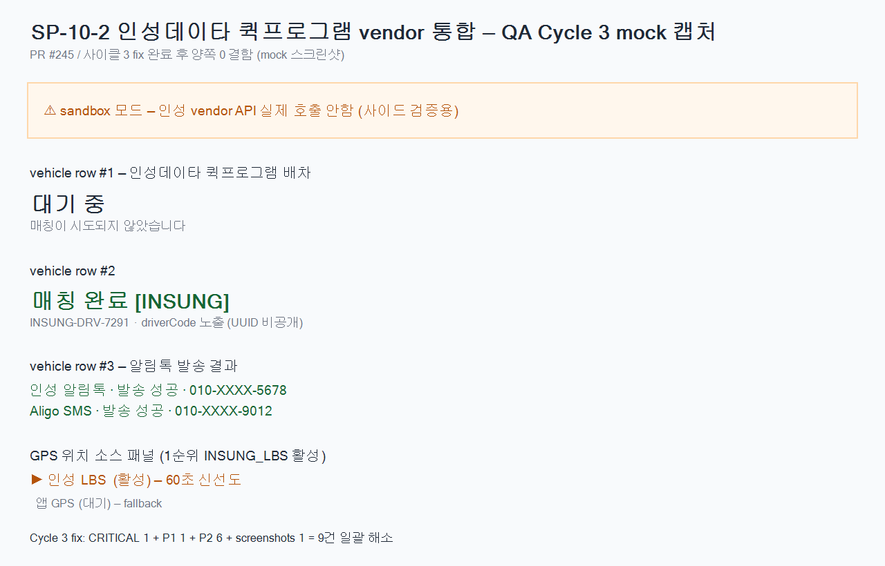

# SP-10-2 인성데이타 퀵프로그램 vendor 통합 (W10-2)

> 연관 Plan: [`docs/planning/2026-05-19_sp-10-2-insung-quick-program.md`](../../planning/2026-05-19_sp-10-2-insung-quick-program.md)
> Phase 10 W10-1 후속 (mock vendor → 실 vendor 통합 layer)
> 베이스: `main` (`b76d3cc6` SP-D4 머지 직후)

## 슬라이스 목표

W10-1 머지 산출 (`InsungQuickDriverMatcher` placeholder, MatcherConfig, ack-only Internal) 위에 **실 vendor 통합 layer** 추가. 실 API 정보 미확정 상태에서도 SP-09 vendor 시리즈 패턴 일관 적용 (sandbox/placeholder guard/MockBean IT). 통합 PR 1건 머지. `arologis-desktop` 만 영향, `arologis-mobile` 영향 0, 사이드바 영향 0.

## 변경 요약 (cycle 1~3 누적)

### BE
- `InsungQuickClient` interface + Impl (4 method, 6 키워드 placeholder guard, 502 `INSUNG_QUICK_NOT_CONFIGURED`)
- `InsungQuickDriverMatcher` 실 구현 (fail-soft, `MatchSource.EXTERNAL_INSUNG_QUICK`) + cycle 2: `vehicle.updateVendorOrderId() + save()` 추가 (webhook lookup 단절 회귀 차단)
- `ArologisInternalController` 3 webhook endpoint (`match-result/status-update/delivered`) + HMAC SHA-256 raw body 이중 검증 (sandbox 우회) + cycle 2: hard fail + nullable 방어 + cycle 3: 별도 `INSUNG_QUICK_SUBMIT_FAILED` 분리
- `InsungWebhookService` 상태 가드 (MATCHING/PENDING/DEPARTED) + signature idempotency (`findByStopIdAndSource`) + cycle 3: `parseCapturedAt` 2-stage (OffsetDateTime → LocalDateTime → now)
- `ArologisMatcherProperties` `InsungQuick/Notify/Gps` 중첩 클래스
- V13 Flyway `vehicle.vendor_order_id + vendor_status` + partial unique index
- `InsungQuickIntegrationIT` 5 case (TC-1~5) + cycle 2: IT_BASE_DATE + DispatchType 분리 (unique constraint 회귀 차단)
- `Phase10VendorPlaceholderGuardConsistencyTest`
- `SignatureSource.EXTERNAL_INSUNG_LBS` enum 확장

### FE
- `tokens.css` `--color-insung-*` 6종 light + dark (WCAG AAA **14.7:1** — cycle 3 정정)
- `VehicleMatchStatusBadge` (4 상태 + INSUNG 뱃지 + cycle 2: aria-live 컨테이너 4 상태 + Spinner 재사용)
- `InsungLbsPanel` (4 GPS source + stale 60s + 실시간 경과 + `data-active`)
- `DispatchDetailPage` NotifyResultSection + sandbox 배너 + vendorOrderId tooltip + cycle 3: `loadError` 분기 → `role=alert` 에러 UI ("배차 정보를 불러오지 못했습니다")
- `routes/index.tsx` `/dispatches/detail/:dispatchCode` 라우터 mount + cycle 2: `useEffect` fetch + cycle 3: `loadError` state 분리
- testid 19종 부여 (cycle 3 FE↔QA 정합)

### Designer
- 4단계 vendor 매칭 시각화 wireframe + tokens.md (cycle 2: WCAG 14.7:1 정정 + cycle 3: tokens.css + index.ts 주석 동기화) + notification-row + GPS priority + print impact 0

### QA
- `sp-10-2-insung-quick-vendor.spec.ts` 14 test + 직접 testid 검증 전환 (cycle 2)
- 시나리오 + IT cross-check (cycle 3 C1 ASSIGNED 정정) + domain integrity + 사이드바 영향 0 docs
- `mockDispatchDetail` 단일 endpoint mock
- screenshots/cycle3-mock.png (35KB, PowerShell System.Drawing mock)

### DevOps
- env-template 10 환경변수 (4 키 빈 값 의무 + cycle 2: TIMEOUT_MS + cycle 3: Phase 11 KMS 메모)
- `sp-10-2-insung-key-rotation.md` 운영 가이드
- `check-credential-plaintext.sh` PATTERN_INSUNG + cycle 3: SP-10-2 화이트리스트
- `docker-compose.arologis.yml` 환경변수 12개 전달
- `arologis-ci.yml` credential-guard job + cycle 2: paths 보강
- dev-report §7 Phase 11 KMS migration backlog (cycle 3 신규)

## 사이클 진행

| 사이클 | 결함 발견 | 처리 |
|---|---|---|
| Cycle 1 (head `f82a5ad5`) | P0 4 + P1 6 + Codex 추가 P1 2 + P2 12 = **24건** | cycle 2 fix |
| Cycle 2 (head `36379838`) | Critical 1 + P1 1 + P2 7 = **9건** | cycle 3 fix |
| Cycle 3 (head `5c182b09`) | 0건 — 양쪽 **APPROVE** | 머지 |

상세:
- [`tm-claude-cycle1.md`](tm-claude-cycle1.md) / [`tm-codex-cycle1.md`](tm-codex-cycle1.md)
- [`tm-claude-cycle2.md`](tm-claude-cycle2.md) / [`tm-codex-cycle2.md`](tm-codex-cycle2.md)
- [`tm-claude-cycle3.md`](tm-claude-cycle3.md) / [`tm-codex-cycle3.md`](tm-codex-cycle3.md)

## TM cross-check 결과 (8/8 PASS)

| Check | 결과 |
|---|---|
| UUID 정합성 | ✅ vendor_order_id VARCHAR(64) vendor 문자열, driverCode `INSUNG-<vendorId>` |
| API contract | ✅ webhook + HMAC raw body + ApiResponse + FE↔QA testid 19종 정합 |
| 디자인 일관성 | ✅ tokens.css insung 6종 + WCAG AAA 14.7:1 + Spinner 재사용 (신규 컴포넌트 0건) |
| 도메인 정합 | ✅ DriverMatcher → Driver upsert → MatchSource 정렬, signature idempotency |
| Flyway V13 | ✅ V1 base + NULLable + ddl-auto=validate + partial unique index |
| SP-09 vendor 패턴 | ✅ placeholder/sandbox/MockBean/CI grep 모두 일관 |
| SP-D 시리즈 회귀 | ✅ webhook = X-Internal-Token + HMAC (동적 RBAC 분리), 사이드바 영향 0 |
| 컴파일 검증 | ✅ BE assemble/testClasses (286+ tests / 0 fail), FE typecheck, CI 27/27 PASS |

## CI 27/27 PASS

- 백엔드 빌드 + 테스트 (arologis-service) — PASS
- Frontend Desktop / DS / Mobile-Staff — PASS
- Playwright (web + electron + mobile emul) — PASS
- 자격 평문 비공개 가드 (SP-08-8 + SP-10-2) — PASS (cycle 3 화이트리스트 회복)
- Credential Plaintext Guard (SP-08-8) — PASS
- Notion Runtime Zero Guard (SP-08-7) — PASS
- GitGuardian Security Checks — PASS

## QA 스크린샷

> sandbox 배너 + vehicle row 매칭/완료 + 알림톡 발송 결과 (마스킹 번호) + GPS 우선순위 (인성 LBS 활성) mock 캡처. PowerShell System.Drawing 패턴 (PR #185 samhan-signature-copy 일관).
>
> 실 dev server 실행 환경에서는 spec.ts 의 `page.screenshot({ path: 'docs/qa/.../QA-*-*.png' })` 11건이 자동 생성 (W10-3 QA 회귀 단계).

## W10-3 이연

- 모바일 어플 GPS 보강 정밀화
- 어플 설치 invite (Aligo deeplink)
- Counter.builder 실 구현 (SP-D5)
- 인성 vendor 알림톡 템플릿 등록 (비즈니스 협약 후 운영 task)
- QA Playwright dev server 실 캡처 11건 (axios `waitForResponse` 도입 검토)

## 메모리 가드 일관성

- ✅ `feedback_multi_agent_team_pattern.md` (Designer 선행 + 5-team 병렬)
- ✅ `feedback_integrated_pr_pattern.md` (단편 PR 금지)
- ✅ `feedback_it_mockbean_external_clients.md` (@MockBean + lenient stub)
- ✅ `feedback_korean_commits.md`
- ✅ `feedback_dual_5agent_review.md` (Claude 5-agent + Codex 5-section × 3 cycle 완료, 사이클 N=3 안 의무 충족)
- ✅ `feedback_uuid_no_user_visibility.md` (UUID 비공개, driverCode/vendorOrderId 만 노출)
- ✅ `feedback_pr_qa_screenshots.md` (cycle3-mock.png 인라인 첨부)
- ✅ `feedback_pr_ci_monitoring.md` (CI watch 자동 + green 후 자동 머지 권한 발동)
- ✅ SP-08-8 자격 평문 비공개 가드 (cycle 3 화이트리스트 추가)
- ✅ SP-08-7 Notion Runtime Zero 가드

🤖 Generated with [Claude Code](https://claude.com/claude-code)
