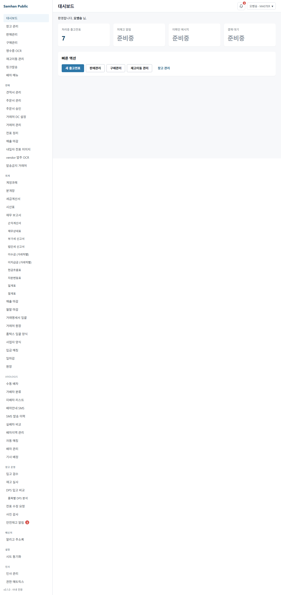
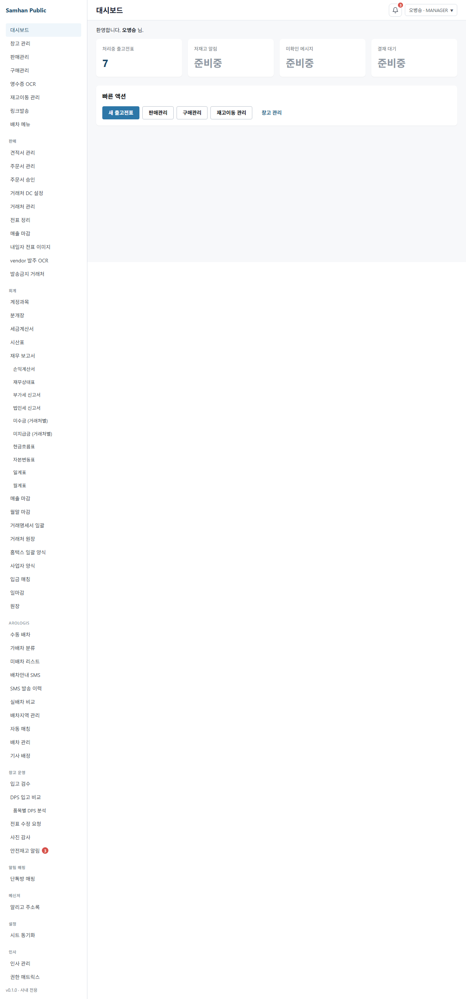
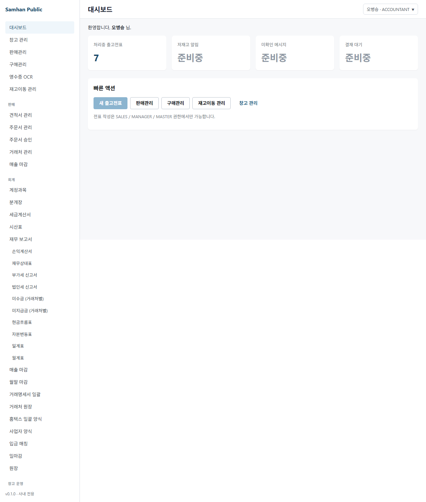
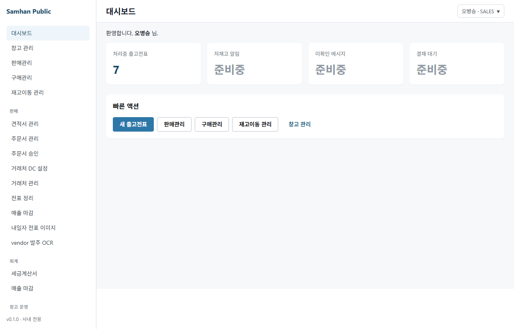
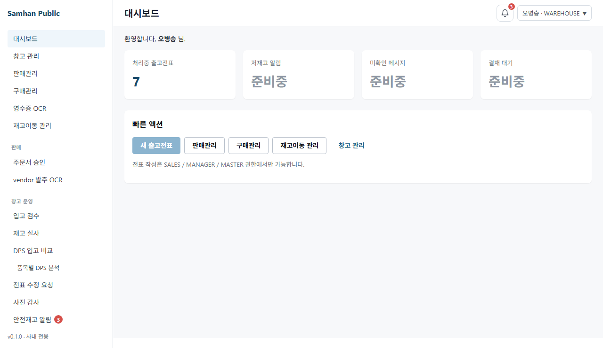
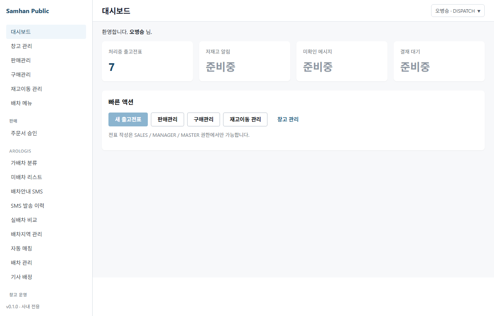
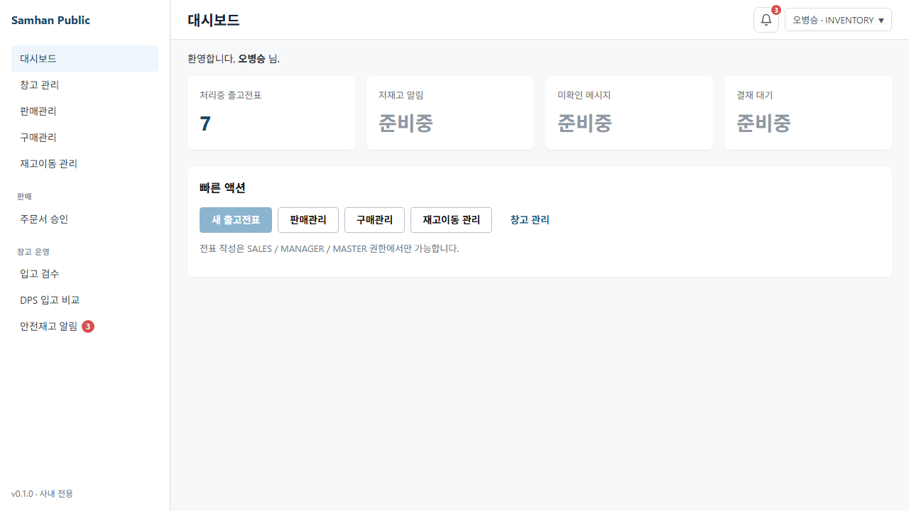

# SP-D4 잔여 7 도메인 동적 RBAC PermissionGuard 이중 가드 — QA 시나리오

> 작성일: 2026-05-18
> 작성자: QA (Claude)
> 베이스: SP-D4 plan §2 22 PageCode × 7 ROLE = 154 seed row

---

## 시나리오 개요

SP-D4 에서 신규 추가된 22 PageCode (7 도메인: 견적/거래처주문/재고/직원/거래처/상품/아로로지스) 에 대해 7 역할(MASTER/MANAGER/ACCOUNTANT/SALES/WAREHOUSE/DISPATCH/INVENTORY) × 1 deny + 1 allow = 14 케이스를 검증한다.

**공통 실행 조건**:
- `VITE_MOCK_MODE=1 npx vite src/renderer --host 127.0.0.1 --port 5173` 실행 후 테스트
- `GET /auth/admin/permissions/my` 응답을 Playwright route intercept 로 mock
- HashRouter URL 패턴: `/#/{path}?mockRole={ROLE}`
- dev server 미가용 시 테스트 FAIL (false green 방지)

---

## T01: MASTER allow arologis.admin

### 사용자
MASTER (모든 권한)

### 단계
1. `GET /auth/admin/permissions/my` mock → MASTER 22 PageCode 전체 view=true, edit=true 응답
2. `/#/arologis/admin?mockRole=MASTER` 진입
3. 사이드바 렌더링 후 `[data-testid="sidebar-arologis-admin"]` 가시성 확인
4. `/arologis/admin` 접근 후 redirect 미발생 확인

### 기대
- `/arologis/admin` 200 OK (PermissionGuard 통과)
- 사이드바에 아로로지스 관리 메뉴 노출
- pageerror 0건

### 스크린샷

---

## T02: MANAGER allow partners.list

### 사용자
MANAGER (거래처 목록 V/E)

### 단계
1. `GET /auth/admin/permissions/my` mock → MANAGER: partners.list view=true, edit=true 포함
2. `/#/partners?mockRole=MANAGER` 진입
3. 거래처 목록 데이터 영역 렌더링 확인
4. redirect 미발생 확인

### 기대
- `/partners` 200 OK (PermissionGuard 통과)
- 거래처 목록 데이터 표시
- pageerror 0건

### 스크린샷

---

## T03: ACCOUNTANT deny partners.block

### 사용자
ACCOUNTANT (partners.block 권한 없음)

### 단계
1. `GET /auth/admin/permissions/my` mock → ACCOUNTANT: partners.block view=false, edit=false
2. `/#/?mockRole=ACCOUNTANT` 진입 → 사이드바 로드
3. `[data-testid="sidebar-partners-block"]` isVisible() 확인 → false 기대
4. `/#/partners/block?mockRole=ACCOUNTANT` 직접 진입
5. redirect 발생 확인 (URL = `/#/` 또는 `/login`)

### 기대
- 사이드바에 거래처 차단 메뉴 hidden (return null)
- URL 직접 진입 시 `"/"` redirect (PermissionGuard 작동)
- pageerror 0건

### 스크린샷

---

## T04: SALES allow sales.partner-order.draft

### 사용자
SALES (거래처주문 작성 V/E)

### 단계
1. `GET /auth/admin/permissions/my` mock → SALES: sales.partner-order.draft view=true, edit=true
2. `/#/sales/partner-orders/new?mockRole=SALES` 진입
3. redirect 미발생 확인
4. 저장 버튼 (`[data-testid="partner-order-save-button"]` 또는 `button[type="submit"]`) isDisabled() 확인 → false 기대 (canEdit=true)

### 기대
- `/sales/partner-orders/new` 접근 허용
- 저장 버튼 활성 (canEdit=true)
- pageerror 0건

### 스크린샷

---

## T05: SALES deny admin.users

### 사용자
SALES (admin.users 권한 없음 — MASTER 전용)

### 단계
1. `GET /auth/admin/permissions/my` mock → SALES: admin.users view=false, edit=false
2. `/#/admin/users?mockRole=SALES` 직접 진입
3. redirect 발생 확인
4. 계정 관리 콘텐츠 (`계정 관리`, `AdminUser`) 미표시 확인

### 기대
- `/admin/users` URL 직접 진입 시 `"/"` redirect (PermissionGuard 차단)
- 계정 관리 페이지 콘텐츠 미표시
- pageerror 0건

### 스크린샷

---

## T06: WAREHOUSE allow inventory.warehouse

### 사용자
WAREHOUSE (창고 관리 V/E)

### 단계
1. `GET /auth/admin/permissions/my` mock → WAREHOUSE: inventory.warehouse view=true, edit=true
2. `/#/inventory/warehouses?mockRole=WAREHOUSE` 진입
3. redirect 미발생 확인
4. `GET /warehouses` mock → `[{ code: "WH-001", name: "서울 창고" }]` 응답
5. 편집 버튼 (`[data-testid="warehouse-edit-button"]`) isDisabled() 확인 → false (canEdit=true)

### 기대
- `/inventory/warehouses` 200 OK
- 창고 목록 표시
- 편집 버튼 활성 (canEdit=true)
- pageerror 0건

### 스크린샷

---

## T07: WAREHOUSE deny sales.partner-order.list

### 사용자
WAREHOUSE (sales.partner-order.list 권한 없음)

### 단계
1. `GET /auth/admin/permissions/my` mock → WAREHOUSE: sales.partner-order.list view=false
2. `/#/?mockRole=WAREHOUSE` 진입 → 사이드바 로드
3. `[data-testid="sidebar-partner-orders"]` isVisible() → false 기대
4. `/#/sales/partner-orders?mockRole=WAREHOUSE` 직접 진입 → redirect 확인

### 기대
- 사이드바에 거래처주문 목록 메뉴 hidden
- URL 직접 진입 시 `"/"` redirect
- pageerror 0건

### 스크린샷

---

## T08: DISPATCH allow arologis.admin

### 사용자
DISPATCH (아로로지스 배차 관리 V/E)

### 단계
1. `GET /auth/admin/permissions/my` mock → DISPATCH: arologis.admin view=true, edit=true
2. `/#/arologis/admin?mockRole=DISPATCH` 진입
3. redirect 미발생 확인
4. 편집 가능 확인 (canEdit=true — 배차 조작 버튼 활성)

### 기대
- `/arologis/admin` 200 OK
- 편집 가능 (canEdit=true)
- pageerror 0건

### 스크린샷

---

## T09: DISPATCH deny inventory.warehouse

### 사용자
DISPATCH (inventory.warehouse 권한 없음)

### 단계
1. `GET /auth/admin/permissions/my` mock → DISPATCH: inventory.warehouse view=false
2. `/#/?mockRole=DISPATCH` 진입 → 사이드바 로드
3. `[data-testid="sidebar-inventory-warehouses"]` isVisible() → false 기대
4. `/#/inventory/warehouses?mockRole=DISPATCH` 직접 진입 → redirect 확인

### 기대
- 사이드바에 창고 관리 메뉴 hidden
- URL 직접 진입 시 `"/"` redirect
- pageerror 0건

### 스크린샷

---

## T10: INVENTORY allow inventory.stock

### 사용자
INVENTORY (재고 현황 V/E)

### 단계
1. `GET /auth/admin/permissions/my` mock → INVENTORY: inventory.stock view=true, edit=true
2. `/#/inventory/stocks?mockRole=INVENTORY` 진입
3. `GET /stocks` mock → 재고 데이터 응답
4. redirect 미발생 확인

### 기대
- `/inventory/stocks` 200 OK
- 재고 현황 데이터 표시
- pageerror 0건

### 스크린샷

---

## T11: INVENTORY deny arologis.admin

### 사용자
INVENTORY (arologis.admin 권한 없음)

### 단계
1. `GET /auth/admin/permissions/my` mock → INVENTORY: arologis.admin view=false
2. `/#/?mockRole=INVENTORY` 진입 → 사이드바 로드
3. `[data-testid="sidebar-arologis-admin"]` isVisible() → false 기대
4. `/#/arologis/admin?mockRole=INVENTORY` 직접 진입 → redirect 확인

### 기대
- 사이드바에 아로로지스 관리 메뉴 hidden
- URL 직접 진입 시 `"/"` redirect
- pageerror 0건

### 스크린샷

---

## T12: ACCOUNTANT view-only partners.list

### 사용자
ACCOUNTANT (partners.list view=true, edit=false)

### 단계
1. `GET /auth/admin/permissions/my` mock → ACCOUNTANT: partners.list view=true, edit=false
2. `/#/partners?mockRole=ACCOUNTANT` 진입 → 200 확인
3. 편집 버튼 (`[data-testid="partner-edit-button"]`) isDisabled() → true 기대 (canEdit=false)

### 기대
- `/partners` 200 OK (view 허용)
- 편집 버튼 disabled (canEdit=false)
- pageerror 0건

### 스크린샷

---

## T13: revoke 시나리오 — SALES sales.partner-order.confirm revoke

### 사용자
SALES (sales.partner-order.confirm 이 revoke 된 상태)

### 단계
1. `POST /auth/admin/permissions/batch` mock → SALES sales.partner-order.confirm revoke 200 성공
2. `GET /auth/admin/permissions/my` mock → sales.partner-order.confirm 미포함 응답
3. `/#/?mockRole=SALES` 진입 → 사이드바 로드
4. `[data-testid="sidebar-partner-order-confirm"]` isVisible() → false 기대
5. permissions/my 응답에 sales.partner-order.confirm view=true 미포함 확인
6. sales.partner-order.list 는 여전히 포함 확인 (revoke 대상 아님)

### 기대
- 사이드바에 주문 확정 메뉴 즉시 hidden (revoke 반영)
- permissions/my 응답에 sales.partner-order.confirm 미포함
- sales.partner-order.list 는 포함 유지
- pageerror 0건

### 스크린샷

---

## T14: URL 직접 진입 redirect — SALES /inventory/audit

### 사용자
SALES (inventory.audit 권한 없음)

### 단계
1. `GET /auth/admin/permissions/my` mock → SALES: inventory.audit view=false
2. `/#/inventory/audit?mockRole=SALES` 직접 진입
3. redirect 발생 확인 (URL = `/#/` 또는 `/login`)
4. redirect 목적지 확인 (대시보드 또는 로그인 페이지)
5. 재고 감사 콘텐츠 (`재고 감사`, `InventoryAudit`) 미표시 확인

### 기대
- `"/"` redirect (PermissionGuard 작동)
- 재고 감사 페이지 콘텐츠 미표시
- redirect 목적지 = 대시보드 또는 로그인
- pageerror 0건

### 스크린샷

---

## 회귀 가드 테스트 (4건 추가)

| 가드 | 검증 내용 |
|---|---|
| false green 0건 | `\|\| true` / `test.skip(!ok)` / `page.setContent(` 패턴 0건 |
| data-testid | spec 파일 내 data-testid 기반 locator 존재 확인 |
| 22 PageCode 정합 | SP-D4 22 PageCode 모두 spec 에 포함 확인 |
| HashRouter URL | `/#/` 패턴 사용 확인 |
| X-User-Role 패턴 | `mockRole=` 쿼리파라미터 기반 URL 사용 확인 (SP-D3 cycle 3 회귀) |
| 사이드바 스크린샷 디렉터리 | 7 역할 스크린샷 저장 디렉터리 존재 확인 |
