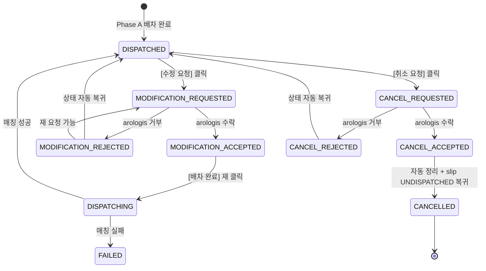

# D1 — DispatchTask 상세 modal (DISPATCHED 상태 + 수정/취소 요청 액션)

> 컴포넌트:
>   - desktop: `clients/desktop/src/renderer/routes/dispatch-board/components/DispatchTaskDetailModal.tsx` (side modal, 우 760px)
>   - mobile: `clients/mobile-staff/src/screens/dispatch-board/DispatchTaskDetailScreen.tsx` (full screen)
> 트리거:
>   - 우 panel 의 DispatchTask 카드 클릭 (desktop) / tap (mobile)
>   - `DispatchTaskListPage` 행 클릭 (별도 라우트, Phase C scope 외)
> 데이터: slip-service `GET /admin/dispatch-tasks/{id}` — `DispatchTask` + 차량 그룹 + 정차 슬립 + 아로로지스 기사 정보
> 액션:
>   - **[수정 요청]** → `D2 ModificationRequestDialog` open
>   - **[취소 요청]** → `D3 CancellationRequestDialog` open
>   - **상세 보기 → 출고전표** → `D4 SlipDetailModal` push (재사용)
> 신규 상태 (Phase C):
>   - DISPATCHED → 본 modal 의 두 버튼만 활성
>   - MODIFICATION_REQUESTED / CANCEL_REQUESTED → 상태 배지 표시 + 두 버튼 비활성 ("아로로지스 응답 대기 중")
>   - MODIFICATION_ACCEPTED → D4 mock 의 편집 모드로 분기 (본 modal 닫고 board 의 drag-and-drop 활성)
>   - MODIFICATION_REJECTED / CANCEL_REJECTED → 사유 카드 표시 + 두 버튼 재 활성
>   - CANCELLED → 두 버튼 모두 숨김, 상태 배지만 (취소선 표기 D4)

---

## 1. 디자인 의도

- **DISPATCHED 상태 = 수정/취소 요청 가능** 의 유일 진입점. 다른 상태에서는 두 버튼 비활성 또는 숨김.
- side modal (desktop) — 좌/우 panel 컨텍스트 유지 (D4 출고전표 상세 modal 동일 패턴, 760px 폭).
- full screen (mobile) — 정보 밀도 + 두 액션 버튼을 bottom-fixed 로 안정 배치.
- **두 액션 버튼의 위계**:
  - [수정 요청] = primary outline (arologis-teal) — 정상 흐름 (수정해서 다시 발송)
  - [취소 요청] = danger outline — exceptional 흐름 (완전 중단)
- 정보 구성: ① 헤더 (taskCode + 상태 배지) ② 배차 일자 + 기사 정보 ③ 차량 그룹 + 정차 슬립 list ④ Phase C 신규 상태 정보 (있을 때) ⑤ footer 액션.
- 상태 배지 = D-DB-05 + Phase C 6 신규 (본 mock § 4.1 + D4 §3).
- UUID 비공개 — `taskCode` / `slipNumber` / `partnerCode` / `partnerName` / `driverName` / `phoneMasked` 만.

---

## 2. ASCII 화면 mock — desktop side modal (760px 우측 슬라이드)

### 2.1 DISPATCHED 상태 (정상)

```
[main 영역 dim 0.3]
                            ┌─ side modal 760px ─────────────────────────────┐
                            │  ←  배차 작업 상세                       [×]   │ ← header 56px
                            │  ──────────────────────────────────────────── │
                            │                                                │
                            │  DT-20260514-001                               │ ← taskCode 큰 텍스트
                            │  ┌──────────────┐                              │
                            │  │ ✓ 배차 완료   │                             │ ← D-DB-05 md badge
                            │  └──────────────┘                              │   arologis-50 / 700
                            │                                                │
                            │  ┌─ 배차 정보 ─────────────────────────────┐  │
                            │  │ 배차일       2026-05-14                   │  │
                            │  │ 발송 시각    09:12                        │  │
                            │  │ 매칭 시각    09:14                        │  │
                            │  │ 발송처       아로로지스                   │  │
                            │  └────────────────────────────────────────────┘  │
                            │                                                │
                            │  ┌─ 기사 정보 ─────────────────────────────┐  │
                            │  │ 기사명       홍길동                       │  │
                            │  │ 차량 번호    78허1234                      │  │ ← UUID X
                            │  │ 차량 종류    1톤 카고                     │  │
                            │  │ 연락처       ☎ 010-****-5678              │  │ ← masked
                            │  │ 소속         인성데이타                   │  │
                            │  └────────────────────────────────────────────┘  │
                            │                                                │
                            │  ┌─ 차량 그룹 (2) ──────────────────────────┐  │
                            │  │                                            │  │
                            │  │ ┌─ 1톤 #1 (3건) ───────────────────────┐ │  │
                            │  │ │ ① SL-2026-0518 영진통상              │ │  │ ← click → D4 SlipDetailModal
                            │  │ │ ② SL-2026-0521 대구공조              │ │  │
                            │  │ │ ③ SL-2026-0525 한진산업              │ │  │
                            │  │ └────────────────────────────────────────┘ │  │
                            │  │                                            │  │
                            │  │ ┌─ 2.5톤 #1 (2건) ─────────────────────┐ │  │
                            │  │ │ ① SL-2026-0530 한솔                  │ │  │
                            │  │ │ ② SL-2026-0533 동광산업              │ │  │
                            │  │ └────────────────────────────────────────┘ │  │
                            │  └────────────────────────────────────────────┘  │
                            │                                                │
                            │  ──────────────────────────────────────────── │
                            │  ┌─ ✏ 수정 요청 ───┐ ┌─ ✗ 취소 요청 ───┐    │ ← footer 80px
                            │  │ primary outline │ │ danger outline   │    │
                            │  │ arologis-teal   │ │ danger-500       │    │
                            │  └─────────────────┘ └──────────────────┘    │
                            └────────────────────────────────────────────────┘

  side modal 우측 슬라이드 in (300ms ease-out)
  scroll 가능 (sticky header + footer, 본문만 scroll)
```

### 2.2 MODIFICATION_REQUESTED 상태 (응답 대기)

```
┌─ side modal 760px ─────────────────────────────┐
│  ←  배차 작업 상세                       [×]   │
│  ──────────────────────────────────────────── │
│                                                │
│  DT-20260514-001                               │
│  ┌────────────────────────────┐                │
│  │ ◐ 수정 요청 — 응답 대기     │               │ ← MODIFICATION_REQUESTED
│  └────────────────────────────┘                │   purple-50 / 700
│                                                │
│  ┌─ 요청 사유 ───────────────────────────────┐│
│  │ 슬립 SL-2026-0530 추가 + 1톤 #1 의 정차    ││ ← modification_reason
│  │ 순서 ② ↔ ③ 교체 필요                       ││   읽기 전용
│  │                                            ││
│  │ ⓘ 요청 시각: 2026-05-14 11:23             ││ ← modification_requested_at
│  │ ⓘ 응답 평균: 약 5초 (Mock 자동 수락)      ││ ← Phase C Mock 안내
│  └────────────────────────────────────────────┘│
│                                                │
│  [...배차 정보 / 기사 정보 / 차량 그룹...]     │
│                                                │
│  ──────────────────────────────────────────── │
│  ┌─ ✏ 수정 요청 ───┐ ┌─ ✗ 취소 요청 ───┐    │
│  │ disabled        │ │ disabled         │    │ ← 두 버튼 비활성
│  │ "응답 대기 중"   │ │ "응답 대기 중"    │    │   tooltip
│  └─────────────────┘ └──────────────────┘    │
└────────────────────────────────────────────────┘
```

### 2.3 MODIFICATION_REJECTED 상태 (거부)

```
┌─ side modal 760px ─────────────────────────────┐
│  ←  배차 작업 상세                       [×]   │
│  ──────────────────────────────────────────── │
│                                                │
│  DT-20260514-001                               │
│  ┌────────────────────────────┐                │
│  │ ⚠ 수정 거부됨               │               │ ← MODIFICATION_REJECTED
│  └────────────────────────────┘                │   danger-50 / 700
│                                                │
│  ┌─ 거부 사유 ───────────────────────────────┐│
│  │ 차량 종류 변경은 시간대 외 변경 불가        ││ ← rejection_reason
│  │ — 아로로지스                                ││   read-only
│  │                                            ││
│  │ ⓘ 거부 시각: 2026-05-14 11:24             ││ ← modification_decided_at
│  │ ⓘ 상태는 DISPATCHED 로 유지됨              ││
│  └────────────────────────────────────────────┘│
│                                                │
│  [...배차 정보 / 기사 정보 / 차량 그룹...]     │
│                                                │
│  ──────────────────────────────────────────── │
│  ┌─ ✏ 수정 요청 ───┐ ┌─ ✗ 취소 요청 ───┐    │ ← 재 요청 가능
│  │ primary outline │ │ danger outline   │    │   (DISPATCHED 동등)
│  └─────────────────┘ └──────────────────┘    │
└────────────────────────────────────────────────┘
```

### 2.4 MODIFICATION_ACCEPTED 안내 (5초 미만 잠깐 노출 후 close)

```
┌─ side modal 760px ─────────────────────────────┐
│  ←  배차 작업 상세                       [×]   │
│  ──────────────────────────────────────────── │
│                                                │
│  DT-20260514-001                               │
│  ┌────────────────────────────┐                │
│  │ ✓ 수정 수락됨 — 편집 모드   │               │ ← MODIFICATION_ACCEPTED
│  └────────────────────────────┘                │   arologis-50 / 700
│                                                │
│  ┌─ ✓ 아로로지스가 수정 요청을 수락했습니다 ──┐│ ← banner (D4 일관)
│  │                                            ││
│  │ 본 modal 을 닫고 배차 보드에서 슬립/차량을 ││
│  │ 자유롭게 편집한 후 [배차 완료] 를 다시      ││
│  │ 클릭해 주세요.                             ││
│  │                                            ││
│  │ ┌─ 편집 모드로 이동 ──────────────────┐  ││
│  │ │ → board 활성 + 본 modal close       │  ││ ← primary action
│  │ └──────────────────────────────────────┘  ││
│  └────────────────────────────────────────────┘│
│                                                │
└────────────────────────────────────────────────┘

  편집 모드로 이동 = 본 modal close + DispatchBoard 의 drag-and-drop 활성
  (D4 mock 참조)
```

### 2.5 CANCEL_REQUESTED / CANCEL_ACCEPTED / CANCELLED

```
[CANCEL_REQUESTED]
┌────────────────────────────┐
│ ◐ 취소 요청 — 응답 대기     │   ← warning-50 / 700 (주황)
└────────────────────────────┘
+ 사유 카드 (modification_reason 재활용)
+ 두 버튼 disabled

[CANCEL_ACCEPTED → CANCELLED 자동 전이]
DT-20260514-001  ← 취소선 (line-through)
┌────────────────────────────┐
│ ⊘ 취소 완료                 │   ← neutral-100 / 600 (회색)
└────────────────────────────┘
+ "이 배차는 취소되었습니다" 안내
+ 두 버튼 숨김
+ footer 는 [닫기] 만
```

---

## 3. ASCII 화면 mock — mobile full screen

```
┌────────────────────────────────────┐
│ ← 배차 작업 상세           [×]    │ ← header 56px (safe area)
├────────────────────────────────────┤
│                                    │
│ DT-20260514-001                    │ ← size-xl bold
│ ┌──────────────┐                   │
│ │ ✓ 배차 완료   │                  │ ← md badge
│ └──────────────┘                   │
│                                    │
│ ┌─ 배차 정보 ─────────────────────┐│
│ │ 배차일  2026-05-14              ││
│ │ 발송    09:12 → 매칭 09:14      ││
│ │ 발송처  아로로지스              ││
│ └──────────────────────────────────┘│
│                                    │
│ ┌─ 기사 정보 ─────────────────────┐│
│ │ 홍길동 · 78허1234 · 1톤 카고    ││
│ │ ☎ 010-****-5678 (tap → 통화)    ││ ← tap to call
│ │ 인성데이타                      ││
│ └──────────────────────────────────┘│
│                                    │
│ ┌─ 1톤 #1 (3건) ──────────────────┐│
│ │ ① SL-2026-0518 영진통상         ││ ← tap → D4 slip detail
│ │ ② SL-2026-0521 대구공조         ││
│ │ ③ SL-2026-0525 한진산업         ││
│ └──────────────────────────────────┘│
│ ┌─ 2.5톤 #1 (2건) ────────────────┐│
│ │ ① SL-2026-0530 한솔             ││
│ │ ② SL-2026-0533 동광산업         ││
│ └──────────────────────────────────┘│
│                                    │
│ [scroll]                           │
│                                    │
├────────────────────────────────────┤
│ ┌─ ✏ 수정 요청 ─────────────────┐ │ ← bottom 2 fixed (safe area)
│ │ primary outline full width 48 │ │
│ └────────────────────────────────┘ │
│ ┌─ ✗ 취소 요청 ─────────────────┐ │
│ │ danger outline full width 48  │ │
│ └────────────────────────────────┘ │
└────────────────────────────────────┘

  CANCEL_REQUESTED / MODIFICATION_REQUESTED 시 두 버튼 disabled
  CANCELLED 시 두 버튼 숨김, [닫기] 단일 버튼 표시
```

---

## 4. 디자인 토큰

### 4.1 색상 — Phase C 6 신규 상태 배지

> Phase A (D-DB-05) 의 4 색상 (DRAFT/DISPATCHING/DISPATCHED/FAILED) + Phase C 6 신규 + CANCELLED = 총 11 값. 아래는 Phase C 6 신규만, Phase A 는 [05-state-badges.md](../samhan-dispatch-board/05-state-badges.md) § 5.1 참조.

| 상태 | bg | border | text | icon |
|---|---|---|---|---|
| MODIFICATION_REQUESTED | `purple-50` (`#F4EEFB`) | `purple-200` (`#D0BFF0`) | `purple-700` (`#5A2E94`) | `purple-500` (`#8246CF`) |
| MODIFICATION_ACCEPTED | `arologis-50` (`#EFFAF8`) | `arologis-200` (`#A4DFD3`) | `arologis-700` (`#1B665C`) | `arologis-500` (`#2A9D8F`) |
| MODIFICATION_REJECTED | `danger-50` (`#FBEEEE`) | `danger-200` (`#EBB0AD`) | `danger-700` (`#8E2F2B`) | `--color-danger` (`#D6504A`) |
| CANCEL_REQUESTED | `warning-50` (`#FDF4E8`) | `warning-200` (`#F2CC93`) | `warning-700` (`#925100`) | `warning-500` (`#E08D2F`) |
| CANCEL_ACCEPTED | `--color-bg-muted` (`neutral-100` `#EDF0F4`) | `neutral-200` `#D6DCE3` | `neutral-600` `#4D5562` | `neutral-400` `#8E97A4` |
| CANCEL_REJECTED | `danger-50` | `danger-200` | `danger-700` | `--color-danger` |
| CANCELLED | `neutral-100` | `neutral-200` | `neutral-600` (text-decoration: line-through) | `neutral-400` |

> `purple-50/200/500/700` + `warning-50/200/500/700` = Samhan Public design system 에 미존재 시 본 컴포넌트에서 1회 정의 (FE 팀 책임, `clients/web/design-system/src/tokens/tokens.css`).

### 4.2 라벨 (한국어)

| 상태 | 라벨 (full) | 라벨 (sm) | 아이콘 |
|---|---|---|---|
| MODIFICATION_REQUESTED | 수정 요청 — 응답 대기 | 수정 요청 | ◐ |
| MODIFICATION_ACCEPTED | 수정 수락됨 — 편집 모드 | 수정 수락됨 | ✓ |
| MODIFICATION_REJECTED | 수정 거부됨 | 수정 거부 | ⚠ |
| CANCEL_REQUESTED | 취소 요청 — 응답 대기 | 취소 요청 | ◐ |
| CANCEL_ACCEPTED | 취소 수락됨 — 정리 중 | 취소 수락 | ⊘ |
| CANCEL_REJECTED | 취소 거부됨 | 취소 거부 | ⚠ |
| CANCELLED | 취소 완료 | 취소됨 | ⊘ |

### 4.3 size / spacing

| 영역 | desktop | mobile |
|---|---|---|
| modal width | 760px (side) | screen width |
| modal padding | `space-6` (24) | `space-4` (16) |
| section gap | `space-5` (20) | `space-4` (16) |
| section padding | `space-5` (20) | `space-4` (16) |
| section radius | `radius-md` (8) | `radius-md` (8) |
| 라벨 width (desktop) | 110px label | flex |
| footer 액션 버튼 (desktop) | 200 x 44 (각 2개, gap 12) | full width 48 (각 2개, gap 8) |
| modal slide-in 시간 | 300ms ease-out | 250ms slide-up |

### 4.4 typography

| 영역 | size | weight |
|---|---|---|
| modal title ("배차 작업 상세") | `size-xl` (18) | `semibold` |
| taskCode 강조 | `size-2xl` (20) / mobile `size-xl` | `bold` arologis-700 |
| section title (배차 정보 등) | `size-md` (15) | `semibold` |
| 라벨 ("배차일") | `size-sm` (13) | `regular` text-muted |
| 값 (2026-05-14) | `size-base` (14) | `medium` |
| 사유 카드 본문 | `size-base` (14) | `regular` |
| 사유 메타 (시각/안내) | `size-xs` (12) | `regular` text-muted |
| 액션 버튼 라벨 | `size-base` (14) | `semibold` |

### 4.5 액션 버튼 색상 (footer)

| 버튼 | bg (idle) | border | text | hover bg | disabled bg |
|---|---|---|---|---|---|
| [수정 요청] (primary outline) | transparent | `arologis-500` (`#2A9D8F`) | `arologis-700` (`#1B665C`) | `arologis-50` (`#EFFAF8`) | `neutral-100` |
| [취소 요청] (danger outline) | transparent | `--color-danger` (`#D6504A`) | `danger-700` (`#8E2F2B`) | `danger-50` (`#FBEEEE`) | `neutral-100` |
| [편집 모드로 이동] (primary solid) | `arologis-500` | `arologis-500` | white | `arologis-700` | — |
| [닫기] (footer outline) | transparent | `neutral-300` (`#B8C0CB`) | `neutral-700` | `neutral-50` | — |

---

## 5. 컴포넌트 매핑

| 영역 | 컴포넌트 | 신규 / 재사용 |
|---|---|---|
| modal portal (desktop) | `@samhan/design-system` `SideModal` (D4 재사용 확장) | 재사용 |
| modal portal (mobile) | `expo-router` `Modal` route | 재사용 |
| header | `DispatchTaskDetailHeader` (taskCode + 상태 배지) | 신규 |
| 배차 정보 section | `DispatchTaskInfoSection` (read-only) | 신규 |
| 기사 정보 section | `DispatchDriverInfoSection` (전화 tap-to-call mobile) | 신규 |
| 차량 그룹 list | `VehicleGroupListReadonly` (D-DB-01 의 `VehicleGroupCard` read-only 변형) | 재사용 + 변형 |
| 정차 슬립 row | `SlipRowReadonly` (D-DB-04 slip row read-only) | 재사용 |
| 사유 카드 (Phase C) | `ModificationReasonCard` (props: variant `request` / `rejection`, color 자동 분기) | 신규 |
| 편집 모드 안내 banner | `EditModeBanner` (D4 § 2 banner 동일) | 신규 (D4) |
| 상태 배지 | `DispatchStatusBadge` (D-DB-05 + Phase C 6 확장) | 재사용 + 확장 |
| footer [수정 요청] / [취소 요청] | `@samhan/design-system` `Button` variant outline / outline-danger | 재사용 |

---

## 6. data-testid + 접근성

| 영역 | data-testid | aria-label / role |
|---|---|---|
| modal root | `dispatch-task-detail-modal` | `role="dialog"` `aria-labelledby="dispatch-task-detail-title"` `aria-modal="true"` |
| modal title | `dispatch-task-detail-title` | "{taskCode} 배차 작업 상세" |
| [×] 닫기 | `dispatch-task-detail-close` | "상세 닫기" |
| taskCode | `dispatch-task-code` | "배차 코드 {taskCode}" |
| 상태 배지 | `dispatch-status-badge-{status_lower}` | "배차 상태: {라벨}" `role="status"` (D-DB-05 일관) |
| 배차 정보 section | `section-task-info` | `aria-labelledby="section-task-info-title"` |
| 기사 정보 section | `section-driver-info` | `aria-labelledby="section-driver-info-title"` |
| 기사 전화 (mobile) | `driver-phone-call` | "기사 전화 걸기" + `href="tel:..."` |
| 차량 그룹 section | `section-vehicle-groups` | `aria-labelledby="section-vehicle-groups-title"` |
| 사유 카드 (요청) | `modification-reason-request` | "수정 요청 사유" `aria-live="polite"` |
| 사유 카드 (거부) | `modification-reason-rejection` | "수정 거부 사유" `aria-live="assertive"` |
| 편집 모드 banner | `edit-mode-banner` | "수정 수락됨, 편집 모드 활성" `aria-live="polite"` |
| [수정 요청] 버튼 | `request-modification-btn` | "{taskCode} 수정 요청 발송" |
| [취소 요청] 버튼 | `request-cancellation-btn` | "{taskCode} 취소 요청 발송" |
| [편집 모드로 이동] | `enter-edit-mode-btn` | "편집 모드로 이동" |
| 두 버튼 disabled 상태 | (동일 testid) | `aria-disabled="true"` + tooltip "아로로지스 응답 대기 중" |

### 6.1 키보드 접근성

- `Esc` → modal 닫기 (편집 모드 banner 가 떠있을 때도 동일).
- `Tab` 순서: 닫기 [×] → taskCode (skip, non-focusable) → 차량 그룹 slip row 들 → 사유 카드 (있을 때 readable region) → [수정 요청] → [취소 요청] → [닫기 (mobile only)] 또는 [편집 모드로 이동 (ACCEPTED only)].
- [수정 요청] 또는 [취소 요청] focus 상태에서 `Enter`/`Space` → 해당 dialog open.
- disabled 상태에서는 focus 가능하지만 활성 X (tooltip `aria-describedby` 로 안내).

### 6.2 mobile 가드

- bottom-fixed 액션 버튼 = `safe-area-inset-bottom` 적용.
- 기사 전화 = `Linking.openURL('tel:01098765678')` (numeric only, 하이픈 제거).
- 차량 그룹 slip row = tap → D4 SlipDetailModal push (`expo-router` `<Stack.Screen options={{ presentation: 'modal' }} />`).
- swipe-to-close gesture = side modal (desktop) 없음, mobile 만 활성.

### 6.3 상태 전이 announce (aria-live)

| 전이 | aria-live 영역 + 메시지 |
|---|---|
| DISPATCHED → MODIFICATION_REQUESTED | polite — "수정 요청을 발송했습니다. 아로로지스 응답을 기다립니다." |
| MODIFICATION_REQUESTED → MODIFICATION_ACCEPTED | assertive — "수정 수락되었습니다. 편집 모드로 이동합니다." |
| MODIFICATION_REQUESTED → MODIFICATION_REJECTED | assertive — "수정 거부되었습니다. 사유를 확인하세요." |
| DISPATCHED → CANCEL_REQUESTED | polite — "취소 요청을 발송했습니다." |
| CANCEL_REQUESTED → CANCELLED | assertive — "취소되었습니다. 이 배차는 정리되었습니다." |

---

## 7. mermaid 상태 전이 diagram



---

## 8. 비고

- UUID 비공개 — `dispatchTaskId` / `arologisDispatchId` / `vehicleGroupId` / `slipId` / `driverId` 모두 노출 X. `taskCode` / `slipNumber` / `partnerName` / `driverName` / `phoneMasked` 만.
- 기사 전화 = mask format `010-****-5678` (가운데 4자리 마스킹, Aligo 발송 시에만 backend 가 unmask).
- 두 액션 버튼 권한 = `ROLE_MANAGER` + `ROLE_MASTER` + `ROLE_DISPATCH` (D-DC-07).
- 사유 textarea `max length` = 500 자 (`dispatch_task.modification_reason` / `rejection_reason` column constraint, B1.2 Flyway V23).
- 5-team 통합 PR 후 D-DC-00 DECISIONS 에 본 mock 링크 추가 (TM 책임).
- arologis-teal `#2A9D8F` = MODIFICATION_ACCEPTED 색상 + [수정 요청] 버튼 outline = D-AX-03 brand color 일관 (Phase A D-DB-05 동일).
