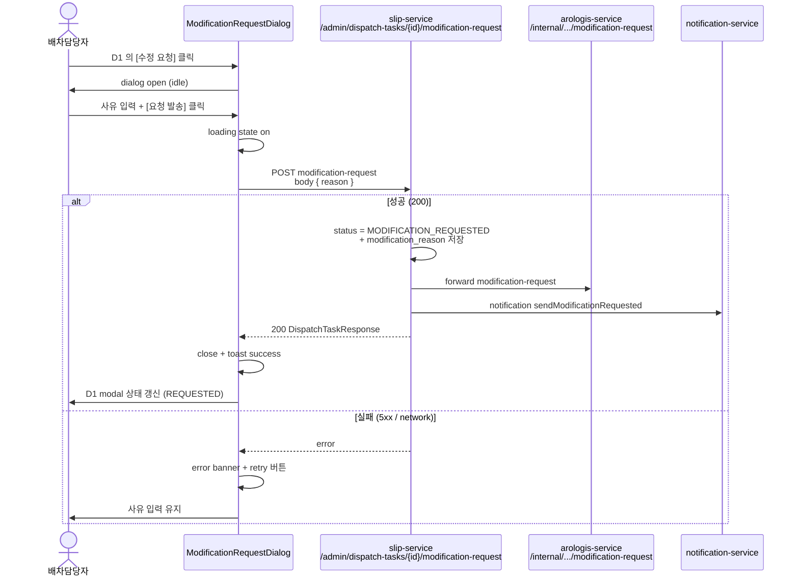

# D2 — 수정 요청 dialog mock (사유 textarea + 발송/취소 버튼)

> 컴포넌트:
>   - desktop: `clients/desktop/src/renderer/routes/dispatch-board/components/ModificationRequestDialog.tsx` (center modal, 520px)
>   - mobile: `clients/mobile-staff/src/screens/dispatch-board/ModificationRequestSheet.tsx` (bottom sheet, screen height 60%)
> 트리거: D1 의 [수정 요청] 버튼 클릭 → 본 dialog open
> API: `POST /admin/dispatch-tasks/{taskId}/modification-request` body `{ reason }` (slip-service B2/B6)
> 응답: 200 → D1 modal close + DispatchTask.status `MODIFICATION_REQUESTED` 전이 + 상태 배지 갱신 + 알림 toast
> 권한: `ROLE_MANAGER` + `ROLE_MASTER` + `ROLE_DISPATCH` (D-DC-07)
> 데이터:
>   - 입력: `reason` (선택) — 사유 textarea
>   - 표시: `taskCode` / 차량 그룹 요약 (1톤 #1 / 2.5톤 #1 ...)

---

## 1. 디자인 의도

- **단일 목적 dialog** — 사유 입력 + 발송 결정만. 다른 작업 X (상세 정보는 D1 modal 에서 이미 확인).
- center modal (desktop, 520px) — 좌/우 panel 컨텍스트 dim (0.4) 으로 가려 집중 유도.
- bottom sheet (mobile, 60% height) — drag-down 으로 dismiss 가능.
- **사유 = 선택 입력** (D-DC-06: rejection 사유는 필수, request 사유는 선택). 비워도 발송 가능.
- 사유 입력 시 char count 표시 (0/500). 500 초과 시 textarea border = danger.
- 발송 후 spinner (~2초) → 성공 toast → D1 modal close.
- 발송 실패 (network / 4xx / 5xx) → 본 dialog 유지 + error toast + retry 버튼.

---

## 2. ASCII 화면 mock — desktop center modal (520px)

### 2.1 기본 상태 (idle, textarea empty)

```
[main 영역 + D1 modal dim 0.4]
                ┌─ center modal 520px ───────────────────────────┐
                │  ✏ 수정 요청                              [×]  │ ← header 56px
                │  ──────────────────────────────────────────── │
                │                                                │
                │  ┌─ 대상 배차 ─────────────────────────────┐  │
                │  │ DT-20260514-001                          │  │
                │  │ 1톤 #1 (3건) + 2.5톤 #1 (2건)            │  │ ← 차량 그룹 요약
                │  │ 기사: 홍길동 (78허1234)                  │  │
                │  └────────────────────────────────────────────┘  │
                │                                                │
                │  사유 (선택)                                    │
                │  ┌────────────────────────────────────────┐    │
                │  │                                        │    │ ← textarea
                │  │  (placeholder)                         │    │   min 100 / max 240
                │  │  예: 슬립 SL-2026-0530 추가 +          │    │   placeholder 회색
                │  │      정차 순서 ② ↔ ③ 교체 필요         │    │
                │  │                                        │    │
                │  │                                        │    │
                │  └────────────────────────────────────────┘    │
                │  ⓘ 0 / 500 자                                  │ ← char count
                │                                                │
                │  ⓘ 사유는 선택사항이지만 아로로지스 응답         │
                │    검토에 도움이 됩니다.                        │
                │                                                │
                │  ──────────────────────────────────────────── │
                │  ┌─ 취소 ────────┐ ┌─ → 요청 발송 ───────┐   │ ← footer 72px
                │  │ outline ghost │ │ primary solid       │   │   gap 12
                │  │ neutral-700   │ │ arologis-500        │   │
                │  └───────────────┘ └─────────────────────┘   │
                └────────────────────────────────────────────────┘

  center modal fade-in (200ms) + main dim (0.4 backdrop)
  Esc / [×] / [취소] = close
  외부 backdrop click = close (단 textarea 에 입력 있으면 confirm "사유가 사라집니다, 정말 닫으시겠습니까?")
```

### 2.2 입력 상태 (사용자 typing)

```
┌─ center modal 520px ───────────────────────────┐
│  ✏ 수정 요청                              [×]  │
│  ──────────────────────────────────────────── │
│                                                │
│  ┌─ 대상 배차 ─────────────────────────────┐  │
│  │ DT-20260514-001                          │  │
│  │ 1톤 #1 (3건) + 2.5톤 #1 (2건)            │  │
│  │ 기사: 홍길동 (78허1234)                  │  │
│  └────────────────────────────────────────────┘  │
│                                                │
│  사유 (선택)                                    │
│  ┌────────────────────────────────────────┐    │
│  │ 슬립 SL-2026-0530 추가 + 1톤 #1 의 정차│   │ ← textarea focus
│  │ 순서 ② ↔ ③ 교체 필요|                  │   │   arologis-500 border 2px
│  │                                        │   │
│  │                                        │   │
│  └────────────────────────────────────────┘    │
│  ⓘ 38 / 500 자                                 │ ← live count (aria-live polite)
│                                                │
│  ──────────────────────────────────────────── │
│  ┌─ 취소 ────────┐ ┌─ → 요청 발송 ───────┐   │
│  │ outline ghost │ │ primary solid       │   │ ← 활성 (입력 유무 무관)
│  └───────────────┘ └─────────────────────┘   │
└────────────────────────────────────────────────┘
```

### 2.3 char count 초과 상태 (500 over)

```
사유 (선택)
┌────────────────────────────────────────┐
│ ...                                    │ ← textarea border danger 2px
│ ...                                    │   bg = danger-50 alpha
│ ...                                    │
└────────────────────────────────────────┘
⚠ 512 / 500 자 — 12 자 초과                ← danger-700 text
┌─ 취소 ────────┐ ┌─ → 요청 발송 ───────┐
│ outline ghost │ │ disabled            │ ← 발송 비활성
└───────────────┘ └─────────────────────┘   tooltip "사유는 500 자 이내"
```

### 2.4 발송 중 (loading)

```
┌─ center modal 520px ───────────────────────────┐
│  ✏ 수정 요청                              [×]  │ ← [×] disabled
│  ──────────────────────────────────────────── │
│                                                │
│  ┌─ 대상 배차 ─────────────────────────────┐  │
│  │ DT-20260514-001                          │  │
│  │ ...                                      │  │
│  └────────────────────────────────────────────┘  │
│                                                │
│  사유 (선택)                                    │
│  ┌────────────────────────────────────────┐    │
│  │ 슬립 SL-2026-0530 추가 + ...           │   │ ← textarea readonly
│  │                                        │   │   opacity 0.6
│  └────────────────────────────────────────┘    │
│  ⓘ 38 / 500 자                                 │
│                                                │
│  ──────────────────────────────────────────── │
│  ┌─ 취소 ────────┐ ┌─ ◌ 발송 중...     ───┐   │
│  │ disabled      │ │ primary spinner     │   │ ← spinner + "발송 중..."
│  └───────────────┘ └─────────────────────┘   │   aria-busy="true"
└────────────────────────────────────────────────┘

  발송 중 = 최대 5초 timeout. 5초 후 응답 X → error 분기.
```

### 2.5 발송 성공 (toast + close)

```
[toast — 우상단 또는 main 중앙 상단]
┌────────────────────────────────────────┐
│ ✓ 수정 요청을 발송했습니다              │ ← toast variant success
│   아로로지스 응답을 기다립니다 (~5초)   │   arologis-50 / 700
└────────────────────────────────────────┘
  자동 dismiss 4초 + manual [×]

본 dialog → fade-out 200ms → close
D1 modal → status MODIFICATION_REQUESTED 갱신 + 사유 카드 표시 + 두 버튼 disabled
```

### 2.6 발송 실패 (error)

```
┌─ center modal 520px ───────────────────────────┐
│  ✏ 수정 요청                              [×]  │
│  ──────────────────────────────────────────── │
│                                                │
│  ┌─ ⚠ 발송 실패 ─────────────────────────┐    │ ← error banner
│  │ 네트워크 오류로 수정 요청을 발송하지     │   │   danger-50 / 700
│  │ 못했습니다.                              │   │
│  │ — 잠시 후 다시 시도해 주세요.            │   │
│  │   (status: 500 / 503 / network)          │   │ ← 응답 코드 표기 (dev)
│  └────────────────────────────────────────────┘  │
│                                                │
│  [...textarea 내용 유지...]                     │
│                                                │
│  ──────────────────────────────────────────── │
│  ┌─ 취소 ────────┐ ┌─ ↻ 재시도 ─────────┐    │
│  │ outline ghost │ │ primary solid       │   │ ← retry 활성
│  └───────────────┘ └─────────────────────┘   │
└────────────────────────────────────────────────┘
```

---

## 3. ASCII 화면 mock — mobile bottom sheet (60% height)

```
┌────────────────────────────────────┐
│                                    │ ← main 영역 dim
│                                    │
│                                    │
│                                    │
│            (dim 0.4)               │
│                                    │
├════════════════════════════════════┤
│        ━━━━━━                       │ ← drag handle
│                                    │
│  ✏ 수정 요청                  [×]  │ ← sheet header
│  ───────────────────────────────── │
│                                    │
│  ┌─ 대상 배차 ─────────────────────┐│
│  │ DT-20260514-001                  ││
│  │ 1톤 #1 + 2.5톤 #1               ││
│  │ 기사: 홍길동                     ││
│  └──────────────────────────────────┘│
│                                    │
│  사유 (선택)                        │
│  ┌────────────────────────────────┐│
│  │                                ││ ← textarea min 80 / max 160
│  │ (placeholder 4 줄)             ││   focus 시 keyboard up
│  │                                ││   sheet auto-expand
│  └────────────────────────────────┘│
│  ⓘ 0 / 500 자                      │
│                                    │
│  ⓘ 사유는 선택사항이지만 ...        │
│                                    │
├────────────────────────────────────┤
│ ┌─ → 요청 발송 ────────────────┐ │ ← bottom 2 fixed (safe area)
│ │ primary solid full width 48   │ │
│ └────────────────────────────────┘ │
│ ┌─ 취소 ────────────────────────┐ │
│ │ outline ghost full width 48   │ │
│ └────────────────────────────────┘ │
└────────────────────────────────────┘

  drag-handle drag down 100px → close (textarea 입력 있으면 confirm)
  keyboard up = sheet 80% expand (smooth)
  Done / submit gesture = Cmd+Enter (iOS) / Ctrl+Enter (Android) → 발송
```

---

## 4. 디자인 토큰

### 4.1 색상

| 영역 | 토큰 | HEX |
|---|---|---|
| backdrop dim | rgba(15,18,22,0.4) | — |
| modal bg | `--color-bg` (`neutral-0`) | `#FFFFFF` |
| section bg (대상 배차) | `--color-bg-subtle` (`neutral-50`) | `#F7F8FA` |
| section border | `--color-border` (`neutral-200`) | `#D6DCE3` |
| header title | `--color-text` (`neutral-900`) | `#0F1216` |
| 라벨 ("사유 (선택)") | `--color-text-muted` | `#4D5562` |
| textarea border (idle) | `--color-border-strong` (`neutral-300`) | `#B8C0CB` |
| textarea border (focus) | `arologis-500` | `#2A9D8F` (2px) |
| textarea border (error) | `--color-danger` | `#D6504A` (2px) |
| placeholder text | `neutral-400` | `#8E97A4` |
| char count idle | `--color-text-muted` | `#4D5562` |
| char count over | `danger-700` | `#8E2F2B` |
| 안내 텍스트 (ⓘ) | `--color-text-muted` | `#4D5562` |
| error banner bg | `danger-50` | `#FBEEEE` |
| error banner border | `danger-200` | `#EBB0AD` |
| error banner text | `danger-700` | `#8E2F2B` |
| [요청 발송] primary bg | `arologis-500` | `#2A9D8F` |
| [요청 발송] hover bg | `arologis-700` | `#1B665C` |
| [요청 발송] disabled bg | `neutral-200` | `#D6DCE3` |
| [요청 발송] text | white | `#FFFFFF` |
| [취소] outline border | `neutral-300` | `#B8C0CB` |
| [취소] outline text | `neutral-700` | `#363D49` |
| [취소] hover bg | `neutral-50` | `#F7F8FA` |
| toast success bg | `arologis-50` | `#EFFAF8` |
| toast success text | `arologis-700` | `#1B665C` |
| spinner | `arologis-500` | `#2A9D8F` |

### 4.2 size / spacing

| 영역 | desktop | mobile |
|---|---|---|
| modal width | 520px (center) | screen width |
| modal height | auto (max 80vh) | 60% screen (auto-expand 80% on keyboard) |
| modal padding | `space-6` (24) | `space-4` (16) + safe area |
| section gap | `space-5` (20) | `space-4` (16) |
| section padding | `space-4` (16) | `space-3` (12) |
| textarea height (min) | 100px | 80px |
| textarea height (max) | 240px | 160px |
| textarea padding | `space-3` (12) | `space-3` (12) |
| char count gap | `space-1` (4) | `space-1` (4) |
| 안내 ⓘ 텍스트 gap | `space-3` (12) | `space-3` (12) |
| footer 액션 버튼 | 각 120 x 44, gap 12, 우측 정렬 | full width 48, stack, gap 8 |
| modal fade-in | 200ms ease-out | 250ms slide-up |
| toast 위치 (desktop) | 우상단, offset 24, 16 | 상단 safe area |
| toast 위치 (mobile) | — | 상단 safe area, slide-down 250ms |
| toast auto-dismiss | 4초 | 4초 |

### 4.3 typography

| 영역 | size | weight |
|---|---|---|
| modal title ("✏ 수정 요청") | `size-lg` (16) | `semibold` |
| section title ("대상 배차") | `size-sm` (13) | `semibold` text-muted |
| section 본문 | `size-base` (14) | `regular` |
| 라벨 ("사유 (선택)") | `size-sm` (13) | `medium` |
| textarea 입력 | `size-base` (14) | `regular` |
| placeholder | `size-base` (14) | `regular` neutral-400 |
| char count | `size-xs` (12) | `regular` (over 시 `medium` danger) |
| 안내 ⓘ | `size-xs` (12) | `regular` text-muted |
| error banner 본문 | `size-sm` (13) | `regular` danger-700 |
| error banner status code (dev) | `size-xs` (12) | `mono` text-muted |
| 액션 버튼 라벨 | `size-base` (14) | `semibold` |
| toast 본문 | `size-sm` (13) | `regular` |

---

## 5. 컴포넌트 매핑

| 영역 | 컴포넌트 | 신규 / 재사용 |
|---|---|---|
| dialog portal (desktop) | `@samhan/design-system` `Dialog` (CenterModal) | 재사용 |
| sheet portal (mobile) | `@samhan/mobile-design-system` `BottomSheet` 또는 `@gorhom/bottom-sheet` | 재사용 |
| drag handle (mobile) | sheet 내장 | 내장 |
| header | `DialogHeader` (title + [×]) | 재사용 |
| 대상 배차 section | `RequestTargetSummaryCard` (taskCode + 차량 그룹 요약 + 기사) | 신규 (D2/D3 공통) |
| 사유 textarea | `@samhan/design-system` `Textarea` (props: `maxLength`, `showCount`, `placeholder`) | 재사용 |
| char count | `Textarea` 내장 + custom aria-live wrapper | 재사용 |
| 안내 ⓘ | `Hint` 또는 `Callout` variant info | 재사용 |
| error banner | `Banner` variant danger (Phase A D-DB-04 의 메모 저장 실패 banner 패턴 일관) | 재사용 |
| [요청 발송] / [재시도] | `Button` variant primary solid + `loading` prop | 재사용 |
| [취소] | `Button` variant outline ghost | 재사용 |
| toast (성공) | `@samhan/design-system` `Toast` variant success | 재사용 |
| toast (실패 fallback) | `Toast` variant danger | 재사용 |

---

## 6. data-testid + 접근성

| 영역 | data-testid | aria-label / role |
|---|---|---|
| dialog root | `modification-request-dialog` | `role="dialog"` `aria-labelledby="modification-request-title"` `aria-modal="true"` `aria-describedby="modification-request-hint"` |
| dialog title | `modification-request-title` | "수정 요청" |
| [×] 닫기 | `modification-request-close` | "수정 요청 닫기" |
| 대상 배차 section | `request-target-summary` | `aria-labelledby="request-target-title"` |
| 대상 taskCode | `request-target-task-code` | "대상 배차 {taskCode}" |
| 사유 textarea | `modification-reason-textarea` | "수정 요청 사유, 선택 입력, 최대 500 자" + `aria-describedby="reason-char-count modification-request-hint"` |
| char count | `modification-reason-char-count` | aria-live polite, "현재 {N} / 500 자" |
| 안내 ⓘ | `modification-request-hint` | (시각 보조, role 없음) |
| error banner | `modification-request-error-banner` | `role="alert"` `aria-live="assertive"` |
| [취소] | `modification-request-cancel-btn` | "수정 요청 취소" |
| [요청 발송] | `modification-request-submit-btn` | "수정 요청 발송" |
| [재시도] | `modification-request-retry-btn` | "수정 요청 재시도" |
| 발송 중 spinner | `modification-request-submit-btn` (동일 testid + `aria-busy="true"`) | "수정 요청 발송 중" |
| toast (성공) | `toast-modification-request-success` | `role="status"` `aria-live="polite"` |
| toast (실패) | `toast-modification-request-error` | `role="alert"` `aria-live="assertive"` |

### 6.1 키보드 접근성

- `Esc` → close (입력 있을 시 confirm "사유가 사라집니다, 정말 닫으시겠습니까?")
- `Tab` 순서: 닫기 [×] → 사유 textarea → [취소] → [요청 발송] (mobile 은 stack 순)
- `Cmd+Enter` / `Ctrl+Enter` → [요청 발송] 활성 (textarea focus 중)
- `Enter` 단독 → textarea 줄바꿈 (submit X)
- 발송 중 (loading) → `Tab` 이동 비활성, [×] / [취소] / [요청 발송] 모두 disabled

### 6.2 mobile 가드

- bottom sheet drag-down 100px → close (입력 있을 시 confirm sheet pop)
- keyboard up → sheet expand 80% (smooth animation)
- safe-area-inset-bottom 적용 (액션 버튼이 home indicator 와 안 겹침)
- swipe-down on textarea = scroll (not dismiss)

### 6.3 입력 검증

| 조건 | 동작 |
|---|---|
| reason 길이 0 | 발송 가능 (선택 입력) |
| reason 길이 1~500 | 정상 |
| reason 길이 > 500 | 발송 버튼 disabled + char count danger 색상 + tooltip "사유는 500 자 이내" |
| reason 공백만 | trim 후 길이 0 으로 간주 (선택 입력 정책) |

### 6.4 외부 backdrop click 동작

| 입력 상태 | 동작 |
|---|---|
| 입력 없음 | 즉시 close |
| 입력 있음 (>= 1 자) | confirm dialog "사유가 사라집니다, 정말 닫으시겠습니까?" → [닫기] / [계속 작성] |

---

## 7. mermaid 발송 시퀀스 diagram



---

## 8. 단위 테스트 (Vitest + RTL)

```ts
describe('ModificationRequestDialog', () => {
  it('renders with empty textarea and active submit button by default', () => {
    render(<ModificationRequestDialog taskId="t-1" taskCode="DT-20260514-001" onClose={vi.fn()} />);
    expect(screen.getByTestId('modification-reason-textarea')).toHaveValue('');
    expect(screen.getByTestId('modification-request-submit-btn')).not.toBeDisabled();
  });

  it('disables submit when reason exceeds 500 chars', () => {
    render(<ModificationRequestDialog taskId="t-1" taskCode="DT-20260514-001" onClose={vi.fn()} />);
    const textarea = screen.getByTestId('modification-reason-textarea');
    fireEvent.change(textarea, { target: { value: 'x'.repeat(501) } });
    expect(screen.getByTestId('modification-request-submit-btn')).toBeDisabled();
    expect(screen.getByTestId('modification-reason-char-count')).toHaveTextContent('501 / 500');
  });

  it('shows loading state and disables all buttons during submit', async () => {
    const requestModification = vi.fn().mockReturnValue(new Promise(() => {})); // never resolves
    render(<ModificationRequestDialog taskId="t-1" taskCode="DT-20260514-001" onClose={vi.fn()} requestModificationFn={requestModification} />);
    fireEvent.click(screen.getByTestId('modification-request-submit-btn'));
    expect(screen.getByTestId('modification-request-submit-btn')).toHaveAttribute('aria-busy', 'true');
    expect(screen.getByTestId('modification-request-cancel-btn')).toBeDisabled();
  });

  it('shows error banner with retry button on 5xx', async () => {
    const requestModification = vi.fn().mockRejectedValue({ status: 500 });
    render(<ModificationRequestDialog taskId="t-1" taskCode="DT-20260514-001" onClose={vi.fn()} requestModificationFn={requestModification} />);
    fireEvent.click(screen.getByTestId('modification-request-submit-btn'));
    await waitFor(() => expect(screen.getByTestId('modification-request-error-banner')).toBeInTheDocument());
    expect(screen.getByTestId('modification-request-retry-btn')).toBeInTheDocument();
  });

  it('submits with Cmd+Enter from textarea focus', () => {
    const onSubmit = vi.fn();
    render(<ModificationRequestDialog taskId="t-1" taskCode="DT-20260514-001" onClose={vi.fn()} onSubmit={onSubmit} />);
    const textarea = screen.getByTestId('modification-reason-textarea');
    fireEvent.change(textarea, { target: { value: '수정 필요' } });
    fireEvent.keyDown(textarea, { key: 'Enter', metaKey: true });
    expect(onSubmit).toHaveBeenCalledWith({ reason: '수정 필요' });
  });
});
```

---

## 9. 비고

- UUID 비공개 — `dispatchTaskId` / `arologisDispatchId` 모두 노출 X. `taskCode` 만.
- 사유 = 선택 입력 (D-DC-06 — request 사유는 선택, rejection 사유만 필수).
- 사유 max 500 자 = `dispatch_task.modification_reason VARCHAR(500)` column constraint (B1.2 Flyway V23).
- placeholder 예시 = 사용자에게 어떤 수준의 사유를 기재해야 하는지 가이드. 너무 길지 않게 1줄.
- arologis-teal `#2A9D8F` = textarea focus border + [요청 발송] primary bg + 성공 toast = Phase A D-AX-03 brand color 일관.
- 발송 timeout = 5초 (frontend), 5초 후 응답 X → error 분기. 실제 서버 처리는 비동기 (B7 Mock 5초 후 회신).
- D3 (취소 요청 dialog) 와 본 D2 = 거의 동일 구조 (color + 라벨만 다름) → 공통 `RequestDialog` base 컴포넌트 + props.variant `modification` / `cancellation` 으로 통합 구현 가능 (FE 팀 책임).
