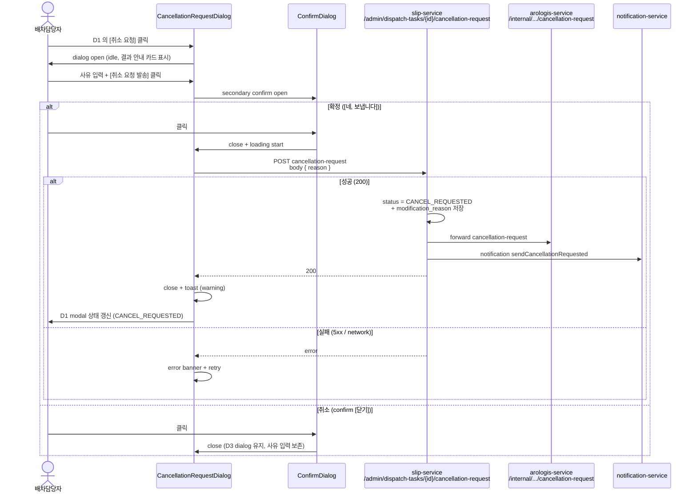

# D3 — 취소 요청 dialog mock (사유 textarea + 발송/취소 버튼)

> 컴포넌트:
>   - desktop: `clients/desktop/src/renderer/routes/dispatch-board/components/CancellationRequestDialog.tsx` (center modal, 520px)
>   - mobile: `clients/mobile-staff/src/screens/dispatch-board/CancellationRequestSheet.tsx` (bottom sheet, 60% screen)
> 트리거: D1 의 [취소 요청] 버튼 클릭 → 본 dialog open
> API: `POST /admin/dispatch-tasks/{taskId}/cancellation-request` body `{ reason }` (slip-service B4/B6)
> 응답: 200 → D1 modal close + DispatchTask.status `CANCEL_REQUESTED` 전이 + 상태 배지 갱신 + 알림 toast
> 권한: `ROLE_MANAGER` + `ROLE_MASTER` + `ROLE_DISPATCH` (D-DC-07)
> 데이터:
>   - 입력: `reason` (선택) — 사유 textarea
>   - 표시: `taskCode` / 차량 그룹 요약 / 기사 정보
>   - 추가: **취소 결과 안내** (수락 시 slip UNDISPATCHED 복귀 + arologis Dispatch soft-delete)

---

## 1. 디자인 의도

- **D2 (수정 요청) 와 동일 구조 + 4 차이점**:
  - ① **색상 위계 = danger** ([요청 발송] = danger primary solid, 수정의 arologis-teal 과 명확히 구분)
  - ② **취소 결과 안내 카드** (취소 수락 시 어떤 일이 일어나는지 — slip UNDISPATCHED 복귀 + arologis 정리)
  - ③ **secondary confirm** (사유 입력 후 [요청 발송] 클릭 시 한 번 더 confirm "정말 취소 요청을 보내시겠습니까?")
  - ④ **사유 입력 권장** (선택이지만 placeholder + 안내 텍스트로 권장 — 취소는 영향 범위가 크므로)
- 결과적으로 user friction = D2 (수정) 보다 살짝 높음. 의도된 design — 취소는 exceptional flow.
- center modal (desktop, 520px) — 좌/우 panel dim (0.4)
- bottom sheet (mobile, 60% height) — drag-down dismiss + confirm

---

## 2. ASCII 화면 mock — desktop center modal (520px)

### 2.1 기본 상태 (idle)

```
[main 영역 + D1 modal dim 0.4]
                ┌─ center modal 520px ───────────────────────────┐
                │  ✗ 취소 요청                              [×]  │ ← header 56px
                │                                                │   icon: danger
                │  ──────────────────────────────────────────── │
                │                                                │
                │  ┌─ 대상 배차 ─────────────────────────────┐  │
                │  │ DT-20260514-001                          │  │
                │  │ 1톤 #1 (3건) + 2.5톤 #1 (2건)            │  │
                │  │ 기사: 홍길동 (78허1234)                  │  │
                │  └────────────────────────────────────────────┘  │
                │                                                │
                │  ┌─ ⚠ 취소 수락 시 ────────────────────────┐  │ ← 결과 안내 카드
                │  │                                          │  │   warning-50 / 700
                │  │ • 본 배차의 모든 슬립 5건이               │  │
                │  │   "미배차" 상태로 복귀합니다             │  │
                │  │ • 아로로지스의 배차 정보가 정리됩니다     │  │
                │  │ • 기사에게 알림이 발송됩니다              │  │
                │  │ • 본 작업은 되돌릴 수 없습니다 (재 발송   │  │
                │  │   필요 시 새 DispatchTask 생성 필요)     │  │
                │  └────────────────────────────────────────────┘  │
                │                                                │
                │  사유 (선택, 권장)                              │
                │  ┌────────────────────────────────────────┐    │
                │  │                                        │    │ ← textarea
                │  │  (placeholder)                         │    │   min 100 / max 240
                │  │  예: 고객사 요청으로 배차 자체 취소     │    │   placeholder 회색
                │  │     필요 (사정 변경)                    │    │
                │  │                                        │    │
                │  │                                        │    │
                │  └────────────────────────────────────────┘    │
                │  ⓘ 0 / 500 자                                  │
                │                                                │
                │  ⓘ 취소 사유는 아로로지스 응답 검토 +            │
                │    영업담당 회신에 사용됩니다.                  │
                │                                                │
                │  ──────────────────────────────────────────── │
                │  ┌─ 닫기 ────────┐ ┌─ ✗ 취소 요청 발송 ──┐   │ ← footer 72px
                │  │ outline ghost │ │ danger solid        │   │
                │  │ neutral-700   │ │ danger-500 #D6504A  │   │
                │  └───────────────┘ └─────────────────────┘   │
                └────────────────────────────────────────────────┘
```

### 2.2 secondary confirm (한 번 더)

```
[D3 modal dim 0.5]
                ┌─ confirm dialog 400px (overlay D3) ──────────┐
                │                                              │
                │  ⚠ 정말 취소 요청을 보내시겠습니까?           │
                │                                              │
                │  DT-20260514-001 의 모든 슬립 5건이           │
                │  "미배차" 상태로 복귀하며, 아로로지스의       │
                │  배차 정보가 정리됩니다.                      │
                │                                              │
                │  이 작업은 아로로지스 수락 후 되돌릴 수       │
                │  없습니다.                                    │
                │                                              │
                │  ──────────────────────────────────────────  │
                │  ┌─ 취소 ─────────┐ ┌─ 네, 보냅니다 ────┐   │
                │  │ outline ghost  │ │ danger solid     │   │
                │  └────────────────┘ └──────────────────┘   │
                └──────────────────────────────────────────────┘

  Esc / [취소] = confirm 닫기 (D3 dialog 유지)
  [네, 보냅니다] = 실제 발송 (D3 dialog loading 상태로 전환)
```

### 2.3 발송 중 (loading)

```
┌─ center modal 520px ───────────────────────────┐
│  ✗ 취소 요청                              [×]  │ ← [×] disabled
│  ──────────────────────────────────────────── │
│                                                │
│  [...대상 배차 / 결과 안내 / textarea...]      │ ← 모두 readonly opacity 0.6
│                                                │
│  ──────────────────────────────────────────── │
│  ┌─ 닫기 ────────┐ ┌─ ◌ 발송 중...      ──┐   │
│  │ disabled      │ │ danger spinner      │   │ ← aria-busy="true"
│  └───────────────┘ └─────────────────────┘   │
└────────────────────────────────────────────────┘
```

### 2.4 발송 성공 (toast + close)

```
[toast — 우상단 또는 main 중앙 상단]
┌────────────────────────────────────────┐
│ ✓ 취소 요청을 발송했습니다              │ ← warning variant (CANCEL_REQUESTED 색)
│   아로로지스 응답을 기다립니다 (~5초)   │   warning-50 / 700
└────────────────────────────────────────┘
  auto dismiss 4초

본 dialog → fade-out 200ms → close
D1 modal → status CANCEL_REQUESTED + 사유 카드 + 두 버튼 disabled
```

### 2.5 발송 실패 (error)

```
┌─ center modal 520px ───────────────────────────┐
│  ✗ 취소 요청                              [×]  │
│  ──────────────────────────────────────────── │
│                                                │
│  ┌─ ⚠ 발송 실패 ─────────────────────────┐    │
│  │ 네트워크 오류로 취소 요청을 발송하지     │   │
│  │ 못했습니다.                              │   │
│  │ — 잠시 후 다시 시도해 주세요.            │   │
│  │   (status: 500 / 503 / network)          │   │
│  └────────────────────────────────────────────┘  │
│                                                │
│  [...결과 안내 / textarea 내용 유지...]        │
│                                                │
│  ──────────────────────────────────────────── │
│  ┌─ 닫기 ────────┐ ┌─ ↻ 재시도 ──────────┐   │
│  │ outline ghost │ │ danger solid        │   │
│  └───────────────┘ └─────────────────────┘   │
└────────────────────────────────────────────────┘
```

---

## 3. ASCII 화면 mock — mobile bottom sheet (60% height)

```
┌────────────────────────────────────┐
│                                    │
│            (dim 0.4)               │
│                                    │
├════════════════════════════════════┤
│        ━━━━━━                       │ ← drag handle
│                                    │
│  ✗ 취소 요청                  [×]  │
│  ───────────────────────────────── │
│                                    │
│  ┌─ 대상 배차 ─────────────────────┐│
│  │ DT-20260514-001                  ││
│  │ 1톤 #1 + 2.5톤 #1                ││
│  │ 기사: 홍길동                     ││
│  └──────────────────────────────────┘│
│                                    │
│  ┌─ ⚠ 취소 수락 시 ────────────────┐│ ← 결과 안내 (compact)
│  │ • 슬립 5건 미배차 복귀           ││
│  │ • 아로로지스 배차 정리           ││
│  │ • 기사 알림 발송                 ││
│  │ • 되돌릴 수 없음                 ││
│  └──────────────────────────────────┘│
│                                    │
│  사유 (선택, 권장)                   │
│  ┌────────────────────────────────┐│
│  │                                ││ ← textarea
│  │ (placeholder 4 줄)             ││
│  │                                ││
│  └────────────────────────────────┘│
│  ⓘ 0 / 500 자                      │
│                                    │
├────────────────────────────────────┤
│ ┌─ ✗ 취소 요청 발송 ───────────┐ │ ← bottom 2 fixed
│ │ danger solid full width 48    │ │   (safe area)
│ └────────────────────────────────┘ │
│ ┌─ 닫기 ────────────────────────┐ │
│ │ outline ghost full width 48   │ │
│ └────────────────────────────────┘ │
└────────────────────────────────────┘

  mobile secondary confirm = native Alert (iOS / Android) 또는 BottomSheet stack
  "정말 취소 요청을 보내시겠습니까?" + [닫기] / [네, 보냅니다]
```

---

## 4. 디자인 토큰

### 4.1 색상 (D2 와 차이만 강조)

| 영역 | D2 (수정) | D3 (취소) |
|---|---|---|
| header icon | `arologis-500` (✏) | `--color-danger` `#D6504A` (✗) |
| 결과 안내 카드 bg | (D2 없음) | `warning-50` `#FDF4E8` |
| 결과 안내 카드 border | (D2 없음) | `warning-200` `#F2CC93` |
| 결과 안내 카드 text | (D2 없음) | `warning-700` `#925100` |
| textarea border (focus) | `arologis-500` 2px | `--color-danger` 2px (`#D6504A`) |
| [발송] primary bg | `arologis-500` `#2A9D8F` | `--color-danger` `#D6504A` |
| [발송] hover bg | `arologis-700` | `danger-700` `#8E2F2B` |
| [발송] text | white | white |
| confirm dialog 강조 색 | (D2 없음) | `--color-danger` |
| toast (성공) bg | `arologis-50` | `warning-50` `#FDF4E8` |
| toast (성공) text | `arologis-700` | `warning-700` `#925100` |
| toast (성공) icon | ✓ arologis-500 | ✓ warning-500 `#E08D2F` |

> **D2 와 동일한 토큰** (생략 — D2 § 4.1 참조): backdrop dim / modal bg / section bg / placeholder / char count / [닫기] outline / spinner / error banner.

### 4.2 size / spacing

| 영역 | desktop | mobile |
|---|---|---|
| modal width | 520px | screen width |
| modal height | auto max 80vh | 60% screen |
| 결과 안내 카드 padding | `space-4` (16) | `space-3` (12) |
| 결과 안내 카드 list gap | `space-2` (8) | `space-2` (8) |
| 결과 안내 카드 radius | `radius-md` (8) | `radius-md` (8) |
| confirm dialog width | 400px center | screen width sheet |
| confirm dialog padding | `space-5` (20) | `space-4` (16) |

> 그 외 size/spacing = D2 § 4.2 와 동일.

### 4.3 typography

| 영역 | size | weight |
|---|---|---|
| modal title ("✗ 취소 요청") | `size-lg` (16) | `semibold` `--color-danger` |
| 결과 안내 카드 title ("⚠ 취소 수락 시") | `size-sm` (13) | `semibold` warning-700 |
| 결과 안내 카드 list 항목 | `size-sm` (13) | `regular` warning-700 |
| confirm dialog title | `size-md` (15) | `semibold` `--color-danger` |
| confirm dialog 본문 | `size-base` (14) | `regular` |

> 그 외 typography = D2 § 4.3 와 동일.

---

## 5. 컴포넌트 매핑

| 영역 | 컴포넌트 | 신규 / 재사용 |
|---|---|---|
| dialog portal (desktop) | `@samhan/design-system` `Dialog` | 재사용 |
| sheet portal (mobile) | `BottomSheet` | 재사용 |
| header | `DialogHeader` icon variant danger | 재사용 |
| 대상 배차 section | `RequestTargetSummaryCard` (D2 공통) | 재사용 (D2/D3) |
| 결과 안내 카드 | `CancellationImpactCard` (props: slipCount, vehicleGroupSummary) | 신규 (D3 전용) |
| 사유 textarea | `Textarea` (D2 동일, placeholder 다름) | 재사용 |
| 안내 ⓘ | `Hint` variant info (D2 와 라벨만 다름) | 재사용 |
| error banner | `Banner` variant danger | 재사용 |
| [취소 요청 발송] | `Button` variant danger solid + loading | 재사용 |
| [닫기] | `Button` variant outline ghost | 재사용 |
| secondary confirm | `@samhan/design-system` `ConfirmDialog` variant danger | 재사용 |
| toast (성공) | `Toast` variant warning (CANCEL_REQUESTED 색) | 재사용 |
| toast (실패) | `Toast` variant danger | 재사용 |

### 5.1 D2 와 base 컴포넌트 공유

```tsx
// 공통 base 컴포넌트
type RequestDialogProps = {
  taskId: string;
  taskCode: string;
  variant: 'modification' | 'cancellation';
  onClose: () => void;
  onSubmit: (reason: string) => Promise<void>;
};

function RequestDialog({ variant, ...rest }: RequestDialogProps) {
  const isCancellation = variant === 'cancellation';
  return (
    <Dialog>
      <DialogHeader icon={isCancellation ? '✗' : '✏'} variant={isCancellation ? 'danger' : 'arologis'}>
        {isCancellation ? '취소 요청' : '수정 요청'}
      </DialogHeader>
      <RequestTargetSummaryCard {...rest} />
      {isCancellation && <CancellationImpactCard />}
      <Textarea
        placeholder={isCancellation ? '예: 고객사 요청으로 배차 취소 필요' : '예: 슬립 추가 + 정차 순서 교체'}
      />
      <Footer>
        <Button variant="outline">닫기</Button>
        <Button variant={isCancellation ? 'danger' : 'primary'}
                onClick={isCancellation ? handleSubmitWithConfirm : handleSubmit}>
          {isCancellation ? '✗ 취소 요청 발송' : '→ 요청 발송'}
        </Button>
      </Footer>
    </Dialog>
  );
}
```

> FE 팀 D-FE-02 task 에서 base 컴포넌트 + 2 wrapper 패턴 권장.

---

## 6. data-testid + 접근성

| 영역 | data-testid | aria-label / role |
|---|---|---|
| dialog root | `cancellation-request-dialog` | `role="dialog"` `aria-labelledby="cancellation-request-title"` `aria-modal="true"` |
| dialog title | `cancellation-request-title` | "취소 요청" |
| [×] 닫기 | `cancellation-request-close` | "취소 요청 닫기" |
| 대상 배차 section | `request-target-summary` | 동일 (D2 공통) |
| 결과 안내 카드 | `cancellation-impact-card` | `role="region"` `aria-labelledby="cancellation-impact-title"` |
| 결과 안내 카드 title | `cancellation-impact-title` | "취소 수락 시 영향" |
| 결과 안내 list 항목 | `cancellation-impact-item-{n}` | (li 내장) |
| 사유 textarea | `cancellation-reason-textarea` | "취소 요청 사유, 선택 입력 권장, 최대 500 자" + `aria-describedby="cancellation-reason-char-count cancellation-impact-card"` |
| char count | `cancellation-reason-char-count` | aria-live polite |
| 안내 ⓘ | `cancellation-request-hint` | (시각 보조) |
| error banner | `cancellation-request-error-banner` | `role="alert"` `aria-live="assertive"` |
| [닫기] | `cancellation-request-cancel-btn` | "취소 요청 닫기" |
| [취소 요청 발송] | `cancellation-request-submit-btn` | "취소 요청 발송" |
| [재시도] | `cancellation-request-retry-btn` | "취소 요청 재시도" |
| secondary confirm root | `cancellation-confirm-dialog` | `role="alertdialog"` `aria-labelledby="cancellation-confirm-title"` `aria-describedby="cancellation-confirm-desc"` |
| secondary confirm [닫기] | `cancellation-confirm-cancel-btn` | "취소 요청 발송 취소" |
| secondary confirm [네, 보냅니다] | `cancellation-confirm-submit-btn` | "취소 요청 발송 확정" |
| toast (성공) | `toast-cancellation-request-success` | `role="status"` `aria-live="polite"` |

### 6.1 키보드 접근성

- `Esc` → close (입력 있을 시 confirm "사유가 사라집니다, 정말 닫으시겠습니까?")
- `Tab` 순서: 닫기 [×] → 결과 안내 카드 (skip readable region) → 사유 textarea → [닫기] → [취소 요청 발송]
- secondary confirm 활성 시 → focus trap inside confirm + `Esc` → confirm 닫기 (D3 dialog 유지)
- `Cmd+Enter` / `Ctrl+Enter` (textarea focus 중) → [취소 요청 발송] 클릭과 동일 (secondary confirm 표시)
- D2 와 다른 점: secondary confirm 의 [네, 보냅니다] 는 `Enter` 단독 으로 활성 (default focus, danger destructive 작업이지만 사용자가 이미 한 번 의도 표명 후 의식적 확인이라 허용)

### 6.2 mobile 가드

- bottom sheet drag-down 100px → close (입력 있을 시 confirm)
- secondary confirm = native Alert API (iOS UIAlertController / Android AlertDialog) 또는 BottomSheet stack (디자인 시스템 패턴 일관)
- safe-area-inset-bottom 적용
- `Linking.openURL` 없음 (취소 요청에서는 전화 trigger 없음)

### 6.3 입력 검증 (D2 와 동일)

| 조건 | 동작 |
|---|---|
| reason 길이 0 | 발송 가능 (선택 입력, 단 secondary confirm 강제) |
| reason 길이 1~500 | 정상 |
| reason 길이 > 500 | 발송 버튼 disabled + char count danger |
| reason 공백만 | trim 후 길이 0 으로 간주 |

### 6.4 secondary confirm 항상 강제

| reason 길이 | secondary confirm 표시 여부 |
|---|---|
| 0 (비어 있음) | 표시 (취소 요청 결과 안내 + "정말 보내시겠습니까?") |
| 1~500 | 표시 (사유 미리보기 첨부) |

> D2 (수정) 는 secondary confirm 없음. 취소만 destructive 작업이므로 secondary confirm 강제.

---

## 7. mermaid 발송 시퀀스 diagram



---

## 8. 단위 테스트 (Vitest + RTL)

```ts
describe('CancellationRequestDialog', () => {
  it('renders danger header icon and impact card', () => {
    render(<CancellationRequestDialog taskId="t-1" taskCode="DT-20260514-001" slipCount={5} onClose={vi.fn()} />);
    expect(screen.getByTestId('cancellation-request-title')).toHaveTextContent('취소 요청');
    expect(screen.getByTestId('cancellation-impact-card')).toBeInTheDocument();
    expect(screen.getByTestId('cancellation-impact-card')).toHaveTextContent('슬립 5건');
  });

  it('opens secondary confirm on submit click (regardless of reason)', () => {
    render(<CancellationRequestDialog taskId="t-1" taskCode="DT-20260514-001" slipCount={5} onClose={vi.fn()} />);
    fireEvent.click(screen.getByTestId('cancellation-request-submit-btn'));
    expect(screen.getByTestId('cancellation-confirm-dialog')).toBeInTheDocument();
  });

  it('actually submits only when secondary confirm [네, 보냅니다] clicked', async () => {
    const requestCancellation = vi.fn().mockResolvedValue({ status: 'CANCEL_REQUESTED' });
    render(<CancellationRequestDialog taskId="t-1" taskCode="DT-20260514-001" slipCount={5} onClose={vi.fn()} requestCancellationFn={requestCancellation} />);
    fireEvent.click(screen.getByTestId('cancellation-request-submit-btn'));
    expect(requestCancellation).not.toHaveBeenCalled();
    fireEvent.click(screen.getByTestId('cancellation-confirm-submit-btn'));
    await waitFor(() => expect(requestCancellation).toHaveBeenCalled());
  });

  it('keeps reason text when secondary confirm cancelled', () => {
    render(<CancellationRequestDialog taskId="t-1" taskCode="DT-20260514-001" slipCount={5} onClose={vi.fn()} />);
    const textarea = screen.getByTestId('cancellation-reason-textarea');
    fireEvent.change(textarea, { target: { value: '고객사 요청' } });
    fireEvent.click(screen.getByTestId('cancellation-request-submit-btn'));
    fireEvent.click(screen.getByTestId('cancellation-confirm-cancel-btn'));
    expect(textarea).toHaveValue('고객사 요청');
  });

  it('disables submit when reason exceeds 500 chars', () => {
    render(<CancellationRequestDialog taskId="t-1" taskCode="DT-20260514-001" slipCount={5} onClose={vi.fn()} />);
    fireEvent.change(screen.getByTestId('cancellation-reason-textarea'), { target: { value: 'x'.repeat(501) } });
    expect(screen.getByTestId('cancellation-request-submit-btn')).toBeDisabled();
  });
});
```

---

## 9. 비고

- UUID 비공개 — `dispatchTaskId` / `arologisDispatchId` / `slipId` 모두 노출 X. `taskCode` + `slipCount` (숫자만) 만.
- 사유 = 선택 입력이지만 결과 안내 카드 + secondary confirm 으로 권장.
- 결과 안내 카드 = warning 색상 (CANCEL_REQUESTED 의 상태 배지 색상과 일관, 사용자 인지 통일).
- secondary confirm = D2 (수정) 에는 없음. 취소만 destructive (slip UNDISPATCHED 복귀 + arologis 정리, D-DC-05) 이므로 안전 가드 강제.
- secondary confirm 의 [네, 보냅니다] 가 default focus + Enter 활성 — 사용자가 이미 [취소 요청 발송] 을 클릭한 후 의식적 재확인이므로 친화적.
- arologis-teal 사용 X — 본 dialog 는 danger 위계가 일관 (header icon / [발송] / textarea focus / confirm 강조). 단, secondary confirm 의 [닫기] 만 neutral outline.
- D2 와 base 컴포넌트 공유 권장 (FE 팀 책임, § 5.1 패턴).
- 발송 timeout = 5초. 5초 후 응답 X → error 분기.
