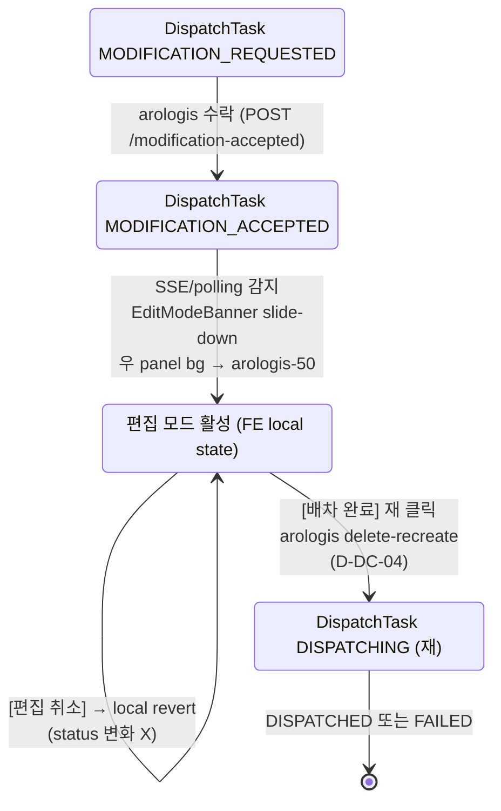

# D4 — MODIFICATION_ACCEPTED 편집 모드 indicator + 6 신규 상태 배지 색상 종합

> 컴포넌트:
>   - desktop: `clients/desktop/src/renderer/routes/dispatch-board/DispatchBoardPage.tsx` (Phase A 페이지) + `EditModeBanner.tsx` (신규)
>   - mobile: `clients/mobile-staff/src/screens/dispatch-board/DispatchBoardScreen.tsx` (Phase A 화면) + `EditModeBanner.tsx`
>   - 상태 배지 (Phase C 6 신규 확장): `clients/desktop/src/renderer/components/dispatch-board/DispatchStatusBadge.tsx` (Phase A D-DB-05 확장)
> 트리거: DispatchTask.status = `MODIFICATION_REQUESTED` → `MODIFICATION_ACCEPTED` 전이 시 (slip-service `POST /internal/slip/dispatch-tasks/{id}/modification-accepted`, SSE 또는 polling 으로 FE 감지)
> 데이터:
>   - DispatchTask.status (11 값) + modification_decided_at
>   - 차량 그룹 + 정차 슬립 list (Phase A 와 동일, 편집 활성)
> 액션 (편집 모드 활성 시):
>   - 슬립 drag-and-drop (`@dnd-kit/core`) — 좌 panel ↔ 우 panel + 차량 그룹 간 + 정차 순서
>   - 차량 그룹 추가 (Phase A `AddVehicleModal` 재 노출)
>   - 차량 종류 변경
>   - **[배차 완료]** 버튼 재 노출 (Phase A D-DB-01 의 우 panel 헤더 우측)
>   - [편집 취소] 버튼 (편집 모드 진입 후 변경사항 폐기 → MODIFICATION_ACCEPTED 유지하지만 변경 X)

---

## 1. 디자인 의도

- **편집 모드 진입 = MODIFICATION_ACCEPTED 진입 시 자동** (사용자 추가 클릭 X — D1 mock § 2.4 의 "편집 모드로 이동" 버튼 클릭 후, 또는 SSE/polling 으로 자동 감지).
- **시각적 차별 = banner + grid 강조 색**:
  - 우 panel 상단 = arologis-teal banner ("✓ 수정 수락됨 — 편집 모드 활성")
  - 우 panel 전체 = arologis-50 (`#EFFAF8`) 옅은 background tint (편집 모드라는 시각 신호)
  - 차량 그룹 카드 outline = arologis-200 (`#A4DFD3`) 2px (Phase A 기본 neutral-200 보다 강조)
- **편집 가능 영역 = 정확히 Phase A 의 DRAFT 상태와 동일 권한**:
  - drag-and-drop 활성
  - [+ 차량 추가] 노출
  - 정차 순서 변경 가능 (D4 SlipDetailModal 의 정차 순서 section 활성)
  - 그룹 제거 가능
  - 차량 종류 변경 가능
- **[배차 완료] 버튼 재 노출** = Phase A 의 우 panel 헤더 우측. 클릭 시 → DispatchTask.status `MODIFICATION_ACCEPTED` → `DISPATCHING` 재 전이 + arologis 새 Dispatch 생성 (D-DC-04).
- **[편집 취소] 옵션** = 변경사항 폐기 (사용자가 실수로 편집 모드 진입한 경우). 현재 DispatchTask 상태는 MODIFICATION_ACCEPTED 유지 (재 [배차 완료] 가능, 또는 24h 후 자동 expire policy — Phase D 후속).
- **6 신규 상태 배지** = Phase A D-DB-05 의 4 값 (DRAFT/DISPATCHING/DISPATCHED/FAILED) + Phase C 7 신규 (D1 mock § 4.1 의 6 + CANCELLED) = 총 11 값 통합.

---

## 2. ASCII 화면 mock — desktop 편집 모드 활성 (1280x800)

### 2.1 전체 board layout (편집 모드 활성)

```
┌─ Top Bar (60px) ───────────────────────────────────────────────────────────┐
│ 삼한 퍼블릭 | 배차 보드                                  👤 김배차 (배차담당) │
└─────────────────────────────────────────────────────────────────────────────┘
┌─ Left Panel (320px) ────┐  ┌─ Right Panel (flex) — bg: arologis-50 #EFFAF8 ─┐
│  🔍 미배차 출고전표 (8)  │  │  ┌─ 편집 모드 banner ────────────────────────┐ │
│  ─────────────────────  │  │  │ ✓ 수정 수락됨 — 편집 모드 활성              │ │ ← 신규 banner
│  ▼ 출고일 2026-05-14    │  │  │                                            │ │   arologis-50 / 700
│   ☰ SL-2026-0518 영진통상│  │  │ DT-20260514-001 의 슬립과 차량을 편집한    │ │   border arologis-500 2px
│      [ ○ 미배차 ]       │  │  │ 후 [배차 완료] 를 다시 클릭해 주세요.      │ │   left arologis-500 4px
│   ☰ SL-2026-0521 대구공조│  │  │                                            │ │
│      [ ○ 미배차 ]       │  │  │ ⓘ 수락 시각 11:24 / 응답까지 1m 12s        │ │
│   ☰ SL-2026-0525 한진산업│  │  │                                            │ │
│      [ ○ 미배차 ]       │  │  │  [편집 취소 (변경 폐기)]                   │ │ ← outline danger ghost
│   ☰ SL-2026-0530 한솔   │  │  └────────────────────────────────────────────┘ │
│      [ ○ 미배차 ]       │  │                                                  │
│   ☰ SL-2026-0533 동광산업│  │  ┌─ DispatchTask 헤더 ─────────────────────┐ │
│      [ ○ 미배차 ]       │  │  │ DT-20260514-001  [✓ 수정 수락됨]         │ │ ← MODIFICATION_ACCEPTED
│   ☰ SL-2026-0535 영진통상│  │  │                              ┌─ 배차 완료 ─┐│ │   md badge (arologis)
│      [ ○ 미배차 ]       │  │  │                              │ primary solid ││ │
│   ☰ SL-2026-0540 정원   │  │  │                              │ arologis-500 ││ │ ← [배차 완료] 재 노출
│      [ ○ 미배차 ]       │  │  │                              └────────────────┘│ │
│   ☰ SL-2026-0545 한진산업│  │  └──────────────────────────────────────────┘ │
│      [ ○ 미배차 ]       │  │                                                  │
│  ─────────────────────  │  │  ┌─ 1톤 #1 (3건) ─────────────────────────┐  │
│                          │  │  │ ⓘ drag-and-drop 활성                    │  │ ← 카드 outline
│  ▼ 출고일 2026-05-15 (0) │  │  │ ─────────────────────────────────────── │  │   arologis-200 2px
│   (없음)                 │  │  │ ① SL-2026-0518 영진통상  [☰ drag]      │  │   bg white
│                          │  │  │ ② SL-2026-0521 대구공조  [☰ drag]      │  │
│                          │  │  │ ③ SL-2026-0525 한진산업  [☰ drag]      │  │
│                          │  │  │                                          │  │
│                          │  │  │  [+ 슬립 추가]   [✗ 그룹 제거]          │  │
│                          │  │  └──────────────────────────────────────────┘  │
│                          │  │                                                  │
│                          │  │  ┌─ 2.5톤 #1 (2건) ───────────────────────┐  │
│                          │  │  │ ⓘ drag-and-drop 활성                    │  │
│                          │  │  │ ─────────────────────────────────────── │  │
│                          │  │  │ ① SL-2026-0530 한솔  [☰ drag]          │  │
│                          │  │  │ ② SL-2026-0533 동광산업  [☰ drag]      │  │
│                          │  │  │                                          │  │
│                          │  │  │  [+ 슬립 추가]   [✗ 그룹 제거]          │  │
│                          │  │  └──────────────────────────────────────────┘  │
│                          │  │                                                  │
│                          │  │  ┌─ + 차량 추가 ───────────────────────────┐ │ ← Phase A 재 노출
│                          │  │  │ outline ghost neutral-300                │ │   AddVehicleModal trigger
│                          │  │  └──────────────────────────────────────────┘ │
└──────────────────────────┘  └──────────────────────────────────────────────────┘
```

### 2.2 편집 모드 banner 상세

```
┌─ 우 panel 상단 — sticky ────────────────────────────────────────────────────┐
│ ┌──────────────────────────────────────────────────────────────────────┐  │
│ │ ┃                                                                    │  │ ← left border 4px
│ │ ┃ ✓ 수정 수락됨 — 편집 모드 활성                                       │  │   arologis-500
│ │ ┃                                                                    │  │   bg arologis-50
│ │ ┃ DT-20260514-001 의 슬립과 차량을 편집한 후 [배차 완료] 를 다시       │  │   border arologis-200
│ │ ┃ 클릭해 주세요. 변경 폐기는 [편집 취소] 를 누르세요.                  │  │   text arologis-700
│ │ ┃                                                                    │  │
│ │ ┃ ⓘ 수락 시각 2026-05-14 11:24 (1m 12s 경과)                          │  │
│ │ ┃                                                                    │  │
│ │ ┃ ┌─ 편집 취소 (변경 폐기) ─┐                                          │  │
│ │ ┃ │ outline ghost danger    │                                          │  │
│ │ ┃ └──────────────────────────┘                                          │  │
│ │ ┃                                                                    │  │
│ │ └──────────────────────────────────────────────────────────────────────┘  │
│ ───────────────────────────────────────────────────────────────────────── │
└─────────────────────────────────────────────────────────────────────────────┘

  banner sticky top: 0 (Top Bar 60px 아래)
  z-index 5 (header 보다 낮음)
  height auto (padding 16, line-height 1.5)
  [편집 취소] 클릭 = confirm "편집 내용을 모두 폐기합니다, 정말 진행할까요?"
   → 확정 시 모든 변경 revert + banner 유지 (재 편집 가능)
```

### 2.3 [배차 완료] 클릭 → DISPATCHING 재 전이

```
┌─ DispatchTask 헤더 ──────────────────────────────┐
│ DT-20260514-001  [◉ 발송 완료, 매칭 대기]         │ ← DISPATCHING 으로 전이
│                              ┌─ 발송 중... ─┐    │   D-DB-05 패턴 일관
│                              │ spinner      │    │   [배차 완료] disabled
│                              │ aria-busy    │    │
│                              └──────────────┘    │
└──────────────────────────────────────────────────┘

  banner = arologis-50 fade-out 300ms → 없음
  우 panel bg = arologis-50 fade-out → white
  슬립 row = drag handle 사라짐 (read-only)
  AddVehicleModal trigger 사라짐
  [+ 슬립 추가] [✗ 그룹 제거] 사라짐

  arologis 응답 (D-DC-04 delete-recreate):
  → 새 Dispatch 생성 + 매칭 → DISPATCHED (배차 완료) 또는 FAILED
```

---

## 3. ASCII 화면 mock — mobile 편집 모드 활성

```
┌─────────────────────────────────────┐
│ ← 배차 보드                   ⋮     │ ← header
├─────────────────────────────────────┤
│ ┌─ 편집 모드 banner ──────────────┐ │ ← banner sticky top
│ │ ✓ 수정 수락됨 — 편집 모드 활성    │ │   arologis-50/700
│ │ DT-20260514-001 편집 가능        │ │
│ │ ⓘ 1m 12s 경과                    │ │
│ │ ┌─ 편집 취소 ──┐                  │ │
│ │ │ ghost danger │                  │ │
│ │ └──────────────┘                  │ │
│ └────────────────────────────────────┘ │
│                                     │
│ [Tab 미배차 (8) | 배차됨 (1)]       │ ← Phase A tab
├─────────────────────────────────────┤
│ ┌─ DispatchTask: DT-20260514-001 ─┐│
│ │ [✓ 수정 수락됨]                  ││ ← md badge
│ │                                  ││
│ │ ┌─ 1톤 #1 (3건) ──────────────┐ ││
│ │ │ ⓘ long-press 로 정차 순서    │ ││ ← 차량 그룹 카드
│ │ │   변경 가능                  │ ││   arologis-200 border 2px
│ │ │ ① SL-2026-0518 영진통상     │ ││   bg arologis-50 alpha 0.3
│ │ │ ② SL-2026-0521 대구공조     │ ││
│ │ │ ③ SL-2026-0525 한진산업     │ ││
│ │ │                              │ ││
│ │ │ ┌─ + 슬립 ─┐ ┌─ ✗ 그룹 ─┐  │ ││
│ │ │ │ outline  │ │ danger    │  │ ││
│ │ │ └──────────┘ └───────────┘  │ ││
│ │ └────────────────────────────────┘ ││
│ │                                  ││
│ │ ┌─ 2.5톤 #1 (2건) ───────────┐ ││
│ │ │ ...                          │ ││
│ │ └────────────────────────────────┘ ││
│ │                                  ││
│ │ ┌─ + 차량 추가 ──────────────┐ ││
│ │ │ outline ghost              │ ││
│ │ └────────────────────────────────┘ ││
│ └──────────────────────────────────┘ │
│                                     │
├─────────────────────────────────────┤
│ ┌─ → 배차 완료 ───────────────────┐ │ ← bottom fixed
│ │ primary solid arologis full     │ │   safe area
│ └──────────────────────────────────┘ │
└─────────────────────────────────────┘

  편집 모드 mobile 특이:
  - drag-and-drop = long-press 200ms → 드래그 시작 (sensor)
  - tab "미배차" → 좌 panel 의 미배차 list 동일
  - bottom fixed [배차 완료] = arologis primary solid
  - haptic feedback (HapticFeedback.impactAsync Light) on long-press start + drop
```

---

## 4. 6 신규 상태 배지 색상 (Phase C 종합)

> 본 mock 의 § 4 는 D1 mock § 4.1 의 6 신규 + CANCELLED + Phase A D-DB-05 4 기존 = **총 11 값 통합 reference**. 컴포넌트 spec 은 [05-state-badges.md](../samhan-dispatch-board/05-state-badges.md) (Phase A) 갱신.

### 4.1 11 값 색상 매트릭스 (전체)

| # | 상태 | 한국어 라벨 (md) | 아이콘 | bg | border | text | icon color | 카테고리 |
|---|---|---|---|---|---|---|---|---|
| 1 | DRAFT | 작성 중 | ◌ | `neutral-100` `#EDF0F4` | `neutral-200` `#D6DCE3` | `neutral-700` `#363D49` | `neutral-400` `#8E97A4` | Phase A |
| 2 | DISPATCHING | 발송 완료, 매칭 대기 | ◉ | `info-50` `#EDF4FA` | `info-200` `#A8C5E0` | `info-700` `#1F4E73` | `info-500` `#3F7DB8` | Phase A |
| 3 | DISPATCHED | 배차 완료 | ✓ | `arologis-50` `#EFFAF8` | `arologis-200` `#A4DFD3` | `arologis-700` `#1B665C` | `arologis-500` `#2A9D8F` | Phase A |
| 4 | FAILED | 배차 불가 | ⚠ | `danger-50` `#FBEEEE` | `danger-200` `#EBB0AD` | `danger-700` `#8E2F2B` | `danger-500` `#D6504A` | Phase A |
| 5 | **MODIFICATION_REQUESTED** | 수정 요청 — 응답 대기 | ◐ | `purple-50` `#F4EEFB` | `purple-200` `#D0BFF0` | `purple-700` `#5A2E94` | `purple-500` `#8246CF` | **Phase C** |
| 6 | **MODIFICATION_ACCEPTED** | 수정 수락됨 — 편집 모드 | ✓ | `arologis-50` `#EFFAF8` | `arologis-200` `#A4DFD3` | `arologis-700` `#1B665C` | `arologis-500` `#2A9D8F` | **Phase C** |
| 7 | **MODIFICATION_REJECTED** | 수정 거부됨 | ⚠ | `danger-50` `#FBEEEE` | `danger-200` `#EBB0AD` | `danger-700` `#8E2F2B` | `danger-500` `#D6504A` | **Phase C** |
| 8 | **CANCEL_REQUESTED** | 취소 요청 — 응답 대기 | ◐ | `warning-50` `#FDF4E8` | `warning-200` `#F2CC93` | `warning-700` `#925100` | `warning-500` `#E08D2F` | **Phase C** |
| 9 | **CANCEL_ACCEPTED** | 취소 수락됨 — 정리 중 | ⊘ | `neutral-100` `#EDF0F4` | `neutral-200` `#D6DCE3` | `neutral-600` `#4D5562` | `neutral-400` `#8E97A4` | **Phase C** |
| 10 | **CANCEL_REJECTED** | 취소 거부됨 | ⚠ | `danger-50` `#FBEEEE` | `danger-200` `#EBB0AD` | `danger-700` `#8E2F2B` | `danger-500` `#D6504A` | **Phase C** |
| 11 | **CANCELLED** | 취소 완료 | ⊘ | `neutral-100` `#EDF0F4` | `neutral-200` `#D6DCE3` | `neutral-600` `#4D5562` (text-decoration: line-through) | `neutral-400` `#8E97A4` | **Phase C** |

### 4.2 11 값 시각 비교 (md size)

```
[Phase A — 4 값]
┌─────────────┐  ┌─────────────────────┐  ┌──────────────┐  ┌──────────────┐
│  ◌ 작성 중   │  │ ◉ 발송 완료, 매칭   │  │ ✓ 배차 완료  │  │ ⚠ 배차 불가  │
│ (회색)       │  │ (파랑 info)         │  │ (녹색 teal)  │  │ (빨강 danger)│
└─────────────┘  └─────────────────────┘  └──────────────┘  └──────────────┘
   DRAFT          DISPATCHING                DISPATCHED       FAILED

[Phase C — 7 신규]
┌──────────────────────┐  ┌──────────────────────┐  ┌──────────────────┐
│ ◐ 수정 요청 — 응답   │  │ ✓ 수정 수락됨 —     │  │ ⚠ 수정 거부됨    │
│ (보라 purple)        │  │   편집 모드 (teal)   │  │ (빨강 danger)    │
└──────────────────────┘  └──────────────────────┘  └──────────────────┘
   MODIFICATION_REQUESTED   MODIFICATION_ACCEPTED     MODIFICATION_REJECTED

┌──────────────────────┐  ┌──────────────────────┐  ┌──────────────────┐
│ ◐ 취소 요청 — 응답   │  │ ⊘ 취소 수락됨 —     │  │ ⚠ 취소 거부됨    │
│ (주황 warning)       │  │   정리 중 (회색)     │  │ (빨강 danger)    │
└──────────────────────┘  └──────────────────────┘  └──────────────────┘
   CANCEL_REQUESTED         CANCEL_ACCEPTED          CANCEL_REJECTED

┌──────────────────────┐
│ ⊘ 취소 완료          │
│ (회색 line-through)  │
└──────────────────────┘
   CANCELLED
```

### 4.3 색상 그룹화 의도

| 카테고리 | 색상 | 의미 |
|---|---|---|
| 작성 / 비활성 (DRAFT / CANCEL_ACCEPTED / CANCELLED) | **회색 neutral** | 진행 중 X 또는 최종 정리 |
| 발송 진행 (DISPATCHING) | **파랑 info** | 매칭 대기 |
| 정상 완료 (DISPATCHED / MODIFICATION_ACCEPTED) | **녹색 arologis-teal** | 긍정 / 다음 단계 가능 |
| 수정 요청 (MODIFICATION_REQUESTED) | **보라 purple** | 정상 흐름의 변형 (긍정도 부정도 아닌 중립) |
| 취소 요청 (CANCEL_REQUESTED) | **주황 warning** | exceptional + 주의 |
| 실패 (FAILED / *_REJECTED) | **빨강 danger** | 부정 / 액션 필요 |

> 색맹 (protanopia / deuteranopia) 가드 = 모든 배지에 **아이콘 + 한국어 텍스트** 의무 (D-DB-05 § 7.1 가드 동일).

### 4.4 신규 토큰 정의 (FE 팀 책임)

| 토큰 | 50 | 200 | 500 | 700 |
|---|---|---|---|---|
| `purple` | `#F4EEFB` | `#D0BFF0` | `#8246CF` | `#5A2E94` |
| `warning` | `#FDF4E8` | `#F2CC93` | `#E08D2F` | `#925100` |

> Samhan Public design system 의 `clients/web/design-system/src/tokens/tokens.css` (또는 동등 mobile-design-system tokens) 에 1회 추가. Phase A D-DB-05 에서 도입한 `info-50/200`, `danger-50/200`, `arologis-50/200` 패턴 일관.

### 4.5 라벨 i18n key

```
dispatch.status.draft                       = 작성 중
dispatch.status.dispatching                 = 발송 완료, 매칭 대기
dispatch.status.dispatched                  = 배차 완료
dispatch.status.failed                      = 배차 불가
dispatch.status.modification_requested      = 수정 요청 — 응답 대기
dispatch.status.modification_accepted       = 수정 수락됨 — 편집 모드
dispatch.status.modification_rejected       = 수정 거부됨
dispatch.status.cancel_requested            = 취소 요청 — 응답 대기
dispatch.status.cancel_accepted             = 취소 수락됨 — 정리 중
dispatch.status.cancel_rejected             = 취소 거부됨
dispatch.status.cancelled                   = 취소 완료
```

---

## 5. 편집 모드 전이 + 권한 매트릭스

### 5.1 편집 가능 여부 by status

| status | drag-and-drop | [+ 슬립 추가] | [✗ 그룹 제거] | [+ 차량 추가] | [배차 완료] | [편집 취소] |
|---|---|---|---|---|---|---|
| DRAFT | ✓ | ✓ | ✓ | ✓ | ✓ | — (편집 모드 아님) |
| DISPATCHING | ✗ | ✗ | ✗ | ✗ | ✗ (이미 진행 중) | ✗ |
| DISPATCHED | ✗ | ✗ | ✗ | ✗ | ✗ | ✗ |
| FAILED | ✗ | ✗ | ✗ | ✗ | ✗ ([재배차] 별도 D-DB-05) | ✗ |
| MODIFICATION_REQUESTED | ✗ | ✗ | ✗ | ✗ | ✗ | ✗ |
| **MODIFICATION_ACCEPTED** | **✓** | **✓** | **✓** | **✓** | **✓** | **✓** |
| MODIFICATION_REJECTED | ✗ (DISPATCHED 복귀) | ✗ | ✗ | ✗ | ✗ | ✗ |
| CANCEL_REQUESTED | ✗ | ✗ | ✗ | ✗ | ✗ | ✗ |
| CANCEL_ACCEPTED | ✗ | ✗ | ✗ | ✗ | ✗ | ✗ |
| CANCEL_REJECTED | ✗ (DISPATCHED 복귀) | ✗ | ✗ | ✗ | ✗ | ✗ |
| CANCELLED | ✗ | ✗ | ✗ | ✗ | ✗ | ✗ |

> **MODIFICATION_ACCEPTED 만 DRAFT 와 동등한 편집 권한**. 다른 신규 상태는 모두 read-only.

### 5.2 [편집 취소] 의미

| 동작 | 결과 |
|---|---|
| MODIFICATION_ACCEPTED 진입 (편집 모드 활성) | banner + edit 가능 |
| 사용자가 슬립/차량 변경 (drag/추가/제거) | local state 변경 (서버 미 반영) |
| 사용자가 [편집 취소] 클릭 | confirm "편집 내용을 모두 폐기합니다, 정말 진행할까요?" |
| confirm 확정 | local state revert → 편집 모드 banner 유지 (재 편집 가능) |
| 사용자가 [배차 완료] 클릭 | 변경사항 + 재 dispatch (DISPATCHING) |
| 사용자가 board 떠나기 | local state 유지 (route guard "변경사항이 있습니다, 정말 떠나시겠습니까?") |

> **[편집 취소] 는 DispatchTask.status 변화 X**. 단지 local UI state 만 revert. MODIFICATION_ACCEPTED 자체는 24h 후 자동 expire (Phase D 후속 정책, 본 Phase C scope 외).

### 5.3 권한 by role

| role | 편집 모드 활성 | [배차 완료] 재 클릭 | [편집 취소] |
|---|---|---|---|
| ROLE_MASTER | ✓ | ✓ | ✓ |
| ROLE_MANAGER | ✓ | ✓ | ✓ |
| ROLE_DISPATCH | ✓ | ✓ | ✓ |
| ROLE_SALES | ✗ | ✗ | ✗ |
| ROLE_WAREHOUSE | ✗ | ✗ | ✗ |
| ROLE_STAFF | ✗ | ✗ | ✗ |

> D-DC-07 일관. 비권한 사용자는 board 자체에 진입은 가능 (read-only), 편집 액션만 비활성.

---

## 6. 디자인 토큰

### 6.1 banner 색상

| 영역 | 토큰 | HEX |
|---|---|---|
| banner bg | `arologis-50` | `#EFFAF8` |
| banner border (full) | `arologis-200` | `#A4DFD3` (1px) |
| banner border (left accent) | `arologis-500` | `#2A9D8F` (4px) |
| banner title text | `arologis-700` | `#1B665C` |
| banner 본문 text | `--color-text` (`neutral-900`) | `#0F1216` |
| banner 메타 (ⓘ 경과 시간) | `--color-text-muted` (`neutral-600`) | `#4D5562` |
| banner [편집 취소] outline | `--color-danger` `#D6504A` | — |
| banner [편집 취소] text | `danger-700` `#8E2F2B` | — |
| banner [편집 취소] hover bg | `danger-50` `#FBEEEE` | — |

### 6.2 우 panel 편집 모드 강조

| 영역 | 토큰 | HEX |
|---|---|---|
| 우 panel bg | `arologis-50` | `#EFFAF8` |
| 차량 그룹 카드 bg | `--color-bg` (`neutral-0`) | `#FFFFFF` |
| 차량 그룹 카드 border | `arologis-200` | `#A4DFD3` (2px) |
| 차량 그룹 카드 shadow | shadow-sm + arologis tint | (CSS computed) |
| 슬립 row drag handle (☰) | `--color-text-muted` | `#4D5562` |
| 슬립 row dragging state | `arologis-50` bg + `arologis-500` border 2px dashed | — |
| [+ 슬립 추가] outline | `arologis-500` `#2A9D8F` | — |
| [+ 슬립 추가] text | `arologis-700` `#1B665C` | — |
| [✗ 그룹 제거] outline | `--color-danger` `#D6504A` | — |
| [+ 차량 추가] outline | `neutral-300` `#B8C0CB` | — |
| [+ 차량 추가] hover bg | `neutral-50` `#F7F8FA` | — |
| [배차 완료] (재) bg | `arologis-500` `#2A9D8F` | — |
| [배차 완료] (재) hover bg | `arologis-700` `#1B665C` | — |
| [배차 완료] (재) text | white | `#FFFFFF` |

### 6.3 size / spacing

| 영역 | desktop | mobile |
|---|---|---|
| banner padding | `space-5` (20) | `space-4` (16) |
| banner left border | 4px | 4px |
| banner full border | 1px | 1px |
| banner radius | `radius-md` (8) | `radius-md` (8) |
| banner title gap | `space-2` (8) | `space-2` (8) |
| banner 본문 gap | `space-3` (12) | `space-3` (12) |
| banner [편집 취소] 버튼 | 140 x 36 outline ghost | full width 44 |
| 차량 그룹 카드 padding | `space-4` (16) | `space-3` (12) |
| 차량 그룹 카드 gap | `space-4` (16) | `space-3` (12) |
| 차량 그룹 카드 border | 2px arologis-200 | 2px arologis-200 |
| 슬립 row padding | `space-3` (12) | `space-3` (12) |
| [배차 완료] (재) 버튼 | 120 x 40 primary solid | full width 48 bottom fixed |
| banner sticky offset | top 60 (Top Bar 아래) | top 56 |

### 6.4 애니메이션

| 전이 | 효과 |
|---|---|
| MODIFICATION_REQUESTED → MODIFICATION_ACCEPTED | 우 panel bg fade arologis-50 (300ms) + banner slide-down from top (200ms ease-out) |
| [배차 완료] (재) 클릭 → DISPATCHING | banner fade-out (300ms) + 우 panel bg → white (300ms) + 차량 그룹 카드 border arologis-200 → neutral-200 (200ms) |
| [편집 취소] confirm 확정 | local state revert + 차량 그룹 카드 살짝 깜빡 (200ms opacity 0.6 → 1.0) |
| `prefers-reduced-motion: reduce` | 모든 fade/slide 즉시 (애니메이션 시간 0ms) |

---

## 7. 컴포넌트 매핑

| 영역 | 컴포넌트 | 신규 / 재사용 |
|---|---|---|
| EditModeBanner (desktop + mobile) | `EditModeBanner` (props: taskCode, acceptedAt, onCancelEdit) | 신규 (D4 전용) |
| 차량 그룹 카드 (편집 활성) | `VehicleGroupCard` (Phase A) — props `editable: boolean` | 재사용 + props 확장 |
| 슬립 row (편집 활성) | `SlipRow` (Phase A) — props `draggable: boolean` | 재사용 + props 확장 |
| AddVehicleModal trigger | `AddVehicleButton` (Phase A D-DB-03) — `editable` 시 노출 | 재사용 |
| [배차 완료] (재) | `Button` variant primary solid (Phase A D-DB-01 헤더 우측) — status 별 분기 노출 | 재사용 |
| [편집 취소] | `Button` variant outline ghost danger | 재사용 |
| confirm dialog ([편집 취소] 확정) | `@samhan/design-system` `ConfirmDialog` variant danger | 재사용 |
| route guard (편집 모드 떠나기) | `useNavigationGuard` hook 또는 `<Prompt>` | 재사용 |
| 상태 배지 (11 값) | `DispatchStatusBadge` (Phase A D-DB-05 + Phase C 6 신규 확장) | 재사용 + 확장 |
| 우 panel bg tint | CSS variable (status === MODIFICATION_ACCEPTED 시 `--right-panel-bg: var(--arologis-50)`) | CSS 변형 |

### 7.1 EditModeBanner API

```tsx
type EditModeBannerProps = {
  taskCode: string;
  acceptedAt: string;              // ISO datetime, "2026-05-14T11:24:00Z"
  onCancelEdit: () => Promise<void>;
  /** 컴팩트 모드 (mobile) */
  compact?: boolean;
  /** test id prefix (default 'edit-mode-banner') */
  testIdPrefix?: string;
};

function EditModeBanner({ taskCode, acceptedAt, onCancelEdit, compact, testIdPrefix = 'edit-mode-banner' }: EditModeBannerProps) {
  const elapsed = useElapsedTime(acceptedAt);  // "1m 12s 경과"
  const [confirming, setConfirming] = useState(false);

  return (
    <aside role="region" aria-label="편집 모드 안내" data-testid={testIdPrefix}>
      <strong>✓ 수정 수락됨 — 편집 모드 활성</strong>
      {!compact && (
        <p>
          {taskCode} 의 슬립과 차량을 편집한 후 <strong>[배차 완료]</strong> 를 다시 클릭해 주세요.
        </p>
      )}
      <small data-testid={`${testIdPrefix}-elapsed`} aria-live="polite">
        ⓘ 수락 시각 {formatDate(acceptedAt)} ({elapsed})
      </small>
      <Button
        variant="outline-danger-ghost"
        onClick={() => setConfirming(true)}
        data-testid={`${testIdPrefix}-cancel-edit-btn`}
        aria-label="편집 취소 및 변경사항 폐기"
      >
        편집 취소 (변경 폐기)
      </Button>
      <ConfirmDialog
        open={confirming}
        title="편집 취소"
        description="편집 내용을 모두 폐기합니다, 정말 진행할까요?"
        variant="danger"
        onConfirm={async () => { await onCancelEdit(); setConfirming(false); }}
        onCancel={() => setConfirming(false)}
        confirmTestId="edit-cancel-confirm-btn"
      />
    </aside>
  );
}
```

---

## 8. data-testid + 접근성

| 영역 | data-testid | aria-label / role |
|---|---|---|
| EditModeBanner root | `edit-mode-banner` | `role="region"` `aria-label="편집 모드 안내"` |
| banner title | `edit-mode-banner-title` | "수정 수락됨, 편집 모드 활성" |
| banner 본문 | `edit-mode-banner-body` | (textual, role 없음) |
| 경과 시간 | `edit-mode-banner-elapsed` | `aria-live="polite"` "수락 후 {elapsed} 경과" |
| [편집 취소] 버튼 | `edit-mode-banner-cancel-edit-btn` | "편집 취소 및 변경사항 폐기" |
| 편집 취소 confirm | `edit-cancel-confirm-dialog` | `role="alertdialog"` `aria-labelledby="edit-cancel-confirm-title"` |
| 편집 취소 confirm 확정 | `edit-cancel-confirm-btn` | "편집 폐기 확정" |
| 편집 취소 confirm 취소 | `edit-cancel-confirm-cancel-btn` | "편집 폐기 취소" |
| 우 panel (편집 모드) | `dispatch-right-panel` (기존, data attr 추가 `data-edit-mode="true"`) | `aria-label="배차 작업 편집 영역"` |
| 차량 그룹 카드 (편집) | `vehicle-group-card-{groupId-public}` (UUID X, public code) | `role="region"` `aria-label="{vehicleType} 차량 그룹, 편집 가능"` |
| 슬립 row drag handle | `slip-row-drag-handle-{slipNumber}` | "{slipNumber} 드래그 핸들" + `tabIndex={0}` |
| [배차 완료] (재) | `complete-dispatch-btn` (Phase A 와 동일 testid, status 별 노출 분기) | "{taskCode} 배차 완료 재 발송" |
| 상태 배지 (11 값) | `dispatch-status-badge-{status_lower}` (D-DB-05 일관) | "배차 상태: {라벨}" `role="status"` |

### 8.1 키보드 접근성 (편집 모드)

- `Tab` 순서: banner [편집 취소] → 우 panel 차량 그룹 카드 → 각 슬립 row drag handle → [+ 슬립 추가] → [✗ 그룹 제거] → 다음 차량 그룹 → [+ 차량 추가] → [배차 완료] (재).
- drag handle focus + `Space` → drag 시작, `↑`/`↓` → 정차 순서 변경, `Space` 재 → drop, `Esc` → cancel.
- drag handle focus + `Tab` (drag 시작 후) → 차량 그룹 간 이동 (다른 그룹 drop zone).
- `Esc` → 편집 모드에서 board 떠나기 시도 → route guard ("변경사항이 있습니다, 정말 떠나시겠습니까?").

### 8.2 mobile 가드

- drag-and-drop = long-press 200ms sensor (`@dnd-kit/core` PointerSensor with `activationConstraint: { delay: 200 }`).
- haptic feedback (`expo-haptics` `impactAsync(ImpactFeedbackStyle.Light)`) on drag start + drop success.
- bottom fixed [배차 완료] = safe-area-inset-bottom 적용.
- banner sticky top = safe-area-inset-top + status bar 적용 (Android translucent status bar 가드).

### 8.3 SSE / polling 통한 status 변화 감지

- MODIFICATION_REQUESTED 상태에서 5초 polling 또는 SSE 구독으로 MODIFICATION_ACCEPTED 감지.
- 감지 시 → 편집 모드 banner slide-down + aria-live assertive "수정 수락되었습니다. 편집 모드로 자동 전환됩니다."
- 사용자가 D1 modal 을 열어둔 상태에서 변화 발생 시 → D1 modal 자동 close + board 의 편집 모드 활성.

---

## 9. mermaid 편집 모드 전이 diagram



---

## 10. 단위 테스트 (Vitest + RTL)

```ts
describe('EditModeBanner', () => {
  it('renders title and elapsed time', () => {
    render(<EditModeBanner taskCode="DT-20260514-001" acceptedAt="2026-05-14T11:24:00Z" onCancelEdit={vi.fn()} />);
    expect(screen.getByTestId('edit-mode-banner-title')).toHaveTextContent('수정 수락됨');
    expect(screen.getByTestId('edit-mode-banner-elapsed')).toHaveAttribute('aria-live', 'polite');
  });

  it('opens confirm dialog when [편집 취소] clicked', () => {
    render(<EditModeBanner taskCode="DT-20260514-001" acceptedAt="2026-05-14T11:24:00Z" onCancelEdit={vi.fn()} />);
    fireEvent.click(screen.getByTestId('edit-mode-banner-cancel-edit-btn'));
    expect(screen.getByTestId('edit-cancel-confirm-dialog')).toBeInTheDocument();
  });

  it('calls onCancelEdit only on confirm', async () => {
    const onCancelEdit = vi.fn().mockResolvedValue(undefined);
    render(<EditModeBanner taskCode="DT-20260514-001" acceptedAt="2026-05-14T11:24:00Z" onCancelEdit={onCancelEdit} />);
    fireEvent.click(screen.getByTestId('edit-mode-banner-cancel-edit-btn'));
    fireEvent.click(screen.getByTestId('edit-cancel-confirm-btn'));
    await waitFor(() => expect(onCancelEdit).toHaveBeenCalled());
  });
});

describe('DispatchStatusBadge — Phase C 6 신규', () => {
  it.each([
    ['MODIFICATION_REQUESTED', '수정 요청', 'purple'],
    ['MODIFICATION_ACCEPTED', '수정 수락됨', 'arologis'],
    ['MODIFICATION_REJECTED', '수정 거부됨', 'danger'],
    ['CANCEL_REQUESTED', '취소 요청', 'warning'],
    ['CANCEL_ACCEPTED', '취소 수락됨', 'neutral'],
    ['CANCELLED', '취소 완료', 'neutral-strikethrough'],
  ])('renders %s with label "%s" and %s color group', (status, expectedLabel, colorGroup) => {
    render(<DispatchStatusBadge status={status as any} size="md" />);
    expect(screen.getByTestId(`dispatch-status-badge-${status.toLowerCase()}`)).toHaveTextContent(expectedLabel);
  });
});

describe('편집 모드 권한 (status 별 분기)', () => {
  it('MODIFICATION_ACCEPTED 시 [배차 완료] 버튼 노출', () => {
    render(<DispatchBoardPage taskStatus="MODIFICATION_ACCEPTED" />);
    expect(screen.getByTestId('complete-dispatch-btn')).toBeInTheDocument();
  });

  it('DISPATCHED 시 [배차 완료] 버튼 숨김', () => {
    render(<DispatchBoardPage taskStatus="DISPATCHED" />);
    expect(screen.queryByTestId('complete-dispatch-btn')).not.toBeInTheDocument();
  });

  it('MODIFICATION_ACCEPTED 시 우 panel bg = arologis-50', () => {
    const { container } = render(<DispatchBoardPage taskStatus="MODIFICATION_ACCEPTED" />);
    const rightPanel = container.querySelector('[data-testid="dispatch-right-panel"]');
    expect(rightPanel).toHaveAttribute('data-edit-mode', 'true');
  });
});
```

---

## 11. 비고

- UUID 비공개 — `dispatchTaskId` / `arologisDispatchId` / `vehicleGroupId` / `slipId` 모두 노출 X. `taskCode` / `slipNumber` / `vehicleType` 만.
- arologis-teal `#2A9D8F` = banner accent + 우 panel bg tint + DISPATCHED/MODIFICATION_ACCEPTED 배지 색상 (D-AX-03 brand color 일관, Phase A D-DB-05 + 본 mock).
- `purple` + `warning` 토큰 = Samhan Public design system 신규 추가 (FE 팀 책임, § 4.4).
- [배차 완료] (재) 클릭 → arologis delete-recreate (D-DC-04) → 새 Dispatch + 매칭. 매칭 중 banner fade-out + 우 panel 정상 색상 복귀.
- [편집 취소] = local state revert 만, DispatchTask.status 변화 X. MODIFICATION_ACCEPTED 자체는 24h 후 자동 expire (Phase D 후속).
- SSE / polling = Phase B 후속 (인성데이타 API 도착 후 실시간 매칭과 함께 도입). Phase C scope 에서는 5초 polling.
- D1 mock § 2.4 의 [편집 모드로 이동] 버튼 → 본 board 편집 모드 활성 + D1 modal close (의도된 진입점).
- 라벨 i18n key (§ 4.5) = `clients/desktop/src/i18n/dispatch.json` + `clients/mobile-staff/src/i18n/dispatch.json` 동기화.
- 5-team 통합 PR 후 D-DC-00 DECISIONS 에 본 mock + 11 값 배지 reference 추가 (TM 책임).
