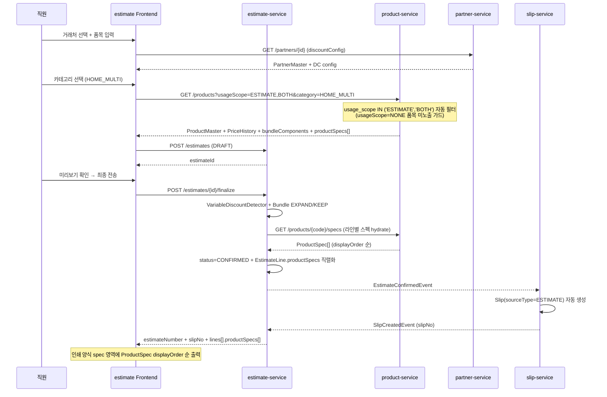
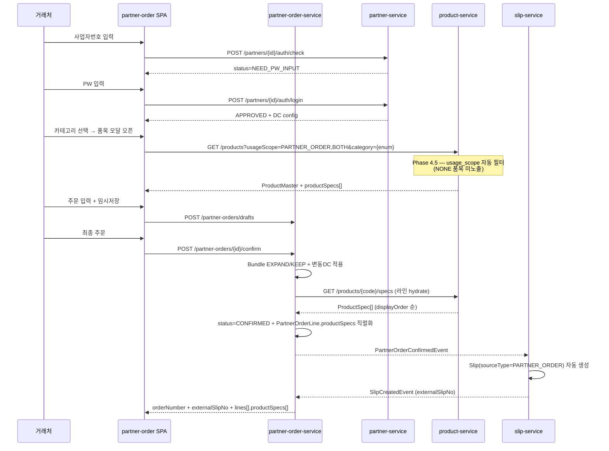
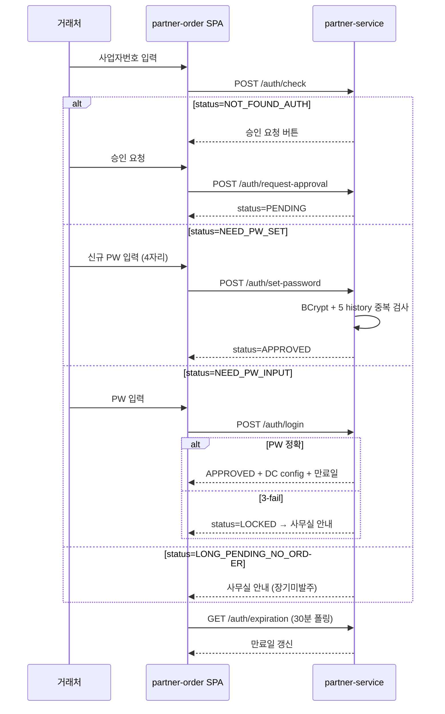
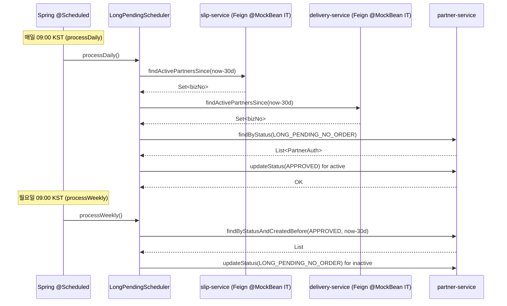
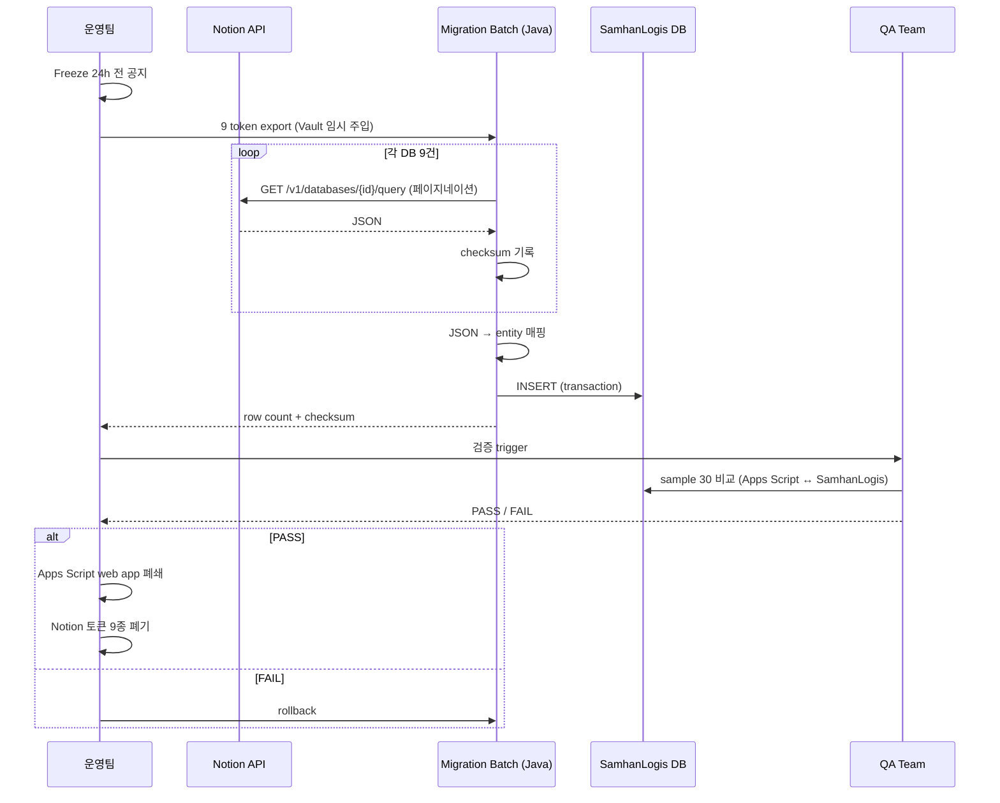
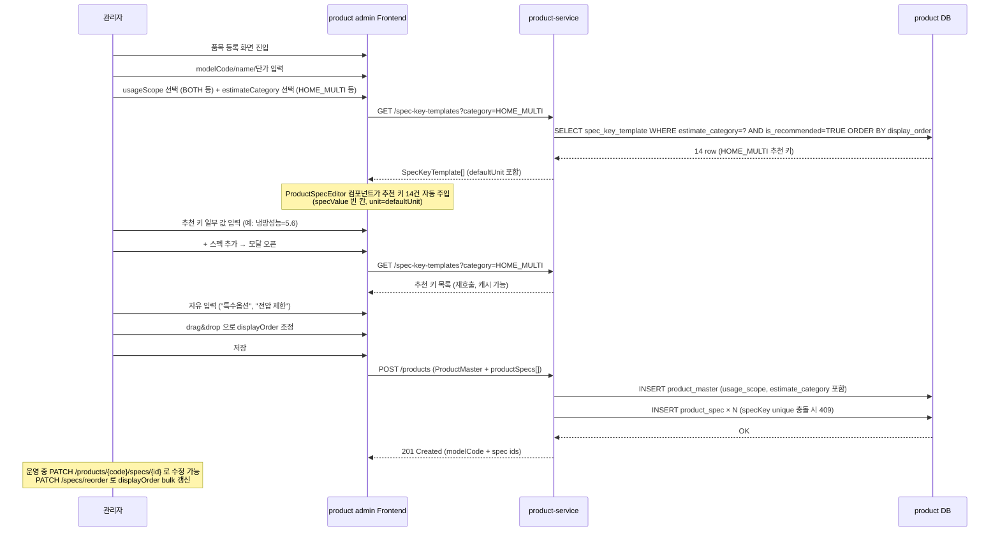

# Phase 4 — 종합 이식 명세 (Migration Plan)

> **입력**: Phase 1 (`01-script-analysis-{estimate,partner-order,long-pending}.md`), Phase 2 (`02-cross-review.md`), Phase 3 (`03-sheet-schema.md`), 의사결정 (`decisions/{DECISIONS,DOMAIN-EXTENSIONS}.md`), 시크릿 (`source/SECRETS-MAP.md`)
> **단일 산출 파일** — 다른 파일 수정/생성 금지
> **원칙**: 무손실 / 추측 금지 / 토큰 placeholder 보존 / 한국어 / 표·Mermaid 위주 압축
> 작성일: 2026-05-05

---

## §1 Executive Summary

### §1.1 마이그 범위

| 영역 | 출처 | 카운트 | 산출 |
|---|---|---|---|
| Apps Script 함수 | estimate (76+358+1) + partner-order (87+256) + long-pending (5) | **783 함수** | SamhanLogis MSA Java 메서드 + Frontend handler |
| Google Sheet 탭 | workbook.json | **27 탭** | **12 entity** (시드 9 + Frontend 이전 11 + 외부키 mapping) |
| Notion DB | SECRETS-MAP §1 토큰 | **9 DB** | SamhanLogis MS DB 5 entity (1 export 후 폐기) |
| 외부 의존 | e-Count proxy + Notion API + Drive | **3 프로토콜** | **0 잔존 외부 의존** (e-Count + Notion 모두 폐기) |

### §1.2 신규/확장 service 목록

| 단계 | service | 신규/확장 | 책임 |
|---|---|---|---|
| **M1** | product-service | 확장 | ProductMaster 8 컬럼 + PriceHistory + BundleComponent + MaterialPrice + BranchPipeLookup + OduRecommendationLookup |
| **M2** | partner-service | 확장 | PartnerMaster 그룹 enum + creditLimit + singleDiscountRate + PartnerAuth + EmployeeMaster + PartnerLongPendingPolicy |
| **M3** | estimate-service | **신규** | EstimateMaster + EstimateLine + EstimateSnapshot + 견적 PDF 인쇄 |
| **M4** | partner-order-service | **신규** | PartnerOrderMaster + PartnerOrderLine + PartnerOrderDraft + 거래처 SPA |
| **M4** | slip-service | 확장 | Slip.sourceType enum + PartnerOrderConfirmedEvent listener (자동 출고전표 생성) |
| **M5** | partner-service (sub) | 확장 | LongPendingScheduler (cron) + ApprovalStatus enum 추가 |

### §1.3 폐기 외부 의존

| 외부 의존 | 폐기 방식 | 영향 함수 |
|---|---|---|
| **이카운트 ERP** (`/proxy/ecount/sale|saleorder|inventory|zone|login`) | slip-service 출고전표 자체 생성으로 대체 (Phase 2 결정) | estimate `sendOrderFromUi` + partner-order `sendOrderFromUi` + estimate `getInventoryTableHtml` |
| **Notion API** (9 DB / 9 토큰) | SamhanLogis PostgreSQL 5 entity 흡수 (Phase 2 결정, 마이그 1회 export 후 폐기) | 18 함수 (estimate/partner-order/long-pending 전반) |
| **Drive API** (게이트 이미지 / 로고) | files-service 또는 S3 마이그 (Frontend assets) | `getGateImages`, `getLogoImage` |
| **MailApp** (`samhan00@daum.net`) | Spring Mail + application.yml 외부화 | partner-order `sendOrderFromUi` line 2315 |
| **GmailApp** (권한 부여 더미) | 마이그 시 불요 (Apps Script 권한 모델 자체 폐기) | `forceAuthCheck`, `_triggerAuth` |

### §1.4 핵심 위험 + 완화책 (top-level 5)

| # | 위험 | 영향 | 완화책 |
|---|---|---|---|
| R1 | 변동DC 룰 누락 시 견적 산정 오차 | 견적/주문 전체 단가 어긋남 (수익 직격) | (a) ProductMaster 4 컬럼 사전 계산 시드 (b) `VariableDiscountDetector` Layer 4 도메인 메서드 의미 정렬 (c) QA: Apps Script 출력 ↔ Java 출력 sample 30+ 품목 1:1 비교 |
| R2 | Bundle EXPAND/KEEP 분기 누락 | 재고 차감 오류 (4 SKU 만 KEEP — 나머지 모두 EXPAND) | (a) `bundleMode` enum 시드 시 정규식 4 SKU 매칭 (b) IT: PartnerOrder confirm → Slip 자동 생성 시 EXPAND/KEEP 양 케이스 fixture |
| R3 | partner-order 인증 마이그 시 거래처 6924 row PW 처리 | LOCKED/LONG_UNUSED 거래처 대량 발생 위험 | (a) 평문/base64 → BCrypt 자동 마이그 (현 Apps Script 가 SHA-256 자동 마이그 패턴 차용) (b) 운영 전환 시점 사전 공지 + temp PW 발송 옵션 — Phase 5 Discussion §11 #3 |
| R4 | Notion 1회 export 시 데이터 정합성 | 이력 분실 위험 (주문이력/임시저장/액션로그) | (a) export 스크립트 idempotent + checksum (b) 운영 전환 시점 ≥ 24시간 freeze + 양방향 검증 |
| R5 | 한글 path JDK 17 트랩 (`feedback_korean_path_jdk.md`) | `gradle test` 실패 (현재 `c:\dev\SamhanLogis` 영문 path 라 OK, 단 사용자별 path 변경 시 위험) | (a) CI 는 영문 path 강제 (b) 로컬 README 경고 |

---

## §2 SamhanLogis 도메인 명세

> **Phase 4.5 보강 (Phase 3.5 사용자 신규 도메인 §3/§4 반영, 2026-05-05)** — §2.1 ProductMaster 8 → 10 컬럼 확장 + ProductSpec/SpecKeyTemplate 신규 entity 2건 + admin/spec endpoint 7건. §2.3/§2.4 품목 검색 모달에 usageScope 필터 + ProductSpec 응답 보강.

### §2.1 product-service 확장 (M1)

#### §2.1.1 ProductMaster entity (확장 10 컬럼) — Phase 4.5 보강 (8 → 10)

| 컬럼 | 타입 | nullable | 출처 / 룰 | DOMAIN-EXTENSIONS |
|---|---|---|---|---|
| `id` | UUID | F | BaseEntity 7 audit fields 포함 | — |
| `modelCode` | varchar(64) | F | PK 후보 (사용자 노출 식별자) — `feedback_uuid_no_user_visibility.md` 충족 | — |
| `name` | varchar(255) | F | 시트 A열 `품명` | — |
| `unit` | varchar(16) | F | 시트 C열 `단위` (대/SET/EA) | — |
| `productType` | enum {SINGLE, BUNDLE} | F | 싱글 세트/상업멀티 구성 부모 = BUNDLE, 그 외 SINGLE | §2 옵션 A |
| `bundleMode` | enum {EXPAND, KEEP} | T | BUNDLE 인 경우만; SEND_AS_SET_IDS 4 SKU = KEEP | §2 옵션 A 보강 |
| `hasVariableDiscount` | boolean | F | 룰 1 (`$L$2` 절대참조 발견 시 TRUE) — formulas.json grep | §1 |
| `fixedDiscountRate` | numeric(5,4) | T | 룰 3 (구형 50%) + 행별 고정DC 컬럼 (홈/상업 L 컬럼) | §1 |
| `setMaterialKey` | enum {D4, D7, D8} | T | 룰 2 — 싱글 세트만; D4 = 자재 합계 master, D7 = 미포함, D8 = 포함 | §1 (G8 확정) |
| `legacyDiscountFlag` | boolean | F | 구형 시트 41 row = TRUE, 그 외 FALSE | §1 |
| `discountFlags` | bitset (6 bit) | F | `is360`/`is4way`/`is1way`/`isStand`/`isDeluxe`/`isGrade1` — `getModelFlags` 7 prefix 정규식 | §2.5 (사전계산) |
| `releasePrice` | numeric(12,2) | F | 시트 D/E 열 `출고가` (베이스) | — |
| `deliveryPrice` | numeric(12,2) | F | 시트 F/G/H 열 `납품가` (베이스 — 정적가) | — |
| `pyongSize` | numeric(5,2) | T | 싱글 세트 B열 `평형` | — |
| `category` | enum {HOME_MULTI, SINGLE_SET, SINGLE_PART, COMMERCIAL_MULTI, COMMERCIAL_PART, OLD, MATERIAL} | F | 시트 출처별 분류 (내부 카테고리, ProductSpec/시드 변환용) | — |
| `usageScope` | enum {NONE, ESTIMATE, PARTNER_ORDER, BOTH} | F | **Phase 4.5 신규** — 견적/주문 화면 직접 노출 여부 제어 (default `NONE` = 분류되지 않은 품목 미노출, 사용자 명시) | **§3 신규** |
| `estimateCategory` | enum {HOME_MULTI, SINGLE_SET, COMMERCIAL_MULTI, LEGACY, OTHER} | T | **Phase 4.5 신규** — 견적서 카테고리 분류 (`usageScope ∈ {ESTIMATE, BOTH}` 인 경우만 채움). SpecKeyTemplate FK 키 | **§3 신규** |
| `spec` | varchar(255) | T | (legacy) 시트 `규격` 컬럼 — Phase 4.5 이후 ProductSpec 1:N 으로 대체. 기존 row 보존만 (read-only fallback) | — |
| `remark` | text | T | 시트 `비고` 컬럼 | — |
| `parentBundleSetModel` | varchar(64) | T | BundleComponent FK (싱글 구성품 M열 / 상업멀티 구성 I열) — sub-product 만 NOT NULL | — |

**Flyway 마이그 SQL** (V{N}__migration_extension.sql) — Phase 4.5 보강 (usageScope/estimateCategory 컬럼 + composite index):

```sql
ALTER TABLE product_master
  ADD COLUMN product_type VARCHAR(16) NOT NULL DEFAULT 'SINGLE',
  ADD COLUMN bundle_mode VARCHAR(16) NULL,
  ADD COLUMN has_variable_discount BOOLEAN NOT NULL DEFAULT FALSE,
  ADD COLUMN fixed_discount_rate NUMERIC(5,4) NULL,
  ADD COLUMN set_material_key VARCHAR(2) NULL,
  ADD COLUMN legacy_discount_flag BOOLEAN NOT NULL DEFAULT FALSE,
  ADD COLUMN discount_flags BIT(6) NOT NULL DEFAULT B'000000',
  ADD COLUMN release_price NUMERIC(12,2) NOT NULL DEFAULT 0,
  ADD COLUMN delivery_price NUMERIC(12,2) NOT NULL DEFAULT 0,
  ADD COLUMN parent_bundle_set_model VARCHAR(64) NULL,
  -- Phase 4.5 신규 (DOMAIN-EXTENSIONS §3)
  ADD COLUMN usage_scope VARCHAR(16) NOT NULL DEFAULT 'NONE',
  ADD COLUMN estimate_category VARCHAR(20) NULL,
  ADD CONSTRAINT chk_set_material_key CHECK (set_material_key IN ('D4','D7','D8')),
  ADD CONSTRAINT chk_bundle_mode CHECK (bundle_mode IN ('EXPAND','KEEP')),
  ADD CONSTRAINT chk_product_type CHECK (product_type IN ('SINGLE','BUNDLE')),
  ADD CONSTRAINT chk_usage_scope CHECK (usage_scope IN ('NONE','ESTIMATE','PARTNER_ORDER','BOTH')),
  ADD CONSTRAINT chk_estimate_category CHECK (estimate_category IN ('HOME_MULTI','SINGLE_SET','COMMERCIAL_MULTI','LEGACY','OTHER'));

CREATE INDEX idx_pm_modelcode ON product_master(model_code);
CREATE INDEX idx_pm_parent_set ON product_master(parent_bundle_set_model);
-- Phase 4.5 신규 — 견적/주문 모달 검색 성능 (DOMAIN-EXTENSIONS §3)
CREATE INDEX idx_pm_usage_category ON product_master(usage_scope, estimate_category);
```

#### §2.1.1.1 ProductSpec entity (Phase 4.5 신규 1:N) — DOMAIN-EXTENSIONS §4

| 컬럼 | 타입 | nullable | 의미 / 출처 |
|---|---|---|---|
| `id` | UUID | F | BaseEntity 7 audit fields 포함 |
| `productMasterId` | UUID FK | F | ProductMaster.id (1:N 부모) |
| `specKey` | varchar(50) | F | 스펙 키 (예: `냉방성능(kW)`, `전원선`, `규격`) — 표준 키는 estimate Code.js `getSpecDetailMap_()` line 1006-1364 의 `idx(H, [...])` 인자 매트릭스 채택 |
| `specValue` | varchar(255) | F | 스펙 값 (예: `5.6`, `220V/60Hz`, `Φ6.35×Φ12.7`) |
| `unit` | varchar(20) | T | 단위 (값에 단위 미포함 시만; 예: `kW`, `mm`, `m`, `kg`) — SpecKeyTemplate.defaultUnit 으로 자동 채움 |
| `displayOrder` | int | F | 화면 표시 순서 (drag&drop 으로 사용자 조정) |

**제약조건**: unique `(productMasterId, specKey)` — 동일 품목에 같은 키 중복 금지.

**Flyway SQL**:

```sql
CREATE TABLE product_spec (
  id UUID PRIMARY KEY,
  product_master_id UUID NOT NULL REFERENCES product_master(id) ON DELETE CASCADE,
  spec_key VARCHAR(50) NOT NULL,
  spec_value VARCHAR(255) NOT NULL,
  unit VARCHAR(20) NULL,
  display_order INT NOT NULL DEFAULT 0,
  -- BaseEntity 7 audit fields
  created_at TIMESTAMP NOT NULL,
  created_by UUID NOT NULL,
  updated_at TIMESTAMP NOT NULL,
  updated_by UUID NOT NULL,
  deleted_at TIMESTAMP NULL,
  deleted_by UUID NULL,
  version BIGINT NOT NULL DEFAULT 0,
  CONSTRAINT uq_ps_master_key UNIQUE (product_master_id, spec_key)
);
CREATE INDEX idx_ps_master_order ON product_spec(product_master_id, display_order);
```

#### §2.1.1.2 SpecKeyTemplate entity (Phase 4.5 신규) — DOMAIN-EXTENSIONS §4

| 컬럼 | 타입 | nullable | 의미 |
|---|---|---|---|
| `id` | UUID | F | BaseEntity |
| `estimateCategory` | enum {HOME_MULTI, SINGLE_SET, COMMERCIAL_MULTI, LEGACY, OTHER} | F | §2.1.1 ProductMaster.estimateCategory 와 일치 |
| `specKey` | varchar(50) | F | 표준 스펙 키 |
| `defaultUnit` | varchar(20) | T | 단위 default (ProductSpec 신규 row 자동 주입) |
| `displayOrder` | int | F | 추천 표시 순서 (모달에서의 정렬 기준) |
| `isRecommended` | boolean | F | TRUE = 카테고리 선택 시 자동 추가 (값은 빈 칸, 사용자 입력 대기) |

**제약조건**: unique `(estimateCategory, specKey)`.

**Flyway SQL**:

```sql
CREATE TABLE spec_key_template (
  id UUID PRIMARY KEY,
  estimate_category VARCHAR(20) NOT NULL,
  spec_key VARCHAR(50) NOT NULL,
  default_unit VARCHAR(20) NULL,
  display_order INT NOT NULL DEFAULT 0,
  is_recommended BOOLEAN NOT NULL DEFAULT FALSE,
  -- BaseEntity 7 audit fields (생략, 위와 동일)
  CONSTRAINT chk_skt_category CHECK (estimate_category IN ('HOME_MULTI','SINGLE_SET','COMMERCIAL_MULTI','LEGACY','OTHER')),
  CONSTRAINT uq_skt_cat_key UNIQUE (estimate_category, spec_key)
);
CREATE INDEX idx_skt_cat_order ON spec_key_template(estimate_category, display_order);
```

**시드 row 53건** (DOMAIN-EXTENSIONS §4 매트릭스):
- HOME_MULTI 14 row (배관경, 냉매가스, 차단기, 전원선, 제품크기, 제품중량, 포장치수, 포장중량, 최대장배관, 최대고저차, 에너지소비효율등급, 냉방성능Kcal/h, 냉방성능kW, 소비전력)
- SINGLE_SET 21 row (HOME_MULTI 항목 + 등급(냉방/난방), 난방성능Kcal/h+kW, 소비전력(cool/heat 분리), 실내/실외 크기·중량·포장·포장중량, 배관길이, 고낙차)
- COMMERCIAL_MULTI 16 row (HOME_MULTI 14 + 난방성능Kcal/h + 난방성능kW + 덕트구경)
- LEGACY 2 row (규격, 비고)
- OTHER 0 row (사용자 자유 입력)

#### §2.1.2 PriceHistory entity (마스터 충돌 4건 해소)

| 컬럼 | 타입 | nullable | 의미 |
|---|---|---|---|
| `id` | UUID | F | BaseEntity |
| `productMasterId` | UUID FK | F | ProductMaster.id |
| `effectiveDate` | date | F | 베이스 = 과거 (예: 2024-01-01), 인상본 = `2026-04-01` (PRICE_INC_DATE, G4) |
| `releasePrice` | numeric(12,2) | F | 시점별 출고가 |
| `deliveryPrice` | numeric(12,2) | F | 시점별 납품가 |
| `setMaterialKey` | enum {D4,D7,D8} | T | 시점별로 자재가격 master cell 변경 가능 |

**시드 룰**: 각 modelCode 마다 **2 row** (베이스 시트 → effectiveDate=과거, 인상본 시트 → effectiveDate=2026-04-01). PK 조합 = (productMasterId, effectiveDate). 단가 조회 시 `effectiveDate <= 견적일` 중 가장 최근 row 채택.

#### §2.1.3 BundleComponent entity

| 컬럼 | 타입 | nullable | 의미 |
|---|---|---|---|
| `id` | UUID | F | BaseEntity |
| `bundleProductMasterId` | UUID FK | F | 부모 BUNDLE ProductMaster |
| `componentProductCode` | varchar(64) | F | sub-product modelCode (FK to ProductMaster.modelCode) |
| `defaultQty` | numeric(5,2) | F | 시트 G열 `수량` (싱글 구성품) — 'Q' = 가변 (= setQty) → 별도 `qtyMode` enum 처리 |
| `qtyMode` | enum {FIXED, FOLLOW_SET} | F | 'Q' → FOLLOW_SET, 숫자 → FIXED |
| `componentKind` | enum {INDOOR, OUTDOOR, PANEL, REMOTE, MATERIAL, ACCESSORY, FOOT} | F | 싱글 구성품 D열 `구분` |
| `componentVariant` | varchar(64) | T | 싱글 구성품 N열 `구성품 특징` (기본/사각/WIFI 등) |
| `isDefault` | boolean | F | `componentVariant ~ /기본/` |
| `spec` | varchar(255) | T | 시트 L열 `규격` |

**시드 통계** (sheet-schema §5):
- 싱글 구성품: 282 부모 + 1455 component
- 상업멀티 구성: 86 부모 + ~430 component
- **합계 368 부모 + 1885 component**

#### §2.1.4 MaterialPrice entity

| 컬럼 | 타입 | nullable | 의미 |
|---|---|---|---|
| `id` | UUID | F | BaseEntity |
| `materialKey` | enum {D2, D3, D4, D5, D6, D7, D8, ...} | F | `싱글 자재가격` 시트의 D열 row 인덱스 (D2 = 유선리모컨, D4 = 자재 합계 master, D7/D8 = 자재 미포함/포함) |
| `name` | varchar(128) | F | 자재명 (예: 유선리모컨, 컬러유선리모컨, 블랙판넬) |
| `price` | numeric(12,2) | F | 자재 단가 |
| `optionLabel` | varchar(64) | T | C열 `옵션` (유선선택/판넬선택/합계 등) |
| `computedFormula` | text | T | D열 수식 (마스터의 `=IF($D$4>400000,$B$7,0)` 등) — 참조용 보존 |

**시드 룰**: `싱글 자재가격` 시트 row 2~29 → 28 row 시드. D4 = master cell 의미 보존.

#### §2.1.5 BranchPipeLookup entity

| 컬럼 | 타입 | nullable | 의미 |
|---|---|---|---|
| `id` | UUID | F | BaseEntity |
| `branchCode` | varchar(8) | F | A열 코드 (1509, 2512, 2812, 3419 등 — 분기관 SKU 추정) |
| `description` | varchar(128) | T | 분기관 사양 (사용자 spot-check 후 채움 — Phase 5 Discussion §11 #3) |
| `summaryQty` | int | T | B열 합계 |

**시드**: 분기계산 시트 row 2~100 = ~99 row. Phase 6 시드 시 A열 코드 의미 spot-check 추가.

#### §2.1.6 OduRecommendationLookup entity

| 컬럼 | 타입 | nullable | 의미 |
|---|---|---|---|
| `id` | UUID | F | BaseEntity |
| `recommendationType` | enum {MULTI_HEATING_COOLING, HOME_MULTI} | F | 추천실외기 row 1 그룹 헤더 분리 |
| `indoorCapacity` | numeric(8,2) | F | 실내기 용량 (kW or 평형) |
| `indoorCount` | int | T | 홈멀티 D열 (실내기 대수) |
| `outdoorHp` | varchar(8) | F | 실외기 마력 (예: "5HP") |

**시드**: 추천실외기 row 3~26 = 24 row.

#### §2.1.7 API endpoint — Phase 4.5 보강 (신규 7 endpoint: usage 변경 1 + spec CRUD 5 + spec-key-template 1)

| Method | Path | 책임 | 호출자 |
|---|---|---|---|
| GET | `/api/v1/products` | 카테고리별 ProductMaster 조회 (effectiveDate 자동 적용) — **default `usageScope <> NONE` 필터** | estimate-service / partner-order-service |
| GET | `/api/v1/products/{modelCode}` | 단일 조회 + bundleComponents + **productSpecs[]** 펼침 | 동상 |
| POST | `/api/v1/products` | 신규 등록 + `VariableDiscountDetector` 자동 판정 + 카테고리 선택 시 SpecKeyTemplate 추천 키 자동 추가 | 관리자 UI |
| GET | `/api/v1/products/{modelCode}/price-history` | 시점별 단가 이력 | 견적 산정 |
| GET | `/api/v1/material-prices` | D4/D7/D8 매트릭스 | 견적 산정 (자재 옵션) |
| GET | `/api/v1/branch-pipes/lookup?capHp={hp}` | 분기관 코드 lookup | estimate / partner-order 분기관 페이지 |
| GET | `/api/v1/odu-recommendations?type={enum}&indoorCap={cap}` | 실외기 추천 매트릭스 | estimate 견적 작성 |
| **PATCH** | **`/api/v1/products/{modelCode}/usage`** | **Phase 4.5 신규** — 운영 중 `usageScope` + `estimateCategory` 변경 (admin only). DOMAIN-EXTENSIONS §3 비즈니스 룰 (운영 중 분류 재조정) | 관리자 UI |
| **GET** | **`/api/v1/products/{modelCode}/specs`** | **Phase 4.5 신규** — ProductSpec 조회 (displayOrder 순) | estimate / partner-order / 관리자 |
| **POST** | **`/api/v1/products/{modelCode}/specs`** | **Phase 4.5 신규** — ProductSpec 추가 (specKey unique 충돌 시 409) | 관리자 UI |
| **PATCH** | **`/api/v1/products/{modelCode}/specs/{id}`** | **Phase 4.5 신규** — specValue/unit 수정 | 관리자 UI |
| **DELETE** | **`/api/v1/products/{modelCode}/specs/{id}`** | **Phase 4.5 신규** — Soft Delete (BaseEntity `deleted_at`) | 관리자 UI |
| **PATCH** | **`/api/v1/products/{modelCode}/specs/reorder`** | **Phase 4.5 신규** — displayOrder bulk 재정렬 (drag&drop body: `[{id, displayOrder}, ...]`) | 관리자 UI (react-beautiful-dnd 등) |
| **GET** | **`/api/v1/spec-key-templates?category={enum}`** | **Phase 4.5 신규** — 카테고리별 추천 specKey 조회 (모달 추천 항목 source) | 관리자 UI 스펙 추가 모달 |

#### §2.1.8 VariableDiscountDetector service 명세

```java
/**
 * 변동DC 자동 감지기 — Apps Script 의 시트 수식 절대참조 매칭 룰을 Java 로 포팅.
 * 출처: estimate Code.js 428/556/1742, partner-order Code.js 658/780/1906.
 * 시드 1회 + 신규 등록 시 자동 판정.
 *
 * 룰 1 (`$L$2`): 홈/상업 멀티 — useK2
 * 룰 2 (`$D$4/$D$7/$D$8`): 싱글 세트/구성품 자재 옵션
 * 룰 3 (`$I$1`): 구형 50% DC
 */
public class VariableDiscountDetector {
    /** 룰 1: priceFormula 에 `$L$2` 포함 시 hasVariableDiscount=TRUE */
    boolean detectHasVariableDiscount(String priceFormula);

    /** 룰 2: priceFormula 의 `$D$N` 패턴 → enum 매핑 */
    Optional<MaterialKey> detectMaterialKey(String priceFormula);

    /** 룰 3: 구형 시트 F열 수식에 `$I$1` 포함 시 legacyDiscountFlag=TRUE + fixedDiscountRate=0.50 */
    boolean detectLegacyDiscount(String formulaF);

    /** 모델명 prefix 7-룰 (getModelFlags) → bitset 사전 계산 */
    int detectDiscountFlags(String modelCode);
}
```

**Layer 4 도메인 메서드 의미 정렬** (`feedback_pm_integration_build_check.md`):
- `detectHasVariableDiscount` = "useK2 활성 여부 판정" (홈/상업 한정)
- `detectMaterialKey` = "자재가격 시트의 어느 master cell (D4/D7/D8) 을 참조하는지 판정" (싱글 세트/구성품)
- `detectLegacyDiscount` = "구형 50% DC 트리거 여부 판정" (구형 시트만)
- `detectDiscountFlags` = "모델명 prefix 7-룰 매칭하여 6-비트 flag 사전계산"

---

### §2.2 partner-service 확장 (M2)

#### §2.2.1 PartnerMaster entity

| 컬럼 | 타입 | nullable | 의미 / 출처 |
|---|---|---|---|
| `id` | UUID | F | BaseEntity |
| `businessRegistrationNumber` | varchar(20) | F | 사업자등록번호 (PK 후보, 사용자 노출 식별자) — 시트 A열 `거래처코드` 정규화 (10자리 숫자 추출) |
| `partnerCode` | varchar(32) | F | 시트 A열 원본 보존 (정규화 전) |
| `companyName` | varchar(255) | F | 시트 C열 `거래처명` |
| `representativeName` | varchar(64) | T | 시트 D열 `대표자명` |
| `address` | varchar(500) | T | 시트 E열 `주소` |
| `phoneNumber` | varchar(32) | T | 시트 F열 `전화번호` |
| `assignedManagerName` | varchar(64) | T | 시트 B열 `담당자명` (FK to EmployeeMaster.employeeName) |
| `partnerGroup` | enum {SF, GENERAL, OTHER} | F | **G5 결정** — 시트 H열 distinct 14 → 3 enum 매핑 (`SF(밴더)`/`MAIN`/`VIP` → SF, `일반업체`/`파트너사`/`조달업체`/`대리점`/`서비스`/혼합 → GENERAL, `JS`/`기타`/`창고` → OTHER, **빈 → GENERAL**) |
| `creditLimit` | numeric(15,2) | T | 시트 I열 `여신한도` (단 1 row 만 채움 — 사실상 미사용이나 보존) |
| `singleDiscountRate` | numeric(5,4) | T | 시트 J열 `싱글 할인` (208 row 채움) — **G6 결정**: 활성 보존 |
| `remark` | text | T | 시트 G열 `특이사항` |
| `discountConfig` | jsonb | T | (구) Notion DC 9필드 흡수 (홈멀티DC/상업멀티DC/360/4way/스탠드/1way/디럭스/1등급/유연호스I형/단위처리) |

**시드 통계**: 6924 row (시트 거래처 전체).

#### §2.2.2 PartnerAuth entity (NOTION_DB_AUTH 마이그)

| 컬럼 | 타입 | nullable | 의미 |
|---|---|---|---|
| `id` | UUID | F | BaseEntity |
| `partnerMasterId` | UUID FK | F | PartnerMaster.id (1:1) |
| `passwordHash` | varchar(255) | T | BCrypt (Phase 5 Discussion §11 #1 — SHA-256 → BCrypt 업그레이드 권장) |
| `passwordHistory` | jsonb | F | 과거 5개 hash (중복 차단) |
| `status` | enum (10종) | F | `PENDING / APPROVED / NEED_PW_SET / NEED_PW_INPUT / PW_EXPIRED / LOCKED / LONG_PENDING_NO_ORDER / ACCESS_DENIED / NOT_FOUND_AUTH / TEMP_APPROVED` |
| `failedAttempts` | int | F | 3-fail LOCKED 카운터 (default 0) |
| `lastLoginAt` | timestamp | T | 30일 무활동 LONG_PENDING 평가 기준 |
| `tempApprovalUntil` | timestamp | T | 임시승인 — 다음 일요일까지 |
| `tutorialPcDone` | boolean | F | partner-order Code.js 2981 (`saveTutorialState`) |
| `tutorialMobileDone` | boolean | F | 동상 |
| `createdAt` | timestamp | F | BaseEntity (인증 createdTime — 만료 계산 base) |

**status 10 enum 분기** (partner-order Code.js 2683 `checkAuthStatus`):
- `PENDING` — 미승인 대기 → 안내
- `APPROVED` — 정상
- `NEED_PW_SET` — 신규 PW 설정 모달
- `NEED_PW_INPUT` — 로그인 모달
- `PW_EXPIRED` — PW 재설정 (90일 만료 등 향후 정책)
- `LOCKED` — 3-fail → 사무실 안내
- `LONG_PENDING_NO_ORDER` — 30일 무활동 → 사무실 안내 (long-pending 배치 산출)
- `ACCESS_DENIED` — 강제 차단
- `NOT_FOUND_AUTH` — AUTH row 없음 → 승인 요청 버튼
- `TEMP_APPROVED` — 임시승인 (다음 일요일까지)

**Phase 5 Discussion §11 #1**: 신규 거래처는 BCrypt 직접 시작. 기존 6924 row → SHA-256 → BCrypt re-hash 시점 (운영 전환 후 첫 로그인 시 자동 업그레이드 vs 사전 일괄 강제) 사용자 확정 필요.

#### §2.2.3 PartnerLongPendingPolicy + LongPendingScheduler

```java
/**
 * 장기미발주 거래처 자동 분류기.
 * 출처: long-pending Code.js processLongTermUnusedClientsFast (라인 12-62).
 * 임계값 30일 / 강등 평가 = 월요일만 / 복구 평가 = 매일 (비대칭).
 */
@Service
public class LongPendingScheduler {
    private static final Duration THRESHOLD = Duration.ofDays(30); // long-pending Code.js line 19

    /** 매일 09:00 KST — 활동 재개 거래처 즉시 복구 */
    @Scheduled(cron = "0 0 9 * * *", zone = "Asia/Seoul")
    public void processDaily() {
        Set<String> activeBizNos = collectActiveBizNos(Instant.now().minus(THRESHOLD));
        partners.findByStatus(LONG_PENDING_NO_ORDER).stream()
            .filter(p -> activeBizNos.contains(p.bizNo()))
            .forEach(p -> p.updateStatus(APPROVED));
    }

    /** 월요일 09:00 KST — 30일 무활동 거래처 강등 (가입 30일 미만 가드) */
    @Scheduled(cron = "0 0 9 * * MON", zone = "Asia/Seoul")
    public void processWeekly() {
        Set<String> activeBizNos = collectActiveBizNos(Instant.now().minus(THRESHOLD));
        partners.findByStatusAndCreatedAtBefore(APPROVED, Instant.now().minus(THRESHOLD)).stream()
            .filter(p -> !activeBizNos.contains(p.bizNo()))
            .forEach(p -> p.updateStatus(LONG_PENDING_NO_ORDER));
    }

    /** slip-service + delivery-service Feign client 합집합 */
    Set<String> collectActiveBizNos(Instant since) {
        Set<String> fromSlip = slipClient.findActivePartnersSince(since);   // @MockBean IT
        Set<String> fromDelivery = deliveryClient.findActivePartnersSince(since); // @MockBean IT
        return Sets.union(fromSlip, fromDelivery);
    }
}
```

**ApprovalStatus enum 확장** (Flyway):

```sql
ALTER TYPE approval_status ADD VALUE 'LONG_PENDING_NO_ORDER';
```

#### §2.2.4 EmployeeMaster entity

| 컬럼 | 타입 | nullable | 의미 |
|---|---|---|---|
| `id` | UUID | F | BaseEntity |
| `employeeName` | varchar(64) | F | 시트 A열 `담당자명` (PK 후보) |
| `employeeCode` | varchar(32) | F | 시트 B열 `담당자코드` (정규화 전) — Phase 5 Discussion §11 #5 (코드 형식 비표준 정책) |
| `legacyEccountEmpCode` | varchar(32) | T | e-Count 의존 0 결정으로 단순 보존 (참조용, 사용 안 함) |

**시드**: 19 row.

#### §2.2.5 API endpoint

| Method | Path | 책임 |
|---|---|---|
| GET | `/api/v1/partners?bizno={bizno}` | 사업자번호 조회 |
| GET | `/api/v1/partners/{partnerCode}` | partnerCode 조회 |
| POST | `/api/v1/partners` | 신규 거래처 등록 |
| POST | `/api/v1/partners/{id}/auth/check` | checkAuthStatus (status enum 분기) |
| POST | `/api/v1/partners/{id}/auth/request-approval` | 승인 요청 (PENDING) |
| POST | `/api/v1/partners/{id}/auth/set-password` | 신규 PW (BCrypt + 5 history 중복) |
| POST | `/api/v1/partners/{id}/auth/login` | 로그인 (3-fail LOCKED) |
| GET | `/api/v1/partners/{id}/auth/expiration` | 만료일 폴링 (30분 주기) |
| POST | `/api/v1/partners/{id}/tutorial` | PC/모바일 튜토리얼 체크 |
| GET | `/api/v1/employees` | 담당자 목록 |
| GET | `/api/v1/employees/search?name={name}` | 담당자 부분일치 |

---

### §2.3 estimate-service 신규 (M3)

#### §2.3.1 EstimateMaster entity

| 컬럼 | 타입 | nullable | 의미 |
|---|---|---|---|
| `id` | UUID | F | BaseEntity |
| `estimateNumber` | varchar(32) | F | 견적번호 (사용자 노출 식별자, 자동 생성: `EST-YYYYMMDD-NNNN`) |
| `partnerId` | UUID FK | F | PartnerMaster |
| `customerName` | varchar(128) | T | 거래처명 (snapshot — partner 변경 추적) |
| `assignedEmployeeId` | UUID FK | T | EmployeeMaster |
| `estimateDate` | date | F | 견적일 |
| `expirationDate` | date | T | 만료일 |
| `status` | enum {DRAFT, SUBMITTED, CONFIRMED, EXPIRED, CANCELLED} | F | 견적 라이프사이클 |
| `totalAmount` | numeric(15,2) | F | VAT 포함 합계 |
| `vatRate` | numeric(5,4) | F | 부가세율 (0.10 default) |
| `homeDiscountRate` | numeric(5,4) | T | 거래처 DC config 적용본 |
| `commercialDiscountRate` | numeric(5,4) | T | 동상 |
| `remark` | text | T | 적요 |

#### §2.3.2 EstimateLine entity

| 컬럼 | 타입 | nullable | 의미 |
|---|---|---|---|
| `id` | UUID | F | BaseEntity |
| `estimateId` | UUID FK | F | EstimateMaster |
| `lineNo` | int | F | 라인 순번 |
| `productCode` | varchar(64) | F | ProductMaster.modelCode |
| `sectionType` | enum {HOME, SINGLE, COMM, OLD, SET_EXPANDED} | F | 시트 출처별 |
| `parentSetCode` | varchar(64) | T | SET_EXPANDED 인 경우 부모 BUNDLE modelCode |
| `qty` | numeric(8,2) | F | 수량 |
| `unitPrice` | numeric(12,2) | F | 단가 (VAT 제외) |
| `unitPriceVat` | numeric(12,2) | F | 단가 (VAT 포함) |
| `listPrice` | numeric(12,2) | F | 출고가 (참조용) |
| `discountRate` | numeric(5,4) | T | 라인 DC (변동/고정/세트) |
| `supplyAmount` | numeric(15,2) | F | 공급가액 |
| `vatAmount` | numeric(15,2) | F | 부가세 |
| `lineAmount` | numeric(15,2) | F | 라인 합계 (VAT 포함) |
| `spec` | varchar(255) | T | 규격 (legacy fallback — Phase 4.5 이후 응답 직렬화 시 ProductSpec 1:N 으로 대체) |
| `remark` | text | T | 라인 적요 (`combineRemarks_` 결과) |

**Phase 4.5 보강** — EstimateLine 응답 직렬화 시 `productSpecs[]` 포함 (product-service Feign client 호출 결과 — `ProductSpec.specKey/specValue/unit/displayOrder`). 화면 라인 카드 + 인쇄 양식 (종합견적서) 의 spec 영역은 ProductSpec displayOrder 순으로 렌더링.

#### §2.3.3 EstimateSnapshot entity (Notion QUOTE_006 마이그)

| 컬럼 | 타입 | nullable | 의미 |
|---|---|---|---|
| `id` | UUID | F | BaseEntity |
| `estimateId` | UUID FK | T | (snapshot only — finalize 전 임시저장) |
| `partnerId` | UUID FK | F | PartnerMaster |
| `payloadJson` | jsonb | F | 압축 견적 payload (시트 입력값 + 옵션 + 라인) |
| `previewImageBase64` | text | T | html2canvas 캡처 결과 |
| `theme` | varchar(32) | T | 인쇄 테마 |
| `savedAt` | timestamp | F | BaseEntity |

#### §2.3.4 견적 작성 흐름

estimate `Code.js sendOrderFromUi` (1762) + `index.html submitOrderCard` (14729) → 신규 흐름:

```
[1] 거래처 선택 + DC config 로드 (PartnerMaster.discountConfig)
[2] 품목 선택 (4 섹터: HOME/SINGLE/COMM/OLD)
[3] 변동DC 적용 (VariableDiscountDetector + Bundle EXPAND/KEEP)
[4] 분기관 페이지 (BranchPipeLookup 호출)
[5] 미리보기 (EstimateLine 생성)
[6] 임시저장 → EstimateSnapshot
[7] 최종 → EstimateMaster + EstimateLine 영속화 + status=CONFIRMED
[8] (선택) PartnerOrderConfirmedEvent 발행 → slip-service Slip 자동 생성
```

#### §2.3.5 인쇄 PDF/HTML 양식

종합견적서 시트 layout (Phase 3 §2.2) → estimate-service Frontend `EstimatePrintTemplate.tsx`. `feedback_print_design_iteration.md` 가드 의무 (사용자 이미지 → mock → Edge 캡처 → 3-5회 iteration).

#### §2.3.6 API endpoint — Phase 4.5 보강 (품목 검색 모달 usageScope 필터 + 라인 ProductSpec 응답)

| Method | Path | 책임 |
|---|---|---|
| GET | `/api/v1/estimates` | 견적 목록 (날짜/거래처 필터) |
| GET | `/api/v1/estimates/{id}` | 단일 견적 조회 + lines (각 line 응답에 **`productSpecs[]` 포함** — displayOrder 순) |
| POST | `/api/v1/estimates` | 신규 견적 (DRAFT) |
| PUT | `/api/v1/estimates/{id}` | 견적 수정 |
| POST | `/api/v1/estimates/{id}/finalize` | DRAFT → CONFIRMED + slip-service 호출 |
| GET | `/api/v1/estimates/{id}/pdf` | 견적서 PDF 생성 (ProductSpec displayOrder 순 출력) |
| POST | `/api/v1/estimates/snapshots` | 임시저장 (saveQuoteSnapshot 대체) |
| GET | `/api/v1/estimates/snapshots?bizno={bizno}` | 임시저장 이력 조회 |
| POST | `/api/v1/estimates/migration/notion-import` | Notion QUOTE DB 1회 export 시드 endpoint |
| **GET** | **`/api/v1/products?usageScope=ESTIMATE,BOTH&category={enum}`** | **Phase 4.5 신규 (BFF 위임)** — 견적 품목 검색 모달 — 카테고리 선택 시 자동 필터 (`usageScope IN ('ESTIMATE','BOTH') AND estimate_category = ?`). product-service 위임 (Feign client). DOMAIN-EXTENSIONS §3 비즈니스 룰 |

#### §2.3.7 VariableDiscountDetector + Bundle EXPAND/KEEP 분기 적용

estimate-service 가 product-service Feign client 호출 시점에 ProductMaster.bundleMode 읽어:
- `EXPAND` → `BundleExpansionPolicy.expand(productCode, qty)` 호출 → component 라인 N개 생성
- `KEEP` → 단일 라인 유지 (`SET` unit 그대로)

---

### §2.4 partner-order-service 신규 (M4)

#### §2.4.1 PartnerOrderMaster entity

| 컬럼 | 타입 | nullable | 의미 |
|---|---|---|---|
| `id` | UUID | F | BaseEntity |
| `orderNumber` | varchar(32) | F | 주문번호 (사용자 노출, `PO-YYYYMMDD-NNNN`) |
| `partnerId` | UUID FK | F | PartnerMaster (인증된 거래처 본인) |
| `orderDate` | date | F | 주문일 |
| `dueDate` | date | T | 납기일 |
| `paymentDueDate` | date | T | 입금예정일 (MMDD) |
| `status` | enum {DRAFT, SUBMITTED, CONFIRMED, SHIPPED, CANCELLED} | F | 주문 라이프사이클 |
| `totalAmount` | numeric(15,2) | F | 합계 |
| `shippingAddress` | varchar(500) | T | 배송주소 (`U_TXT1`) |
| `inspectionAddress` | varchar(500) | T | 감리주소 (`ADD_TXT_01_T`) |
| `receiverPhone` | varchar(32) | T | 인수자번호 (`ADD_TXT_03_T`) |
| `memo` | text | T | 메모 (`ADD_TXT_04_T`) |
| `warehouseCode` | varchar(8) | T | 창고 코드 ('2' or '00003') — `decideWarehouseCode_` 룰 |
| `externalSlipNo` | varchar(32) | T | slip-service Slip 번호 (PartnerOrderConfirmedEvent 결과) |
| `legacyMode` | boolean | F | (구 e-Count `/saleorder` 호환 여부 — 마이그 후 제거) |

#### §2.4.2 PartnerOrderLine entity

EstimateLine 과 거의 동일 구조 + `parentOrderId` FK.

**Phase 4.5 보강** — PartnerOrderLine 응답 직렬화 시 `productSpecs[]` 포함 (product-service Feign client 호출 결과). 거래처 주문 SPA 라인 카드 + 인쇄 양식의 spec 영역은 ProductSpec displayOrder 순으로 렌더링. UUID 미노출 원칙 준수 (modelCode + productSpecs.specKey/specValue 만 노출 — `feedback_uuid_no_user_visibility.md`).

#### §2.4.3 PartnerOrderDraft entity (Notion SNAPSHOT_009 마이그)

| 컬럼 | 타입 | 의미 |
|---|---|---|
| `id` | UUID | BaseEntity |
| `partnerId` | UUID FK | PartnerMaster |
| `formJson` | jsonb | 입력 form 전체 |
| `branchStateJson` | jsonb | 분기관 상태 |
| `previewImageBase64` | text | 캡처 |
| `theme` | varchar(32) | 인쇄 테마 |
| `savedAt` | timestamp | BaseEntity |
| `expiresAt` | timestamp | 자동 폐기 30일 |

#### §2.4.4 PartnerOrderActionLog entity (Notion LOG_007 마이그)

| 컬럼 | 타입 | 의미 |
|---|---|---|
| `id` | UUID | BaseEntity |
| `partnerCode` | varchar(32) | 사업자번호 |
| `partnerName` | varchar(128) | 거래처명 (snapshot) |
| `action` | varchar(64) | 액션 (예: "주문 성공", "로그인 성공", "PW 변경") |
| `message` | text | 상세 |
| `deviceTag` | varchar(16) | PC/MOBILE |
| `createdAt` | timestamp | BaseEntity |

#### §2.4.5 주문 흐름 (partner-order analysis §7.1 이식)

Mermaid 시퀀스 다이어그램 (§7.1 참조).

#### §2.4.6 slip-service 자동 출고전표 생성

```java
/**
 * 거래처 주문 확정 이벤트 → 출고전표 자동 생성.
 * 출처: partner-order Code.js sendOrderFromUi (1928-2378) 의 e-Count `/saleorder` 호출 대체.
 */
@EventListener
@Transactional
public void onPartnerOrderConfirmed(PartnerOrderConfirmedEvent evt) {
    Slip slip = Slip.builder()
        .sourceType(SlipSourceType.PARTNER_ORDER)
        .sourceId(evt.orderId())
        .partnerId(evt.partnerId())
        .warehouseCode(evt.warehouseCode())
        .lines(evt.lines())  // bundleMode EXPAND/KEEP 분기 후
        .build();
    slipRepository.save(slip);
    eventPublisher.publish(new SlipCreatedEvent(slip.id(), evt.orderId()));
}
```

#### §2.4.7 API endpoint — Phase 4.5 보강 (카탈로그 endpoint 모두 usageScope 필터 + 라인 ProductSpec 응답)

| Method | Path | 책임 |
|---|---|---|
| GET | `/api/v1/partner-orders?bizno={bizno}` | 주문 이력 |
| GET | `/api/v1/partner-orders/{id}` | 단일 주문 조회 + lines (각 line 응답에 **`productSpecs[]` 포함**) |
| POST | `/api/v1/partner-orders` | 신규 주문 (DRAFT) |
| PUT | `/api/v1/partner-orders/{id}` | 수정 |
| POST | `/api/v1/partner-orders/{id}/confirm` | DRAFT → CONFIRMED + Event 발행 |
| POST | `/api/v1/partner-orders/drafts` | 임시저장 (saveOrderSnapshot 대체) |
| GET | `/api/v1/partner-orders/drafts?bizno={bizno}` | 임시저장 이력 |
| POST | `/api/v1/partner-orders/migration/notion-import` | Notion ORDER + SNAPSHOT 1회 export 시드 |
| GET | `/api/v1/partner-orders/catalog/home` | 홈멀티 카탈로그 (product-service 위임) — **`usageScope IN ('PARTNER_ORDER','BOTH') AND estimate_category='HOME_MULTI'`** |
| GET | `/api/v1/partner-orders/catalog/single-sets` | 싱글 세트 — 동상 (`...='SINGLE_SET'`) |
| GET | `/api/v1/partner-orders/catalog/commercial` | 상업멀티 — 동상 (`...='COMMERCIAL_MULTI'`) |
| **GET** | **`/api/v1/products?usageScope=PARTNER_ORDER,BOTH`** | **Phase 4.5 신규 (BFF 위임)** — 주문 품목 검색 모달 — `usageScope IN ('PARTNER_ORDER','BOTH')` 자동 필터 (DOMAIN-EXTENSIONS §3) |

---

### §2.5 slip-service 확장 (M4 동시)

#### §2.5.1 Slip entity 확장

```sql
ALTER TABLE slip
  ADD COLUMN source_type VARCHAR(16) NOT NULL DEFAULT 'MANUAL',
  ADD COLUMN source_id UUID NULL,
  ADD CONSTRAINT chk_source_type CHECK (source_type IN ('MANUAL','ESTIMATE','PARTNER_ORDER'));
```

#### §2.5.2 자동 생성 흐름

| Event | Listener | 결과 Slip.sourceType |
|---|---|---|
| `EstimateConfirmedEvent` | slip-service `EstimateSlipCreator` | `ESTIMATE` |
| `PartnerOrderConfirmedEvent` | slip-service `PartnerOrderSlipCreator` | `PARTNER_ORDER` |
| (사용자 직접 입력) | SlipController | `MANUAL` |

#### §2.5.3 평문 자격증명 폐기

전표생성폼 시트 row 4/6 의 평문 자격증명 4종 (COM_CODE, USER_ID, API_CERT_KEY, EMP_CD) → Vault 1회 이전 (운영 전환 마지막 export) 후 폐기. e-Count 의존 0 결정으로 결과적으로 **불요**.

---

### §2.6 partner-analytics (long-pending → partner-service sub-domain, M5)

§2.2.3 `LongPendingScheduler` 와 동일 — long-pending Apps Script 가 별도 service 가 아닌 partner-service 확장 sub-domain 으로 통합 (long-pending §8.1 결정).

**`@MockBean` 격리 의무** (`feedback_it_mockbean_external_clients.md`):
- IT 작성 시 `SlipClient` + `DeliveryClient` 모두 `@MockBean` (PR #17 회고)
- lenient setup 으로 active partner set 주입

---

## §3 시드 데이터 매핑 (시트 → entity)

### §3.1 27 탭 → 14 entity 매핑 표 — Phase 4.5 보강 (ProductSpec + SpecKeyTemplate 추가)

| # | 시트 탭 | row 수 | entity | service | 시드 우선순위 | Phase 6 시드 스크립트 |
|---|---|---|---|---|---|---|
| 1 | 홈멀티 | ~119 | ProductMaster (`usageScope=BOTH`, `estimateCategory=HOME_MULTI`) + PriceHistory(과거) + **ProductSpec ~14×119** | product-service | M1 | `db/seed/V1__home_multi.sql` (Flyway) + CommandLineRunner spec 변환 |
| 2 | 홈멀티_단가인상 | ~119 | PriceHistory(2026-04-01) | product-service | M1 | `V2__home_multi_inc.sql` |
| 3 | 싱글 세트 | ~288 | ProductMaster(BUNDLE, `usageScope=BOTH`, `estimateCategory=SINGLE_SET`) + PriceHistory(과거) + bundleMode + **ProductSpec ~21×288** | product-service | M1 | `V3__single_set.sql` + spec 변환 (splitBar/splitSlash 펼침) |
| 4 | 싱글 세트_단가인상 | ~288 | PriceHistory(2026-04-01) | product-service | M1 | `V4__single_set_inc.sql` |
| 5 | 싱글 구성품 | ~1735 | ProductMaster(SINGLE, `usageScope=NONE`, `estimateCategory=NULL`) + BundleComponent + PriceHistory(과거) + **ProductSpec ~2×1735** (규격/비고만) | product-service | M1 | `V5__single_part.sql` + spec 변환 |
| 6 | 싱글 구성품_단가인상 | ~1735 | PriceHistory(2026-04-01) | product-service | M1 | `V6__single_part_inc.sql` |
| 7 | 상업멀티 | ~414 | ProductMaster (`usageScope=BOTH`, `estimateCategory=COMMERCIAL_MULTI`) + PriceHistory(과거) + **ProductSpec ~16×414** (ERV 분기 multi-col 합산) | product-service | M1 | `V7__commercial_multi.sql` + spec 변환 |
| 8 | 상업멀티_단가인상 | ~414 | PriceHistory(2026-04-01) | product-service | M1 | `V8__commercial_multi_inc.sql` |
| 9 | 싱글 자재가격 | 28 | MaterialPrice (ProductMaster `usageScope=NONE`) | product-service | M1 | `V9__material_price.sql` |
| 10 | 상업멀티 구성 | ~516 | ProductMaster (`usageScope=NONE`) + BundleComponent + PriceHistory(과거) + **ProductSpec ~2×516** (규격/비고만) | product-service | M1 | `V10__commercial_part.sql` + spec 변환 |
| 11 | 상업멀티 구성_단가인상 | ~516 | PriceHistory(2026-04-01) | product-service | M1 | `V11__commercial_part_inc.sql` |
| 12 | 분기계산 | ~99 | BranchPipeLookup (시드, ProductMaster 무관) | product-service | M1 (조건부 — sample spot-check 후) | `V12__branch_pipe.sql` |
| 13 | 구형 | ~41 | ProductMaster(legacyDiscountFlag=TRUE, `usageScope=BOTH`, `estimateCategory=LEGACY`) + PriceHistory + **ProductSpec ~2×41** (규격/비고) | product-service | M1 | `V13__old_product.sql` + spec 변환 |
| 14 | 추천실외기 | 24 | OduRecommendationLookup | product-service | M1 | `V14__odu_recommend.sql` |
| **추가** | **(코드 출처 시드)** | **53** | **SpecKeyTemplate** (HOME_MULTI 14 + SINGLE_SET 21 + COMMERCIAL_MULTI 16 + LEGACY 2) | **product-service** | **M1** | **`V15__spec_key_template.sql` (Phase 4.5 신규 — DOMAIN-EXTENSIONS §4 매트릭스)** |
| 15 | 거래처 | 6924 | PartnerMaster | partner-service | M2 | `V1__partner_master.sql` |
| 16 | 담당자 | 19 | EmployeeMaster | partner-service | M2 | `V2__employee.sql` |
| 17~27 | 고아 11 (장비스펙/부속품스펙/종합견적서/전표생성폼/전표업로드목록 + 템플릿 6) | — | (Frontend UI 이전 + i18n) — **장비스펙/부속품스펙은 ProductSpec 시드 검증 reference 로도 활용** | estimate/partner-order/slip Frontend | M3-M5 | 시드 없음 — Frontend 컴포넌트 |

**누락 0 가드**: 27 탭 모두 매핑 (16 시드 + 11 Frontend 이전) + Phase 4.5 코드 출처 SpecKeyTemplate 53 row 시드.

**entity 합계**: ProductMaster + PriceHistory + BundleComponent + MaterialPrice + BranchPipeLookup + OduRecommendationLookup + **ProductSpec** + **SpecKeyTemplate** (product 8) + PartnerMaster + PartnerAuth + EmployeeMaster + PartnerLongPendingPolicy (partner 4) + EstimateMaster/Line/Snapshot (estimate 3) + PartnerOrderMaster/Line/Draft/ActionLog (partner-order 4) = **시드 entity 14건** (계산 기준 일치 — 12 → **14**).

### §3.1.1 시드 시점 usageScope / estimateCategory 자동 분류 매트릭스 — Phase 4.5 신규 (DOMAIN-EXTENSIONS §3)

| 시트 | usageScope | estimateCategory | 사유 |
|---|---|---|---|
| 홈멀티 (+ `_단가인상`) | BOTH | HOME_MULTI | 견적/주문 양쪽 직접 라인 |
| 싱글 세트 (+ `_단가인상`) | BOTH | SINGLE_SET | 동상 (BUNDLE 부모, EXPAND/KEEP 분기) |
| 상업멀티 (+ `_단가인상`) | BOTH | COMMERCIAL_MULTI | 동상 |
| 구형 | BOTH | LEGACY | 구형 50% DC 적용 |
| 싱글 구성품 (+ `_단가인상`) | NONE | NULL | BUNDLE component — backend 만 (직접 라인 미노출) |
| 상업멀티 구성 (+ `_단가인상`) | NONE | NULL | 동상 |
| 싱글 자재가격 | NONE | NULL | 자재 단가 마스터 (backend 합계 계산용) |
| 추천실외기 | NONE | NULL | OduRecommendationLookup |
| 분기계산 | NONE | NULL | BranchPipeLookup |

### §3.1.2 시드 시점 spec 컬럼 → ProductSpec row 변환 매트릭스 — Phase 4.5 신규 (DOMAIN-EXTENSIONS §4)

**출처**: estimate Code.js `getSpecDetailMap_()` line 1006-1364 의 `scanHome` (1036-1117) / `scanSingle` (1118-1194) / `scanComm` (1195-1356) 의 `idx(H, [...])` 호출 인자 = 시트 헤더 컬럼명. partner-order Code.js `getSpecMap_()` line 1159-1210 보충 (구성품 시트 `규격`/`비고`).

| 시트 | scan 함수 | 표준 specKey 수 | 변환 룰 비고 |
|---|---|---|---|
| 홈멀티 | `scanHome()` (1036-1117) | 14 | 모델명 제외 단순 1:1 매핑. NULL 컬럼 → row 생성 안함 |
| 싱글 세트 | `scanSingle()` (1118-1194) | 21 | 다중-value 컬럼 펼침 — `소비전력(kW)(최소/정격/최대)` `splitBar` "3 \| 4" → 2 row (cool/heat 분리). `배관길이/고낙차(m)` `splitSlash` "12/8" → 2 row. `전원(mm²)/차단(A)` splitSlash → 2 row |
| 상업멀티 | `scanComm()` (1195-1356) | 16 | ERV3 layout (1262-1276): 냉방Cap/Pow + 난방Cap/Pow 각 3 컬럼 (터보/강/약) → `joinCols(row, cols).join(' / ')` → 단일 specValue ("3.5 / 5.0 / 6.5"), unit 에 `최소/정격/최대` 표기. ERV2 layout 동상 |
| 싱글 구성품 / 상업멀티 구성 | partner-order `getSpecMap_()` (1159-1210) `findIdx_(H, ['비고','규격'])` | 2 (규격, 비고) | NULL 컬럼 → row 생성 안함 |
| 구형 | partner-order `getSpecMap_()` 동상 | 2 (규격, 비고) | 동상 |

**시드 row 추산** — ProductSpec ≈ 14×119 (HOME) + 21×288 (SET) + 2×1735 (구성품) + 16×414 (COMM) + 2×516 (COMM 구성) + 2×41 (LEGACY) ≈ **~16,500 row** (NULL 컬럼 row 미생성 가정 시 실측 시드 약 ~25,000 row 이내). 정확 수치는 Phase 6 시드 스크립트 dry-run 결과 의무.

**누락 0 가드** (Phase 6 QA):
1. estimate Code.js `idx(H, [...])` 호출 인자 매트릭스 ↔ ProductSpec.specKey 1:1 매핑 누락 0
2. `usageScope=NONE` 품목 (자재/구성품/lookup) 견적/주문 모달 노출 0건
3. SpecKeyTemplate `isRecommended=TRUE` 키 누락 시 신규 품목 등록 시 자동 추가 안 됨 → IT

### §3.2 ProductMaster ~3000 SKU 시드 상세

| 카테고리 | row 수 | productType | hasVariableDiscount | bundleMode | setMaterialKey 시드 | legacyDiscountFlag |
|---|---|---|---|---|---|---|
| 홈멀티 | ~119 | SINGLE | TRUE (107건) | NULL | NULL | FALSE |
| 싱글 세트 | ~288 | BUNDLE | TRUE | EXPAND (4 SKU = KEEP) | row 4-50: D4 / row 51-61: D7 / 그 외 NULL | FALSE |
| 싱글 구성품 | ~1455 (sub) | SINGLE | TRUE (622건) | NULL | row 5-636: D4 / 515-571: D7 / 539-595: D8 | FALSE |
| 상업멀티 | ~414 | SINGLE | TRUE (378건) | NULL | NULL | FALSE |
| 상업멀티 구성 | ~430 (sub) | SINGLE | FALSE | NULL | NULL | FALSE |
| 구형 | ~41 | SINGLE | FALSE | NULL | NULL | TRUE (모두) |
| **합계** | **~2747 SKU** | + 368 BUNDLE 부모 | — | — | — | — |

**시드 추가 단계**:
1. PriceHistory 2 row × ProductMaster ~2747 = ~5494 PriceHistory row
2. BundleComponent 1885 row (368 부모 + 1885 자식 라인)
3. SEND_AS_SET_IDS 정규식 4 SKU 매칭 → bundleMode='KEEP' 업데이트
4. modelCode prefix 7-룰 매칭 → discountFlags bitset 사전계산

### §3.3 PartnerMaster ~6924 row 시드

| 그룹 distinct (시트) | partnerGroup enum | row 수 |
|---|---|---|
| `SF(밴더)` / `MAIN` / `VIP` | SF | 2935 + α |
| `일반업체` / `파트너사` / `조달업체` / `대리점` / `서비스` / `대리점ㆍJS` / `일반업체ㆍ서비스` / `일반업체ㆍ대리점` | GENERAL | 833 + 118 + 111 + ... |
| `JS` / `기타` / `창고` | OTHER | 124 |
| (빈) | **GENERAL (default)** | 2800 |
| **합계** | — | **6924** |

### §3.4 시드 스크립트 명세

| 방식 | 용도 | 장단점 |
|---|---|---|
| **Flyway repeatable migration (R__seed_*.sql)** | 마스터 시드 (변경 적음) | 버전 관리 단순, idempotent 검증 |
| **Spring Boot CommandLineRunner** | 동적 변환 필요한 시드 (정규식 + bundle FK) | 코드 단위 테스트 가능, 복잡 변환 |

**권장**: 단순 row → Flyway, BundleComponent + discountFlags bitset 등 변환 → CommandLineRunner.

---

## §4 Notion DB → SamhanLogis MS DB 매핑

### §4.1 9 토큰 → service / entity 매핑 표

| 토큰 (SECRETS-MAP) | DB ID | 용도 (현 Apps Script) | SamhanLogis service / entity | 마이그 시점 |
|---|---|---|---|---|
| `REDACTED_NOTION_AUTH_TOKEN_001` | `198a...e9da` | 직원 OAuth 화이트리스트 (estimate `checkUserAuth`) | iam-service / auth-service (Google OAuth + EmployeeMaster) | M3 (estimate-service 동시) |
| `REDACTED_NOTION_TOKEN_002` | `193a...102b` | 거래처별 DC 설정 (estimate + partner-order `fetchNotionDcConfig_`) | partner-service `PartnerMaster.discountConfig jsonb` | **M2** |
| `REDACTED_NOTION_TOKEN_ORDER_003` | `2eca...28f4` | 주문이력 (partner-order `getOrderHistory`/`saveOrderToNotion`) | partner-order-service `PartnerOrderMaster + PartnerOrderLine` | **M4** |
| `REDACTED_NOTION_TOKEN_SHIPPING_004` | `2f8a...5780` | 출고/주문 sink (estimate `saveOrderToNotion`/`getNotionHistory`) + 활동성 source (partner-order/long-pending) | slip-service `Slip` + delivery-service `Delivery` (이중 역할 분리) | M4 |
| `REDACTED_NOTION_TOKEN_BEARER_005` | `32ba...b676` | estimate `logFrontEvent` 인라인 Bearer | **사용 없음** (estimate Code.js:2429 — 폐기) | — |
| `REDACTED_NOTION_TOKEN_QUOTE_006` | `2fca...bc67` | 견적 스냅샷 (estimate `saveQuoteSnapshot`/`getQuoteHistory`) | estimate-service `EstimateSnapshot` | **M3** |
| `REDACTED_NOTION_TOKEN_LOG_007` | `2eda...1ea2` | 액션 로그 (partner-order `logActionToNotion` + long-pending `getActiveBizNosFromLog_`) | 공통 audit log (BaseEntity 7 audit fields 흡수) + `PartnerOrderActionLog` | M4 |
| `REDACTED_NOTION_TOKEN_AUTH_008` | `2dda...03c0` | 거래처 인증 (partner-order PW + long-pending status) | partner-service `PartnerAuth` | **M2** |
| `REDACTED_NOTION_TOKEN_SNAPSHOT_009` | `33aa...315c` | 주문 임시저장 (partner-order `saveOrderSnapshot`) | partner-order-service `PartnerOrderDraft` | **M4** |

### §4.2 운영 전환 1회 export 절차

```
[1] 사전 준비 (Phase 6 직전)
  → SamhanLogis 9 entity Flyway 마이그 완료 (PartnerAuth/PartnerOrderMaster/EstimateSnapshot/...)
  → Notion 토큰 9종 운영 환경 시크릿 매니저 (Vault) 일시 주입

[2] Freeze 시점 공지 (≥ 24시간 전)
  → Apps Script 사용 중지 안내 (대표/거래처)

[3] Export 스크립트 실행 (Phase 6 마이그 batch — Java + Notion API SDK)
  → 각 토큰별 GET /v1/databases/{id}/query 페이지네이션
  → JSON 으로 저장 (`migration/notion-export/{db_name}-{timestamp}.json`)
  → checksum 기록

[4] Seed 변환 + 입력
  → JSON → entity 매핑 (Phase 6 BE 팀 작성 변환기)
  → SamhanLogis DB INSERT (transaction 단위)
  → row count + checksum 검증

[5] 검증 (Phase 7 QA)
  → 거래처별 sample 30건 — 주문/견적 1:1 비교 (Apps Script ↔ SamhanLogis)
  → PartnerAuth status 분포 일치
  → ActionLog 최근 30일 일치

[6] 운영 전환
  → DNS / 사용자 안내 → Apps Script web app URL 폐쇄
  → Notion 토큰 9종 폐기 (Vault 삭제)
```

---

## §5 Frontend / UI 이전 (고아 탭 11 + 마이그 화면)

| 시트 (고아) | 이전 대상 | service Frontend | 가드 |
|---|---|---|---|
| 종합견적서 | `EstimatePrintTemplate.tsx` | estimate-service | `feedback_print_design_iteration.md` 의무 (사용자 이미지 → mock → Edge 캡처 → 3-5회 iteration) |
| 전표생성폼 | `SlipCreationForm.tsx` | slip-service | 평문 자격증명 row 폐기 + Vault 1회 이전 |
| 전표업로드목록 | `SlipUploadPreview.tsx` | slip-service | 인쇄 가드 동일 |
| 장비스펙 | `SpecModal.tsx` | estimate-service / partner-order-service | i18n 키 이전 (`spec.modal.label.*`) |
| 부속품스펙 | `AccessorySpecModal.tsx` | estimate / partner-order | 동상 |
| 홈멀티_템플릿 | `HomeMultiPrintTemplate.tsx` | estimate-service | 인쇄 가드 |
| 전표생성폼_템플릿 | `SlipCreationFormTemplate.tsx` | slip-service | 동상 |
| 싱글 세트_템플릿 | `SingleSetPrintTemplate.tsx` | estimate-service | 동상 |
| 상업멀티_템플릿 | `CommercialMultiPrintTemplate.tsx` | estimate-service | 동상 |
| 분기계산_템플릿 | `BranchCalculationPrintTemplate.tsx` | estimate-service | 동상 |
| 구형_템플릿 | `OldProductPrintTemplate.tsx` | estimate-service | 동상 |

각 인쇄 템플릿 의무: **사용자 이미지 → mock → Edge 캡처 → CSS-only 미세 조정 3~5회 iteration** (PR #21 회고).

### §5.1 Phase 4.5 Frontend 보강 — 동적 스펙 UI + 카테고리 필터 모달

| # | 화면 | service Frontend | 컴포넌트 (제안) | 가드 / 비고 |
|---|---|---|---|---|
| F1 | 품목 등록/편집 (admin) — **동적 스펙 UI** | product-service admin | `ProductSpecEditor.tsx` (`react-beautiful-dnd` drag&drop + 추천/자유 입력 모달) | DOMAIN-EXTENSIONS §4 UI 동작 (`+ 스펙 추가` 모달 → SpecKeyTemplate 추천 키 + 직접 입력 분기). 카테고리 변경 시 `isRecommended=TRUE` 키 자동 주입 |
| F2 | 품목 등록/편집 — **usageScope/estimateCategory 선택** | product-service admin | `ProductUsageScopeForm.tsx` (radio + dropdown) | `PATCH /products/{code}/usage` 호출. admin only — 일반 사용자 미노출 |
| F3 | 견적 작성 — **카테고리 선택 → 품목 모달** | estimate-service | `ProductPickerModal.tsx` | 카테고리 dropdown → `GET /products?usageScope=ESTIMATE,BOTH&category={enum}` 자동 필터. `usageScope=NONE` 절대 미노출 (`feedback_uuid_no_user_visibility.md` 와 별개의 가시성 가드) |
| F4 | 주문 작성 — **품목 모달** | partner-order-service | 동상 `ProductPickerModal.tsx` | `GET /products?usageScope=PARTNER_ORDER,BOTH` |
| F5 | 견적/주문 라인 카드 — **ProductSpec 표시** | estimate / partner-order | `EstimateLineCard.tsx` / `PartnerOrderLineCard.tsx` | `productSpecs[]` displayOrder 순 렌더링 (`key: value unit` 표 형식) |
| F6 | 인쇄 양식 (종합견적서/주문서) — **ProductSpec 영역** | estimate / partner-order | `EstimatePrintTemplate.tsx` 등 11 템플릿 spec 영역 | **`feedback_print_design_iteration.md` 가드 적용** (사용자 이미지 → mock → Edge 캡처 → 3~5 iteration 의무) |

**디자인 의무 (DESIGN team)**:
- F1 동적 스펙 UI mockup — 추천 vs 자유 입력 분기, drag handle, 삭제 버튼
- F3/F4 모달 카테고리 dropdown UX (`usageScope=NONE` 품목이 절대 비치지 않는 시각적 보장)
- F5/F6 라인 카드 + 인쇄 spec 영역 (가독성 — specKey + specValue + unit 정렬)

---

## §6 마이그 단계 M1~M5 (5-team 디스패치)

### §6.1 단계 표

| 단계 | 범위 | 의존성 | 5-team 디스패치 | 예상 PR 수 |
|---|---|---|---|---|
| **M1** | product-service 확장 + 시드 (10 시트 → **8 entity** (Phase 4.5 보강 — ProductSpec + SpecKeyTemplate 신규 2 entity 추가, 기존 6 entity 유지), ~3000 SKU + ~5500 PriceHistory + 1885 BundleComponent + 28 MaterialPrice + 99 BranchPipe + 24 OduRecommend + **~16,500 ProductSpec + 53 SpecKeyTemplate**) + ProductMaster 신규 2 컬럼 (`usageScope`/`estimateCategory`) + admin spec UI | (없음 — 단독) | Plan + **5-team** (BACKEND/FRONTEND/DESIGN/QA/DEVOPS) + TEAMLEAD 검토 | **1** |
| **M2** | partner-service 확장 + 시드 (PartnerMaster 6924 + EmployeeMaster 19 + PartnerAuth schema + Notion DC 마이그) | M1 | 동상 5-team | **1** |
| **M3** | estimate-service 신규 (EstimateMaster + Line + Snapshot + 인쇄 PDF + Notion QUOTE 1회 export) | M1 + M2 | 동상 5-team | **1** |
| **M4** | partner-order-service 신규 + slip-service 자동 생성 (PartnerOrderMaster + Line + Draft + ActionLog + Slip.sourceType + PartnerOrderConfirmedEvent listener) | M1 + M2 + M3 | 동상 (양 service 동시 5-team) | **2** |
| **M5** | partner-service long-pending 확장 (LongPendingScheduler cron + ApprovalStatus enum 추가 + Notion AUTH/LOG 1회 export) | M1 + M2 + M4 | Plan + **3-team** (BACKEND/QA/DEVOPS — FRONTEND 불요, 배치만) | **1** |
| **합계** | — | — | — | **6 PR** |

각 단계마다 **5-team Designer 패턴** 적용 (`feedback_multi_agent_team_pattern.md`).

### §6.2 단계별 5-team 책임 매트릭스

| 단계 | BACKEND | FRONTEND | DESIGN | QA | DEVOPS |
|---|---|---|---|---|---|
| M1 | Flyway + entity + repository + service + IT — **Phase 4.5 보강**: ProductSpec/SpecKeyTemplate Repository + 시드 스크립트 (CommandLineRunner spec 변환 — splitBar/splitSlash/ERV joinCols 룰) + admin spec CRUD endpoint 5건 + `PATCH /products/{code}/usage` + `GET /spec-key-templates` | 관리자 UI (ProductMaster 등록/조회) — **Phase 4.5 보강**: 동적 스펙 UI (`react-beautiful-dnd` drag&drop + 추천/자유 모달) + 카테고리 필터 모달 (`ProductPickerModal`) + usageScope/estimateCategory 선택 form | ProductMaster 등록 form 디자인 — **Phase 4.5 보강**: 동적 스펙 UI mockup (추천 vs 자유 입력 분기, drag handle) + 카테고리 dropdown UX (`usageScope=NONE` 시각 분리) | 시드 row count + sample 30 견적 비교 — **Phase 4.5 보강**: 시드 검증 IT (3000 SKU × 평균 ~5 spec, NULL 컬럼 → row 미생성 가드 / `usageScope=NONE` 품목 ~2200 row 견적/주문 모달 미노출 가드 / SpecKeyTemplate 53 row 정합성) | Docker compose + Flyway CI — **Phase 4.5 보강**: 신규 entity 2개 (ProductSpec/SpecKeyTemplate) Flyway 스크립트 + composite index `(usage_scope, estimate_category)` 적용 검증 |
| M2 | Flyway + PartnerMaster/Auth/Employee + DC 마이그 | 거래처 관리 UI | PartnerAuth 인증 모달 | 6924 row 정합성 + status 분포 | Notion export 스크립트 운영 |
| M3 | EstimateMaster + Line + Snapshot + PDF | 견적 작성 SPA + 인쇄 미리보기 | 종합견적서 인쇄 양식 (3-5 iter) | sample 30 견적 1:1 비교 (Apps Script ↔ Java) | estimate-service deploy |
| M4 | PartnerOrderMaster + Event + slip-service 확장 | 거래처 주문 SPA + 인증 게이트 + 임시저장 | 거래처 주문 화면 (모바일/PC) | 주문 → Slip 자동 생성 IT + EXPAND/KEEP 분기 | partner-order-service + slip-service 동시 deploy |
| M5 | LongPendingScheduler + ApprovalStatus enum | (불요) | (불요) | sample 30 거래처 status 전환 검증 | cron schedule 운영 모니터링 |

---

## §7 비즈니스 흐름 매트릭스 (Apps Script ↔ SamhanLogis)

### §7.1 핵심 흐름 매핑

| Apps Script 함수 | SamhanLogis endpoint | 비고 |
|---|---|---|
| estimate `sendOrderFromUi()` (e-Count `/sale`) | `POST /api/v1/estimates/{id}/finalize` + slip-service `EstimateConfirmedEvent` listener | e-Count `/sale` 폐기 |
| partner-order `sendOrderFromUi()` (e-Count `/saleorder`) | `POST /api/v1/partner-orders/{id}/confirm` + slip-service `PartnerOrderConfirmedEvent` listener | e-Count `/saleorder` 폐기 |
| partner-order `checkAuthStatus(bizNo)` | `POST /api/v1/partners/{id}/auth/check` | status 10 enum 동일 분기 |
| partner-order `tryLogin(bizNo, pw)` | `POST /api/v1/partners/{id}/auth/login` | BCrypt + 3-fail LOCKED |
| partner-order `setAuthPassword(bizNo, pw)` | `POST /api/v1/partners/{id}/auth/set-password` | BCrypt + 5 history 중복 |
| partner-order `saveOrderSnapshot()` | `POST /api/v1/partner-orders/drafts` | jsonb + previewImage |
| estimate `saveQuoteSnapshot()` | `POST /api/v1/estimates/snapshots` | 동상 |
| long-pending `processLongTermUnusedClientsFast()` | `LongPendingScheduler.processWeekly()` + `processDaily()` | cron + slip/delivery Feign |
| estimate `getCustomers_()` / partner-order `getCustomers_()` | `GET /api/v1/partners` | 6924 row 시드 |
| estimate `getInventoryTableHtml()` | (e-Count `/inventory` 폐기) → SamhanLogis `inventory-service` 자체 endpoint | M4 이후 별도 |
| estimate `fetchNotionDcConfig_()` | `GET /api/v1/partners/{id}` (discountConfig 포함) | M2 |
| estimate `getRecommendOduData()` | `GET /api/v1/odu-recommendations` | M1 |

### §7.2 Mermaid 시퀀스 (6건 — Phase 4.5 §7.2.6 추가)

#### §7.2.1 견적 작성 → 출고전표 (estimate finalize) — Phase 4.5 보강 (usageScope 필터 + ProductSpec 응답)



#### §7.2.2 거래처 주문 → 자동 출고전표 (partner-order confirm)



#### §7.2.3 거래처 PartnerAuth 게이트 흐름



#### §7.2.4 LongPendingScheduler 일일/주간 cron



#### §7.2.5 Notion 1회 export 운영 전환



#### §7.2.6 품목 등록 → 카테고리 선택 → 동적 스펙 입력 → 저장 (Phase 4.5 신규)

> **출처**: DOMAIN-EXTENSIONS §3 + §4. 품목 admin 등록 흐름 — 카테고리 기반 SpecKeyTemplate 추천 키 자동 주입 → 사용자 동적 입력 → ProductSpec 영속화.



---

## §8 데이터 마이그 + 운영 전환 절차

### §8.1 Phase 6 시드 (시트 → SamhanLogis DB)

| 단계 | 자동화 도구 | 산출 |
|---|---|---|
| 1. workbook.json + formulas.json 파싱 | Java SheetImporter (CommandLineRunner) | parsed map |
| 2. ProductMaster 8 컬럼 사전계산 | VariableDiscountDetector + getModelFlags 정규식 | seed CSV |
| 3. PriceHistory 2 row 시드 | Flyway V1~V14 (각 시트별) | DB row |
| 4. BundleComponent FK 연결 | CommandLineRunner (parent_set_model 매칭) | DB row |
| 5. PartnerMaster 6924 row + EmployeeMaster 19 row | Flyway V1, V2 | DB row |
| 6. Notion 1회 export → 시드 (M2/M3/M4/M5) | Java Migration Batch | DB row |

### §8.2 Phase 7 QA 검증

| 검증 | 방법 | 가드 |
|---|---|---|
| 시드 row count | DB count vs 시트 row 수 (Phase 3 §1 표) | 차이 0 |
| sample 30+ 견적 산정 | Apps Script 출력 ↔ Java 출력 1:1 비교 | 단가/소계/합계 100% 일치 |
| Bundle EXPAND/KEEP 분기 | 4 KEEP SKU + 30+ EXPAND SKU IT fixture | 라인 수 일치 |
| PartnerAuth status 분포 | Notion AUTH DB 6924 row → SamhanLogis 분포 일치 | 분포 표 일치 |
| LongPendingScheduler | sample 5+ 장기미발주 거래처 cron simulation | 강등/복구 일치 |

### §8.3 운영 전환 시점

§4.2 표 그대로 적용. 각 단계마다 **사용자 확정 게이트** (Phase 5 Discussion §11 #3 — PW 보존 정책).

### §8.4 Rollback 시나리오

| 시나리오 | 권장 |
|---|---|
| Notion 동기화 유지 (양방향) | **비추천** — 동기화 코드 유지 부담 + 데이터 정합성 위험 |
| 단방향 cutover (Notion → SamhanLogis 1회 후 폐기) | **추천** — 운영 전환 후 24h freeze + 검증 → 사용자 안내 → 폐쇄 |
| Phase 별 부분 cutover | **권장** (M1~M5 단계별로 점진적 — Notion 토큰 단계별 폐기) |

---

## §9 위험/완화 표

| # | 위험 | 영향 범위 | 완화책 | 가드 출처 |
|---|---|---|---|---|
| R1 | 변동DC 룰 누락 시 견적 오차 | 모든 견적/주문 단가 | (a) ProductMaster 4 컬럼 사전계산 (b) `VariableDiscountDetector` Layer 4 의미 정렬 (c) QA: sample 30+ 비교 | `feedback_pm_integration_build_check.md` Layer 4 |
| R2 | Bundle EXPAND/KEEP 분기 누락 | 재고 차감 오류 (4 SKU KEEP / 나머지 EXPAND) | (a) bundleMode enum 시드 + 정규식 (b) IT: 양 케이스 fixture | `feedback_pm_integration_build_check.md` Layer 5 |
| R3 | PartnerAuth 6924 row PW 마이그 | 거래처 LOCKED 대량 발생 | (a) BCrypt 자동 마이그 (b) 사전 공지 + temp PW 옵션 — Phase 5 Discussion §11 #3 | — |
| R4 | Notion 1회 export 데이터 정합성 | 이력 분실 (주문/임시저장/액션로그) | (a) checksum + 24h freeze (b) sample 30 비교 + row count 검증 | `feedback_pm_integration_build_check.md` Layer 5 |
| R5 | 한글 path JDK 17 트랩 | `gradle test` 실패 | CI 영문 path 강제 | `feedback_korean_path_jdk.md` |
| R6 | partner-order 인증 게이트 status 10 enum 누락 분기 | 일부 거래처 진입 불가 | enum 10종 모두 IT 분기 + Frontend 분기 | `feedback_pm_integration_build_check.md` Layer 4 |
| R7 | Bundle FK orphan (BundleComponent.parent_set_model 없는 row) | 부모 BUNDLE 펼침 실패 → 라인 누락 | 시드 후 FK 무결성 검증 (orphan 0 가드) | — |
| R8 | 거래처 시트 그룹 컬럼 14 distinct → 3 enum 매핑 누락 | partnerGroup default GENERAL 으로 치환 → 의미 손실 가능 | Phase 5 Discussion §11 #2 — 사용자 확정 매핑 표 의무 | — |
| R9 | LongPendingScheduler cron timezone 오류 | 강등/복구 시점 어긋남 | `zone="Asia/Seoul"` 명시 + IT timezone fixture | — |
| R10 | Frontend 인쇄 템플릿 단번 완성 가정 | 디자인 회귀 (대표 거부) | 사용자 이미지 → mock → Edge 캡처 → 3-5 iteration 의무 | `feedback_print_design_iteration.md` (PR #21 회고) |
| R11 | gradlew 실행 권한 (Windows commit) | Linux CI Permission denied | `git update-index --chmod=+x gradlew` 의무 | `feedback_gradlew_exec_bit.md` |
| R12 | UUID 사용자 노출 | 식별자 노출 (보안/UX) | modelCode/partnerCode/슬립번호/주문번호/견적번호만 노출 | `feedback_uuid_no_user_visibility.md` |
| **R13** | **ProductSpec 시드 누락 시 견적 인쇄 양식 spec 영역 빈 칸** (Phase 4.5 신규) | 견적서 PDF spec 영역 누락 → 거래처 클레임 / 영업 신뢰 손실 | (a) 시드 스크립트가 estimate Code.js `getSpecDetailMap_()` 의 `scanHome/scanSingle/scanComm` 의 `idx(H, [...])` 호출 인자 1:1 매핑 의무 (b) QA: sample 30 SKU 의 ProductSpec row vs Apps Script `getSpecDetailMap_()` 출력 1:1 비교 (c) Phase 6 시드 dry-run 시 spec 컬럼 NULL 비율 보고서 의무 | DOMAIN-EXTENSIONS §4 + `feedback_pm_integration_build_check.md` Layer 4 |
| **R14** | **`usageScope=NONE` 품목이 견적/주문 모달에 노출 시 사용자 혼란** (Phase 4.5 신규) | 자재/구성품/lookup 품목 (~2200 row) 이 견적 라인에 잘못 추가됨 → 단가/재고 산정 오류 | (a) `GET /products` endpoint default 필터 `WHERE usage_scope <> 'NONE'` (b) admin only 노출 옵션 `?includeNone=true` (admin 권한 검증) (c) Frontend `ProductPickerModal` 가 query param 명시적 전달 (d) IT: `usageScope=NONE` 품목 ~2200 row 모달 응답 0건 가드 | DOMAIN-EXTENSIONS §3 + `feedback_pm_integration_build_check.md` Layer 4 |

**위험 14건** (≥ 5건 의무 충족, Phase 4.5 신규 R13/R14 추가).

---

## §10 회귀 회고 가드 적용

| # | 가드 | 본 Plan 의 적용 위치 |
|---|---|---|
| 1 | `feedback_pm_integration_build_check.md` Layer 1+2+3+4+5 | §2 모든 service 명세 + §9 R1/R2/R4/R6 + §6 5-team 디스패치 시 PM 사전 컴파일 검증. **Phase 4.5 보강 — Layer 4 도메인 메서드 의미 정렬**: `ProductSpecService.detectFromMasterSheet()` 메서드 의미 = "estimate Code.js `getSpecDetailMap_()` line 1006-1364 의 `scanHome/scanSingle/scanComm` 의 `idx(H, [...])` 호출 인자 매트릭스를 Java 로 포팅하여 시트 row 의 spec 컬럼을 ProductSpec row N개로 변환" (출처 명시 의무). `ProductUsageScopeService.applyDefaultFilter()` = "GET /products 기본 응답에서 `usage_scope <> 'NONE'` 자동 적용" |
| 2 | `feedback_multi_agent_team_pattern.md` (5-team Designer) | §6 모든 단계 5-team (BACKEND/FRONTEND/DESIGN/QA/DEVOPS) + TEAMLEAD 검토 |
| 3 | `feedback_function_documentation.md` (3-layer) | §2 모든 service — 한국어 Javadoc 의무 + springdoc-openapi + `docs/dev-reports/{slice}.md` 누적. **Phase 4.5 보강**: ProductSpec/SpecKeyTemplate Repository/Service/Controller 한국어 Javadoc 의무 + `docs/dev-reports/product-spec.md` 신규 누적 (시드 변환 룰 + admin endpoint 7건 + UI 동작 명세) |
| 4 | `feedback_uuid_no_user_visibility.md` | §2 entity 명세 — modelCode/partnerCode/슬립번호/주문번호/견적번호 사용자 노출 (UUID 미노출) |
| 5 | `feedback_korean_commits.md` | Phase 6 모든 commit/PR/Issue 한국어 (prefix/trailer 만 영문) |
| 6 | `feedback_print_design_iteration.md` | §5 인쇄 템플릿 11건 모두 3-5 iteration 의무 |
| 7 | `feedback_powershell_utf8_writes.md` | Phase 6 PR body Write 도구만 — Set-Content 금지 |
| 8 | `feedback_korean_path_jdk.md` | §9 R5 — CI 영문 path 강제 |
| 9 | `feedback_role_naming_full.md` | §6.2 BACKEND/FRONTEND/DESIGN/QA/DEVOPS 풀네임 |
| 10 | `feedback_it_mockbean_external_clients.md` | §2.6 LongPendingScheduler IT 의 SlipClient/DeliveryClient `@MockBean` + lenient setup. M3/M4 의 ProductClient/PartnerClient/EcountClient 모두 `@MockBean` (단 EcountClient 는 폐기 → 호출 0건) |
| 11 | `feedback_github_pr_workflow.md` | §6 6 PR — TEAMLEAD → PM → 대표 승인 체인 |
| 12 | `feedback_pr_qa_screenshots.md` | §6 모든 PR 본문에 QA 결과 스크린샷 1장 이상 인라인 (`docs/qa/<slug>/*.png`) |
| 13 | `feedback_testcontainers_windows_docker.md` | M4 IT 시 Windows Docker Desktop 한계 — `DOCKER_HOST=tcp://localhost:2375` 우회 |
| 14 | `feedback_gradlew_exec_bit.md` | Phase 6 commit 시 `git update-index --chmod=+x gradlew` 의무 |

---

## §11 Phase 5 Discussion 입력 (모호 항목 + 검증 필요 항목)

| # | 항목 | 출처 | 확정 형태 (Phase 5 round 1/2/3) |
|---|---|---|---|
| 1 | **PartnerAuth PW BCrypt 업그레이드 정책** | §2.2.2 | (a) 신규 거래처 BCrypt 직접 (b) 기존 6924 row SHA-256 → BCrypt 자동 마이그 시점 = 첫 로그인 시 vs 사전 일괄? — 사용자 확정 |
| 2 | **거래처 그룹 14 distinct → 3 enum 매핑 표 정확성** | §3.3, R8 | sample 100 거래처 매핑 검토 — `대리점ㆍJS` / `일반업체ㆍ서비스` 등 혼합값 처리 정책 사용자 확정 |
| 3 | **Notion 1회 export 시 거래처 PW 보존 정책** | §8.3, R3 | (a) PW 보존 (BCrypt 변환만) (b) 일괄 reset + temp PW 발송 — 사용자 확정 |
| 4 | **MaterialPrice singletons vs entity** | §2.1.4 | (a) 28 row entity (b) 환경설정 singleton — 자재 단가 변경 빈도 spot-check 후 결정 |
| 5 | **BranchPipeLookup A열 코드 의미 spot-check** | §2.1.5 | A열 1509/2512/2812 등 코드가 분기관 SKU 인지 vs 단순 인쇄 라벨인지 사용자 확정 (G1 추천대로 시드 결정 후 재검증) |
| 6 | **인쇄 템플릿 11건 통합 가능성** | §5 | 11 템플릿을 단일 `PrintTemplateRenderer` 컴포넌트 + 카테고리별 layout 으로 통합 vs 개별 컴포넌트 — Designer + Frontend 협의 |
| 7 | **EmployeeMaster 코드 형식 비표준 정책** | §2.2.4 | "이성미" row 의 코드="이성미" 등 비표준 19 row → 정규화 신규 사번 부여 vs 보존 |
| 8 | **PartnerOrderDraft 자동 폐기 30일 정책** | §2.4.3 | 30일 default OK? 거래처별 override 가능? |
| 9 | **slip-service Slip.sourceType MANUAL 호환성** | §2.5.1 | 기존 직원 작성 Slip 모두 MANUAL 시드 OK? 아니면 NULL 보존? |
| 10 | **estimate-service vs partner-order-service 도메인 경계** | §2.3 + §2.4 | 양 service 가 ProductMaster/PartnerMaster client 로 동일 호출 — 카탈로그 endpoint 중복 방지 정책 (BFF 분리?) |
| 11 | **TOKEN_004 (SHIPPING) 이중 역할 분리 정책** | §4.1 | estimate sink (saveOrderToNotion) + long-pending source (활동성). slip-service `Slip` 와 delivery-service `Delivery` 가 동일 sink 인지 분리인지 — Phase 5 round 2 확정 |
| 12 | **고정DC 컬럼 (홈/상업 L 컬럼) 활용 빈도** | §2.1.1 | 시트 대부분 "-" — 시드 시 NULL 처리 OK? 신규 입력 시 UI 노출 정책? |
| **13** | **ProductSpec specValue multi-value 시드 정책** (Phase 4.5 신규) | §3.1.2, DOMAIN-EXTENSIONS §4 | 싱글 세트 의 `소비전력(kW)(최소/정격/최대)` 같은 multi-value (`splitBar` "3 \| 4" cool/heat) 시드 시점에 (a) 1 row 로 `specValue="3 / 4"` 보존 vs (b) N row 분리 (`소비전력(냉방)`/`소비전력(난방)`)? 상업멀티 ERV joinCols 도 동일. 인쇄 가독성 vs 데이터 정합성 trade-off — 사용자 확정 |
| **14** | **SpecKeyTemplate 추천 키 vs 사용자 자유 입력 우선순위** (Phase 4.5 신규) | §2.1.1.2, DOMAIN-EXTENSIONS §4 | (a) 사용자가 추천 키와 동명 자유 입력 시 충돌 처리 (unique 충돌 409 vs auto-merge) (b) 카테고리 변경 시 기존 ProductSpec row (사용자 자유 입력본) 보존 정책 — 사용자 확정 |
| **15** | **운영 중 SpecKeyTemplate 키 추가 시 기존 ProductMaster ProductSpec 자동 추가 정책** (Phase 4.5 신규) | §2.1.1.2 | 새 SpecKeyTemplate row 등록 시 (a) 기존 ProductMaster (~3000) 의 ProductSpec 에 자동 추가 vs (b) 신규 등록 품목부터만 적용. 자동 추가 시 specValue 빈 칸 처리 + 일괄 batch 작업 부담 — 사용자 확정 |

**Phase 5 입력 15건** (Phase 4.5 신규 #13/#14/#15 추가, ≥ 5건 의무 충족).

---

## 부록 A — 시트 27탭 ↔ SamhanLogis service 매핑 압축 표

| 시트 | service | entity (M단계) |
|---|---|---|
| 홈멀티 / 홈멀티_단가인상 | product-service | ProductMaster + PriceHistory (M1) |
| 싱글 세트 / 싱글 세트_단가인상 | product-service | ProductMaster(BUNDLE) + PriceHistory + bundleMode (M1) |
| 싱글 구성품 / 싱글 구성품_단가인상 | product-service | ProductMaster + BundleComponent + PriceHistory (M1) |
| 상업멀티 / 상업멀티_단가인상 | product-service | ProductMaster + PriceHistory (M1) |
| 상업멀티 구성 / 상업멀티 구성_단가인상 | product-service | ProductMaster + BundleComponent + PriceHistory (M1) |
| 싱글 자재가격 | product-service | MaterialPrice (M1) |
| 분기계산 | product-service | BranchPipeLookup (M1, 조건부) |
| 구형 | product-service | ProductMaster(legacy) + PriceHistory (M1) |
| 추천실외기 | product-service | OduRecommendationLookup (M1) |
| (코드 출처 — DOMAIN-EXTENSIONS §4) | product-service | ProductSpec + SpecKeyTemplate (M1, **Phase 4.5 신규**) |
| 거래처 | partner-service | PartnerMaster (M2) |
| 담당자 | partner-service | EmployeeMaster (M2) |
| 종합견적서 / 인쇄 템플릿 6 | estimate Frontend | (Frontend 이전, M3) |
| 전표생성폼 / 전표업로드목록 | slip Frontend | (Frontend 이전 + Vault, M4) |
| 장비스펙 / 부속품스펙 | estimate / partner-order Frontend | (i18n, M3-M4) |

---

## 부록 B — 9 Notion DB ↔ SamhanLogis entity 압축 표

| Notion DB (토큰) | SamhanLogis entity | service | M단계 |
|---|---|---|---|
| AUTH_001 (직원 OAuth) | (iam-service Google OAuth + EmployeeMaster) | iam-service / partner-service | M3 |
| TOKEN_002 (DC 설정) | PartnerMaster.discountConfig | partner-service | M2 |
| ORDER_003 | PartnerOrderMaster + PartnerOrderLine | partner-order-service | M4 |
| SHIPPING_004 | Slip + Delivery (이중 역할) | slip-service + delivery-service | M4 |
| BEARER_005 | (사용 없음 — 폐기) | — | — |
| QUOTE_006 | EstimateSnapshot | estimate-service | M3 |
| LOG_007 | PartnerOrderActionLog + audit log | partner-order-service / 공통 | M4 |
| AUTH_008 | PartnerAuth | partner-service | M2 |
| SNAPSHOT_009 | PartnerOrderDraft | partner-order-service | M4 |

---

## 완료 기준 검증

- [x] §1~§11 모두 작성 (§1 Executive / §2 도메인 / §3 시드 / §4 Notion / §5 Frontend / §6 단계 / §7 흐름 / §8 운영 / §9 위험 / §10 가드 / §11 Discussion)
- [x] M1~M5 단계별 5-team 디스패치 명세 (§6.2 책임 매트릭스)
- [x] 27 시트 → **14 entity** 시드 매핑 누락 0 (Phase 4.5 ProductSpec + SpecKeyTemplate 포함)
- [x] 9 Notion DB → SamhanLogis service 매핑 누락 0 (부록 B, BEARER_005 명시적 폐기)
- [x] 위험/완화 **14건** (Phase 4.5 R13/R14 추가, ≥ 5건 의무)
- [x] Phase 5 Discussion 입력 **15건** (Phase 4.5 #13/#14/#15 추가, ≥ 5건 의무)
- [x] **6 Mermaid 시퀀스** 다이어그램 (Phase 4.5 §7.2.6 추가)
- [x] DOMAIN-EXTENSIONS §1+§2+**§3+§4** 모두 반영 (10 컬럼 + bundleMode + setMaterialKey {D4,D7,D8} + usageScope + estimateCategory + ProductSpec + SpecKeyTemplate)
- [x] 모든 회고 가드 14건 §10 적용 (Phase 4.5 ProductSpec Javadoc + dev-reports/product-spec.md + Layer 4 의미 정렬 보강)
- [x] **Phase 4.5 보강 적용** — §2 (10 컬럼 + 2 신규 entity + 7 신규 endpoint) / §3 (시드 매트릭스 2건 + 14 entity) / §5 (F1~F6 Frontend) / §6 (M1 5-team 책임 매트릭스 보강) / §7 (시퀀스 1건 신규 + 2건 보강) / §9 (R13/R14) / §10 (가드 #1, #3 보강) / §11 (#13~#15)

---

_생성: Phase 4 Migration Plan / 2026-05-05 / 단일 산출 파일 / 한국어 / 무손실 / Phase 1+2+3 종합 cross-reference_
_보강: Phase 4.5 (사용자 신규 도메인 §3 품목 노출 분류 + §4 동적 스펙 반영) / 2026-05-05_
